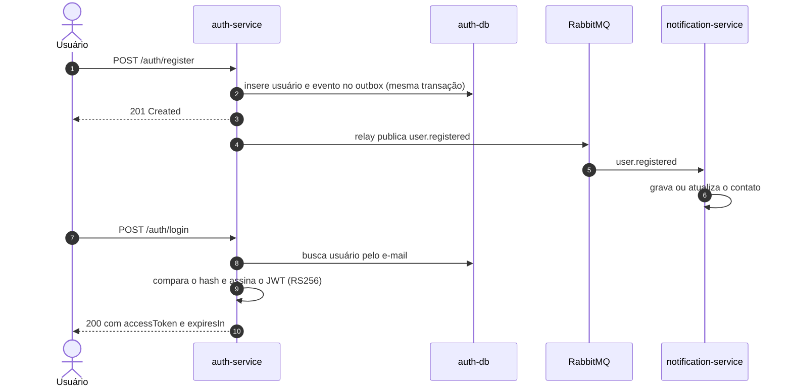
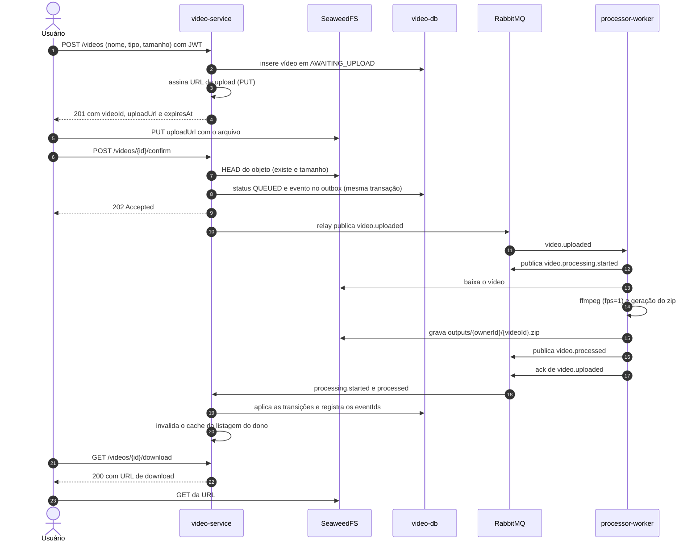
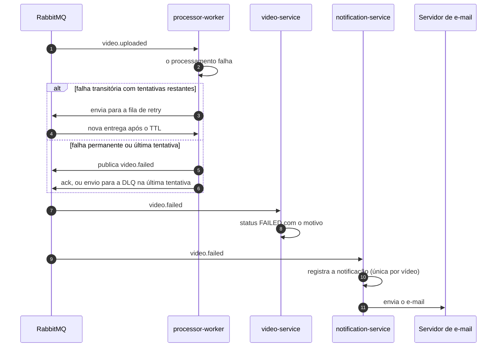
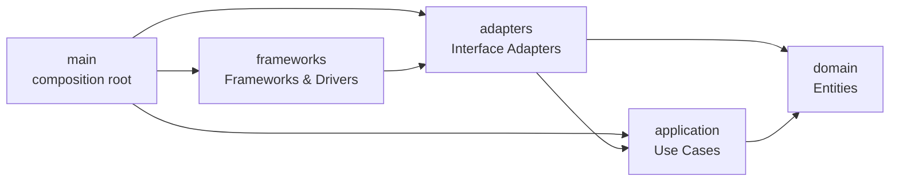

# Documentação do ZipFrames

**ZipFrames** é o sistema de processamento de vídeos entregue à FIAP X, desenvolvido no hackathon da POSTECH Software Architecture (Fase 5). O sistema recebe vídeos enviados por usuários autenticados, extrai um frame por segundo e entrega os frames em um arquivo zip, com processamento assíncrono, escalável e observável.

## Como ler

| Documento | Conteúdo |
|---|---|
| [Análise do projeto base](01-analise-projeto-base.md) | O que o protótipo apresentado aos investidores faz, seus problemas e o que é preservado |
| [Domínio](02-dominio.md) | Linguagem ubíqua, subdomínios, bounded contexts, agregados, regras e eventos |
| [Arquitetura](03-arquitetura.md) | Drivers, serviços, comunicação, fluxos, dados, segurança, resiliência, infraestrutura e testes |
| [C4: contexto](c4/01-contexto.md) | O sistema, seus usuários e sistemas externos |
| [C4: containers](c4/02-containers.md) | Serviços, bancos, broker e storage |
| [C4: componentes do video-service](c4/03-componentes-video-service.md) | As camadas da Clean Architecture dentro de um serviço |

## Convenções

- Os diagramas C4 seguem os níveis e a notação do [modelo C4](https://c4model.com/), desenhados como fluxogramas para manter a legibilidade.
- Os contratos de API (OpenAPI) e de eventos (AsyncAPI) ficam em `docs/openapi/` e `docs/asyncapi/` e são a fonte da verdade para payloads.

## Fluxos principais

### Cadastro e login



### Envio e processamento com sucesso



### Falha e notificação


## Clean Architecture nos serviços

Todos os serviços seguem a mesma organização:

```
src/
├── domain/        # Entities: entidades, value objects, eventos de domínio
├── application/   # Use Cases
│   ├── use-cases/
│   └── ports/     # interfaces de que os use cases precisam
├── adapters/      # Interface Adapters
│   ├── http/          # controllers, DTOs, schemas
│   ├── messaging/     # consumers, publishers, outbox relay
│   ├── persistence/   # repositórios e mappers
│   └── storage/       # acesso ao object storage
├── frameworks/    # Frameworks & Drivers: servidor, clientes e conexões
└── main/          # composition root: configuração e injeção de dependências
```



As setas indicam quem pode importar quem. As dependências sempre apontam para o centro:

| Camada | Pode importar | Não pode importar |
|---|---|---|
| `domain` | Nada além da biblioteca padrão | Qualquer outra camada ou biblioteca de infraestrutura |
| `application` | `domain` | `adapters`, `frameworks`, `main`, Prisma, Fastify, amqplib, SDK S3 |
| `adapters` | `application`, `domain` e bibliotecas de integração | `frameworks`, `main` (recebem clientes por construtor) |
| `frameworks` | `adapters` e bibliotecas | `main` |
| `main` | Todas | — |

Os use cases dependem apenas de interfaces (ports). O `main` cria as implementações concretas e as injeta. Isso permite testar cada use case com implementações em memória, sem banco, broker ou rede.

As regras da tabela são verificadas no CI com o dependency-cruiser. Um import que viole a direção faz o pipeline falhar.

O `processor-worker` segue a mesma estrutura. O `ffmpeg` é um detalhe de infraestrutura atrás do port `FrameExtractor`, e o zip fica atrás do port `FramesPackager`.
