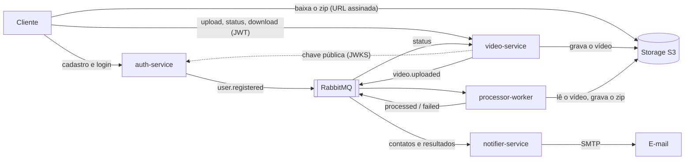

# ZipFrames

[](https://github.com/knzt/zipframes/actions/workflows/auth-service.yml)
[](https://github.com/knzt/zipframes/actions/workflows/video-service.yml)
[](https://github.com/knzt/zipframes/actions/workflows/processor-worker.yml)
[](https://github.com/knzt/zipframes/actions/workflows/notifier-service.yml)

Sistema de processamento de vídeos da FIAP X. O usuário se cadastra, envia um vídeo e recebe um arquivo zip com um frame por segundo em PNG. O processamento é assíncrono, escala pelo tamanho da fila e avisa por e-mail quando o zip fica pronto ou quando algo dá errado.

Ele substitui o protótipo apresentado aos investidores, que processava tudo dentro da requisição HTTP. A [análise do projeto base](docs/review-projeto-base.md) mostra os problemas encontrados e como cada um foi resolvido.

## Requisitos do hackathon

| Requisito                                 | Como é atendido                                                                                                               | Onde ver                                                                                 |
| ----------------------------------------- | ----------------------------------------------------------------------------------------------------------------------------- | ---------------------------------------------------------------------------------------- |
| Processar mais de um vídeo ao mesmo tempo | Workers sem estado consomem uma fila; o KEDA sobe de 1 a 5 réplicas conforme o tamanho dela                                   | [processor-worker](docs/architecture/services/processor-worker.md#concorrência-e-escala) |
| Não perder requisições em picos           | O upload responde depois de gravar e enfileirar; filas duráveis, confirmação do broker, retry com backoff e DLQ               | [Entrega e falhas](docs/architecture/README.md#entrega-e-falhas)                         |
| Acesso protegido por usuário e senha      | auth-service com senha em bcrypt e JWT RS256, validado pelo video-service com a chave pública                                 | [auth-service](docs/architecture/services/auth-service.md)                               |
| Listagem de status dos vídeos do usuário  | `GET /videos`, paginado, com o status de cada vídeo e cache no Redis                                                          | [video-service](docs/architecture/services/video-service.md)                             |
| Notificação em caso de erro               | notifier-service envia e-mail em `video.failed` (e também quando o zip fica pronto)                                           | [notifier-service](docs/architecture/services/notifier-service.md)                       |
| Persistência dos dados                    | Um Postgres por serviço e um object storage compatível com S3                                                                 | [Modelagem de dados](docs/data/modelagem-de-dados.md)                                    |
| Arquitetura escalável                     | Microsserviços sem estado no Kubernetes, HPA nos serviços HTTP e KEDA no worker                                               | [C4 containers](docs/architecture/c4/02-containers.md)                                   |
| Versionamento no GitHub                   | Este repositório e o dos [pacotes compartilhados](https://github.com/zipframes/zipframes-packages), com Conventional Commits  | Histórico de PRs                                                                         |
| Testes                                    | Unitários e de integração com Testcontainers em cada serviço, com cobertura mínima no CI                                      | [Testes](#testes)                                                                        |
| CI/CD                                     | GitHub Actions por serviço, imagens no GHCR e deploy por GitOps com Argo CD                                                   | [CI/CD](#cicd)                                                                           |
| Observabilidade (além do pedido)          | Logs JSON com correlation ID, Prometheus coletando os quatro serviços e o RabbitMQ, dashboard no Grafana e alertas por e-mail | [Observabilidade](docs/architecture/README.md#observabilidade)                           |
| Documentação da arquitetura               | C4 nos níveis 1, 2 e 3, decisões de cada serviço, AsyncAPI e OpenAPI gerado                                                   | [docs/architecture](docs/architecture/README.md)                                         |
| Scripts de banco e de recursos            | Migrations do Prisma em cada serviço; manifests do Kubernetes e script que cria o cluster e os recursos                       | [Banco e recursos](#banco-e-recursos)                                                    |

## Arquitetura em um minuto



| Serviço                                       | Faz                                                                 | Guarda                             |
| --------------------------------------------- | ------------------------------------------------------------------- | ---------------------------------- |
| [auth-service](services/auth-service)         | Cadastro, login e emissão do JWT                                    | Usuários (Postgres)                |
| [video-service](services/video-service)       | Upload em stream, status, listagem, download e retenção de 24 horas | Vídeos (Postgres), cache (Redis)   |
| [processor-worker](services/processor-worker) | Extrai um frame por segundo com `ffmpeg` e monta o zip              | Nada                               |
| [notifier-service](services/notifier-service) | E-mails de resultado e de falha                                     | Contatos e notificações (Postgres) |

Os serviços não compartilham banco nem código. O que atravessa a fronteira é um evento, e o que é comum e técnico vem dos pacotes versionados [`@zipframes/*`](https://github.com/zipframes/zipframes-packages). A visão completa, com os diagramas C4, está em [docs/architecture](docs/architecture/README.md).

## Como rodar

### Kubernetes local

Sobe o sistema inteiro num cluster [kind](https://kind.sigs.k8s.io/) com Postgres e RabbitMQ gerenciados por operators, KEDA, Traefik e Argo CD, a partir das imagens já publicadas no GHCR. Não precisa compilar nada nem ter token.

Precisa de Docker (com uns 6 GB de memória), kind, kubectl e Git Bash no Windows. As portas 80 e 443 precisam estar livres.

```bash
infra/kind/bootstrap.sh
```

Leva alguns minutos na primeira vez. No fim, o sistema responde em:

| Endereço                              | O que é                                          |
| ------------------------------------- | ------------------------------------------------ |
| http://auth.zipframes.localhost       | auth-service (Swagger em `/docs`)                |
| http://api.zipframes.localhost        | video-service (Swagger em `/docs`)               |
| http://mail.zipframes.localhost       | Caixa de e-mails (Mailpit)                       |
| http://rabbitmq.zipframes.localhost   | Painel do RabbitMQ                               |
| http://grafana.zipframes.localhost    | Dashboard: vídeos, falhas, fila, réplicas e APIs |
| http://prometheus.zipframes.localhost | Métricas e alertas                               |

Os detalhes (o que é instalado, onde ficam os segredos, como acessar o Argo CD) estão em [infra/kind/README.md](infra/kind/README.md). Para apagar tudo: `kind delete cluster --name zipframes`.

### Docker Compose

Sobe a infraestrutura e os quatro serviços em containers. Constrói as imagens na hora, então precisa de `NODE_AUTH_TOKEN` (veja [Pré-requisitos](#pré-requisitos)).

```bash
pnpm infra:apps
```

Os serviços respondem em `http://localhost:3000` (auth) e `http://localhost:3001` (video), e o Mailpit em http://localhost:8025. Portas e credenciais estão em [infra/docker-compose/README.md](infra/docker-compose/README.md).

### Na máquina, para desenvolver

Veja [Desenvolvimento](#desenvolvimento).

## Testando o fluxo completo

Com o sistema no ar, este roteiro cadastra um usuário, envia um vídeo, acompanha o processamento e baixa o zip. Use os endereços do kind ou os do Compose:

```bash
# kind
AUTH=http://auth.zipframes.localhost
API=http://api.zipframes.localhost
# Compose ou na máquina
# AUTH=http://localhost:3000
# API=http://localhost:3001

curl -fsS -X POST $AUTH/register -H 'content-type: application/json' \
  -d '{"name":"Ada Lovelace","email":"ada@example.com","password":"senha1234"}'

TOKEN=$(curl -fsS -X POST $AUTH/login -H 'content-type: application/json' \
  -d '{"email":"ada@example.com","password":"senha1234"}' | jq -r .accessToken)

VIDEO_ID=$(curl -fsS -X POST $API/videos \
  -H "authorization: Bearer $TOKEN" -F 'file=@aula.mp4;type=video/mp4' | jq -r .videoId)

curl -fsS $API/videos -H "authorization: Bearer $TOKEN"        # QUEUED → PROCESSING → DONE

curl -fsS "$API/videos/$VIDEO_ID/download" -H "authorization: Bearer $TOKEN" \
  | jq -r .downloadUrl | xargs curl -fsS -o frames.zip
```

Qualquer vídeo curto serve como `aula.mp4`. Aceitos: mp4, avi, mov, mkv, wmv, flv e webm, até 500 MB. A senha precisa ter letra e dígito e pelo menos 8 caracteres.

Depois do processamento, o e-mail "Seu zip está pronto" aparece no Mailpit. Para ver o caminho de falha, envie um arquivo com extensão de vídeo que não seja vídeo de verdade: o status vira `FAILED` e chega o e-mail de falha.

## Testes

Cada serviço tem duas suítes:

- **Unidade** (`pnpm test:unit`): domínio, casos de uso, controllers e adaptadores com implementações falsas. Não precisa de Docker.
- **Integração** (`pnpm test:integration`): sobe o processo de verdade contra Postgres, RabbitMQ, SeaweedFS, Redis e Mailpit em containers (Testcontainers) e percorre o fluxo do serviço. Precisa de Docker.

```bash
pnpm --dir services/video-service test:unit
pnpm --dir services/video-service test          # unidade e integração
```

O CI falha abaixo da cobertura mínima de cada serviço: 100% de linhas e branches no auth-service, 95% e 90% no video-service, 80% no processor-worker e no notifier-service. Na raiz, `pnpm lint`, `pnpm format` e `pnpm check:layers` conferem estilo e as regras de dependência entre camadas.

## CI/CD

```
PR ou merge no main
  └─ workflow do serviço: typecheck, lint, regras de camadas, testes, cobertura, build da imagem
       └─ só no main: publica a imagem testada no GHCR (ghcr.io/knzt/zipframes-<serviço>)
            └─ grava a tag da imagem em infra/k8s/<serviço> e commita no main
                 └─ Argo CD aplica a mudança no cluster
```

Cada serviço tem o próprio workflow em [.github/workflows](.github/workflows), que só roda quando algo daquele serviço muda. A imagem publicada é exatamente a que passou nos testes. O deploy é GitOps: o cluster roda o que está em `infra/` no `main`, e o histórico do Git é o histórico de deploys. O fluxo completo está em [infra/kind/README.md](infra/kind/README.md#entrega-contínua).

## Banco e recursos

| O quê                             | Onde                                                                                         |
| --------------------------------- | -------------------------------------------------------------------------------------------- |
| Migrations (SQL) de cada serviço  | `services/<serviço>/src/infrastructure/repositories/prisma/migrations/`                      |
| Modelo de dados comentado         | [docs/data/modelagem-de-dados.md](docs/data/modelagem-de-dados.md)                           |
| Manifests do Kubernetes           | [infra/k8s](infra/k8s): um diretório por serviço e `platform/` para bancos, broker e storage |
| Criação do cluster e dos segredos | [infra/kind/bootstrap.sh](infra/kind/bootstrap.sh)                                           |
| Infraestrutura local              | [infra/docker-compose](infra/docker-compose/README.md)                                       |

As migrations rodam na subida de cada serviço (`prisma migrate deploy`), então um banco novo fica pronto sem passo manual.

## Documentação

| Documento                                              | Conteúdo                                                    |
| ------------------------------------------------------ | ----------------------------------------------------------- |
| [Arquitetura](docs/architecture/README.md)             | Visão geral, comunicação, falhas, organização do código, C4 |
| [Domínio](docs/domain/dominio.md)                      | Linguagem ubíqua, contextos e regras de negócio             |
| [Modelagem de dados](docs/data/modelagem-de-dados.md)  | Tabelas, índices e como cada consumidor é idempotente       |
| [AsyncAPI](docs/asyncapi/events.yaml)                  | Contrato dos eventos                                        |
| [OpenAPI](docs/openapi/README.md)                      | Onde está o contrato HTTP gerado por cada serviço           |
| [Análise do projeto base](docs/review-projeto-base.md) | O protótipo original e o que mudou                          |
| [Kubernetes local](infra/kind/README.md)               | Cluster, operators, segredos, endereços e entrega contínua  |

## Desenvolvimento

### Pré-requisitos

- Node.js 26 (`.nvmrc`) e pnpm 12.6.0: `npm install -g pnpm@12.6.0 --allow-scripts=pnpm`
- Docker, para a infraestrutura e para os testes de integração
- `ffmpeg` no `PATH`, se o worker rodar fora de container
- Um token do GitHub com `read:packages`, para instalar os pacotes `@zipframes/*` do GitHub Packages

O pnpm 12 não expande `${NODE_AUTH_TOKEN}` no `.npmrc` versionado. Coloque no `~/.npmrc`:

```
//npm.pkg.github.com/:_authToken=${NODE_AUTH_TOKEN}
```

e exporte `NODE_AUTH_TOKEN` antes de instalar.

### Rodar os serviços na máquina

Cada serviço tem o próprio `package.json` e lockfile; a raiz só instala lint, formatação e hooks.

```bash
for s in auth-service video-service processor-worker notifier-service; do
  cp services/$s/.env.example services/$s/.env
  pnpm --dir services/$s install
done
pnpm install
pnpm infra:up                     # Postgres, RabbitMQ, Redis, SeaweedFS, Mailpit
```

Depois, um terminal por serviço:

```bash
pnpm --dir services/auth-service db:generate && pnpm --dir services/auth-service db:deploy && pnpm --dir services/auth-service dev
pnpm --dir services/video-service db:generate && pnpm --dir services/video-service db:deploy && pnpm --dir services/video-service dev
pnpm --dir services/processor-worker dev
pnpm --dir services/notifier-service db:generate && pnpm --dir services/notifier-service db:deploy && pnpm --dir services/notifier-service dev
```

`db:generate` gera o client do Prisma, `db:deploy` aplica as migrations existentes e `db:migrate` cria uma nova. A chave JWT de desenvolvimento está em `infra/docker-compose/auth/jwt-dev.pem`, e as credenciais locais (todas `zipframes`) estão em [infra/docker-compose/README.md](infra/docker-compose/README.md).

Para adicionar uma dependência a um serviço a partir da raiz: `pnpm deps:auth <pacote>`, `pnpm deps:video`, `pnpm deps:worker` ou `pnpm deps:notifier`.
