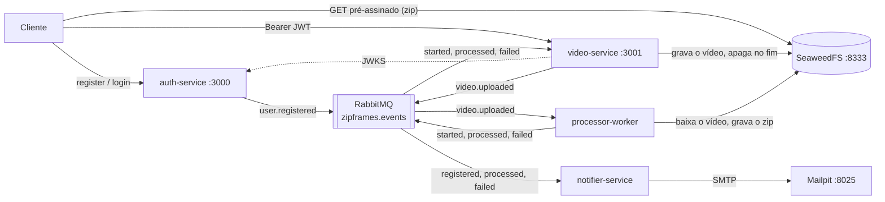

# ZipFrames

Quatro processos neste repositório. O `auth-service` cadastra usuários e emite JWT RS256. O `video-service` recebe o vídeo por upload multipart, grava no storage, publica `video.uploaded`, acompanha o processamento, lista os vídeos do usuário e entrega o zip por uma URL de download de curta duração. O `processor-worker` consome `video.uploaded`, extrai um frame por segundo com `ffmpeg` e grava um zip no storage. O `notifier-service` consome identidade e resultado de processamento e envia e-mail. Não há cliente web aqui.

## Organização

```
zipframes/
├── services/auth-service/       # identidade, Postgres e publicação de eventos
├── services/video-service/      # ciclo de vida do vídeo, upload, download, Postgres e Redis
├── services/processor-worker/   # frames e zip, sem banco
├── services/notifier-service/ # e-mails de resultado e de falha, Postgres
├── infra/docker-compose/        # Postgres, RabbitMQ, SeaweedFS, Mailpit e o resto da máquina
├── infra/k8s/                   # manifests dos quatro processos; não inclui a infra
└── docs/                        # arquitetura e contratos
```

Cada serviço tem o próprio `package.json` e `pnpm-lock.yaml`. A raiz só instala lint, format e hooks. Nenhum serviço importa código do outro. `@zipframes/*` vem do GitHub Packages, na versão declarada no `package.json` do serviço.

| Pacote                     | Uso neste repositório                                          |
| -------------------------- | -------------------------------------------------------------- |
| `@zipframes/core`          | `Result`, erros e readiness                                    |
| `@zipframes/http`          | `defineHandler` no auth, `defineAuthenticatedHandler` no video |
| `@zipframes/schemas`       | contratos HTTP e de evento                                     |
| `@zipframes/value-objects` | e-mail e nome no cadastro                                      |
| `@zipframes/communication` | publicar e consumir no RabbitMQ                                |
| `@zipframes/logger`        | log e correlation id                                           |
| `@zipframes/telemetry`     | métricas Prometheus                                            |
| `@zipframes/authenticator` | validação do JWT no video-service; testes do auth              |
| `@zipframes/test-toolkit`  | testes de integração                                           |

## Como os processos se relacionam



O auth grava o usuário e publica `user.registered` no exchange `zipframes.events`. O video-service valida o token contra o JWKS do auth, grava o arquivo no storage e o vídeo como `QUEUED` e publica `video.uploaded`. O worker escuta a fila `processor.video.uploaded`, processa e publica `video.processing.started`, `video.processed` ou `video.failed`, que o video-service consome pela fila `video-service.processing-status` para mover o status. O notifier-service escuta `notifier.contacts` (identidade) e `notifier.emails` (resultado) e envia e-mail. O vídeo entra pelo video-service, em stream para o storage; o zip sai direto do storage, por uma URL assinada de curta duração.

Nenhum processo chama outro na subida. O video-service só busca o JWKS no primeiro token que valida. A ordem entre os quatro não importa.

## Tecnologias presentes no código

- Node.js 26, TypeScript 5, pnpm 12.6.0
- Fastify, Zod, Prisma (auth, video e notification)
- RabbitMQ (`amqplib`), SeaweedFS pela API S3 (`@aws-sdk/client-s3`, `@aws-sdk/lib-storage` e `@aws-sdk/s3-request-presigner`) e Redis (`ioredis`, cache da listagem)
- JWT RS256 (`jose`) e senha com bcrypt
- Nodemailer no notifier-service (Mailpit no Compose)
- Vitest. A integração sobe Postgres, broker, storage, Redis e Mailpit com `@zipframes/test-toolkit` e precisa de Docker
- `GET /metrics` em texto Prometheus (`prom-client`)

Não há OpenTelemetry, Grafana nem Jaeger no código.

## Pré-requisitos

- Node.js 26 (`.nvmrc` e `.node-version`). O Node 26.10 não traz o `corepack`.
- pnpm 12.6.0, o valor de `packageManager` na raiz e nos serviços:

```bash
npm install -g pnpm@12.6.0 --allow-scripts=pnpm
```

O npm 11 que vem com o Node 26 não executa o script de instalação do pnpm sem `--allow-scripts=pnpm`. As imagens do auth e do video usam o mesmo comando.

- Docker, para a infra e para os testes de integração
- `ffmpeg` no `PATH`, se o worker rodar na máquina e não na imagem
- Token do GitHub com `read:packages` para `@zipframes/*`

O pnpm 12 não expande `${NODE_AUTH_TOKEN}` no `.npmrc` versionado. No `~/.npmrc`:

```
//npm.pkg.github.com/:_authToken=${NODE_AUTH_TOKEN}
```

Exporte `NODE_AUTH_TOKEN` no shell antes de `pnpm install` dentro de cada serviço.

## Ambiente

Copie o exemplo para `.env` ao lado. O processo não lê o `.example`.

| Arquivo                                  | Quem lê                                                                                               |
| ---------------------------------------- | ----------------------------------------------------------------------------------------------------- |
| `infra/docker-compose/.env.example`      | O Compose, em `infra/docker-compose/.env`. Os defaults do YAML repetem o exemplo; a cópia é opcional. |
| `services/auth-service/.env.example`     | `pnpm dev` e `pnpm start` do auth, via `--env-file=.env` no diretório do serviço.                     |
| `services/video-service/.env.example`    | O mesmo, no video-service.                                                                            |
| `services/processor-worker/.env.example` | O mesmo, no worker.                                                                                   |
| `services/notifier-service/.env.example` | O mesmo, no notifier-service.                                                                         |

A chave de desenvolvimento está em `infra/docker-compose/auth/jwt-dev.pem`. O `.env` do auth aponta para ela com caminho relativo ao diretório do serviço. Use `pnpm --dir` a partir da raiz.

Para adicionar um pacote em um serviço, da raiz (o pnpm acrescenta o resto da linha):

```bash
pnpm deps:auth pkgname@3.1
pnpm deps:auth -D pkgname@3.1
pnpm deps:video pkgname@3.1
pnpm deps:worker pkgname@3.1
pnpm deps:notifier pkgname@3.1
```

Credenciais locais, iguais no exemplo e em `infra/docker-compose/seaweedfs/s3.json`:

- Postgres `zipframes` / `zipframes`: `auth_db` na porta 5432, `video_db` na 5433, `notification_db` na 5434
- RabbitMQ `zipframes` / `zipframes`, AMQP 5672, painel http://localhost:15672
- Redis sem senha, porta 6379
- S3 access key `zipframes`, secret `zipframes-local-secret`, bucket `videos`, `http://localhost:8333`

`s3.json` não interpola variável. Se mudar a chave no `.env` do Compose, mude o JSON também. `JWT_KID` na máquina e no Compose é `auth-dev-1`. O ConfigMap de Kubernetes usa `auth-1`. `JWT_ISSUER` e `JWT_AUDIENCE` do video-service precisam ser iguais aos do auth.

## Subir na máquina

```bash
cp services/auth-service/.env.example services/auth-service/.env
cp services/video-service/.env.example services/video-service/.env
cp services/processor-worker/.env.example services/processor-worker/.env
cp services/notifier-service/.env.example services/notifier-service/.env

pnpm install
pnpm --dir services/auth-service install
pnpm --dir services/video-service install
pnpm --dir services/processor-worker install
pnpm --dir services/notifier-service install

pnpm infra:up

pnpm --dir services/auth-service db:generate
pnpm --dir services/auth-service db:deploy
pnpm --dir services/auth-service dev
```

Em outros dois terminais:

```bash
pnpm --dir services/video-service db:generate
pnpm --dir services/video-service db:deploy
pnpm --dir services/video-service dev
```

```bash
pnpm --dir services/processor-worker dev
```

```bash
pnpm --dir services/notifier-service db:generate
pnpm --dir services/notifier-service db:deploy
pnpm --dir services/notifier-service dev
```

`pnpm infra:up` sobe só a infra. Não constrói imagem de serviço. `db:deploy` aplica as migrations que já existem. `db:migrate` é `prisma migrate dev`, para mudar o schema, não para a primeira subida.

Para subir tudo em container em vez disso, veja [`infra/docker-compose/README.md`](infra/docker-compose/README.md) (`pnpm infra:apps`).

## O fluxo completo

Com os quatro processos no ar (na máquina ou no Compose):

```bash
curl -fsS -X POST http://localhost:3000/register -H 'content-type: application/json' \
  -d '{"name":"Ada Lovelace","email":"ada@example.com","password":"senha1234"}'

TOKEN=$(curl -fsS -X POST http://localhost:3000/login -H 'content-type: application/json' \
  -d '{"email":"ada@example.com","password":"senha1234"}' | jq -r .accessToken)

# Uma chamada: o arquivo vai no campo `file` e o vídeo já volta QUEUED.
VIDEO_ID=$(curl -fsS -X POST http://localhost:3001/videos \
  -H "authorization: Bearer $TOKEN" -F 'file=@aula.mp4;type=video/mp4' | jq -r .videoId)

curl -fsS http://localhost:3001/videos -H "authorization: Bearer $TOKEN"          # QUEUED → PROCESSING → DONE

curl -fsS "http://localhost:3001/videos/$VIDEO_ID/download" -H "authorization: Bearer $TOKEN" \
  | jq -r .downloadUrl | xargs curl -fsS -o frames.zip
```

A senha do exemplo tem letra e dígito, entre 8 e 72 caracteres. `GET /health/ready` responde 200 com as dependências alcançáveis e 503 com `reason` se uma falhar; `GET /health/live` só diz que o processo está de pé. Nos dois serviços HTTP, `GET /docs` é o OpenAPI gerado e `GET /metrics` é o texto Prometheus. O worker e o notification não escutam HTTP. O Mailpit captura os e-mails em http://localhost:8025.

Portas, Mailpit e o caminho em que os processos rodam dentro de container estão em [`infra/docker-compose/README.md`](infra/docker-compose/README.md).

## Testes

Na raiz: `pnpm format`, `pnpm lint` e `pnpm check:layers`. Em cada serviço, `pnpm test:unit` não precisa de Docker. `pnpm test` roda a unidade e depois a integração, e a integração precisa de Docker. O teste de integração do worker usa o binário do `ffmpeg-static`, não o `ffmpeg` do sistema.

```bash
pnpm --dir services/auth-service test:unit
pnpm --dir services/video-service test:unit
pnpm --dir services/processor-worker test:unit
pnpm --dir services/notifier-service test:unit
```

## Build

Os pacotes `@zipframes/*` não são buildados neste repositório. Cada serviço:

```bash
pnpm --dir services/auth-service build
pnpm --dir services/video-service build
pnpm --dir services/processor-worker build
pnpm --dir services/notifier-service build
```

A imagem do worker não baixa dependência. Antes dela, `pnpm --dir services/processor-worker stage-runtime` copia os `node_modules` de produção para `.runtime/`. As imagens do auth, do video e do notification instalam o lockfile do serviço durante o build e exigem `NODE_AUTH_TOKEN`.

## Limitações

- Não há cliente web. O auth não publica `user.updated` nem `user.deleted`; o notifier-service já consome esses eventos nos testes.
- `infra/k8s/` não declara Postgres, RabbitMQ, Redis, SeaweedFS nem Mailpit. Os Secrets de exemplo não entram no Kustomize. O worker declara um `ScaledObject` do KEDA. Sem cluster, CRDs e imagens já carregadas, esses manifests não sobem o sistema.
- As imagens ficam locais. Os manifests do Argo CD apontam para `infra/k8s/` e não são um ambiente local pronto.
