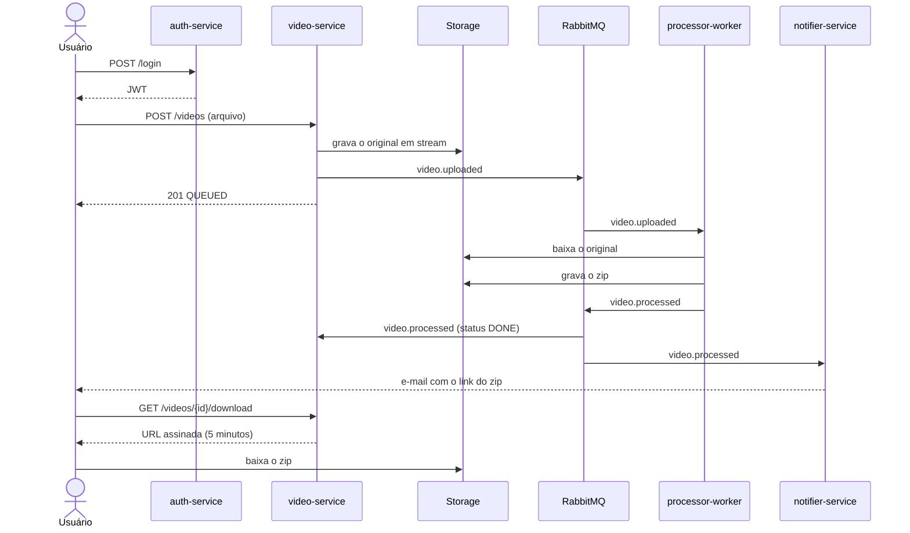
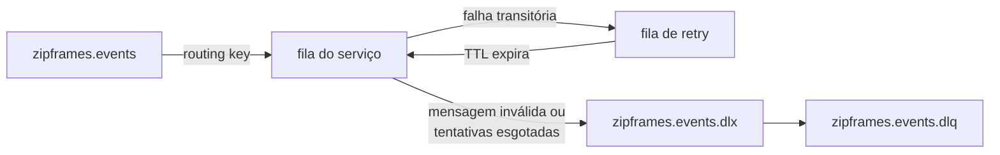

# Arquitetura

O ZipFrames recebe um vídeo, extrai um frame por segundo e devolve os frames num arquivo zip. O trabalho está dividido em quatro serviços, cada um dono de uma parte do problema e do próprio banco:

| Serviço            | Responde por                                             | Guarda                             |
| ------------------ | -------------------------------------------------------- | ---------------------------------- |
| `auth-service`     | Cadastro, login e emissão do JWT                         | Usuários (Postgres)                |
| `video-service`    | Upload, status, listagem, download e retenção dos vídeos | Vídeos (Postgres), cache (Redis)   |
| `processor-worker` | Extração dos frames e montagem do zip                    | Nada                               |
| `notifier-service` | E-mails de resultado e de falha                          | Contatos e notificações (Postgres) |

Os arquivos (vídeos originais e zips) ficam num object storage compatível com S3. Os serviços se falam por eventos num RabbitMQ.

## Por onde começar

| Quero entender                            | Documento                                                                                                                                                                                              |
| ----------------------------------------- | ------------------------------------------------------------------------------------------------------------------------------------------------------------------------------------------------------ |
| O sistema visto de fora                   | [C4 nível 1: contexto](c4/01-contexto.md)                                                                                                                                                              |
| Quais aplicações existem e como conversam | [C4 nível 2: containers](c4/02-containers.md)                                                                                                                                                          |
| Um serviço por dentro                     | C4 nível 3: [auth](c4/03-componentes-auth-service.md), [video](c4/03-componentes-video-service.md), [worker](c4/03-componentes-processor-worker.md), [notifier](c4/03-componentes-notifier-service.md) |
| As decisões de cada serviço               | [auth](services/auth-service.md), [video](services/video-service.md), [worker](services/processor-worker.md), [notifier](services/notifier-service.md)                                                 |
| A linguagem do negócio e os contextos     | [Domínio](../domain/dominio.md)                                                                                                                                                                        |
| Tabelas, índices e idempotência           | [Modelagem de dados](../data/modelagem-de-dados.md)                                                                                                                                                    |
| O formato de cada evento                  | [AsyncAPI](../asyncapi/events.yaml)                                                                                                                                                                    |
| As rotas HTTP                             | [OpenAPI](../openapi/README.md), gerado por cada serviço em `/docs`                                                                                                                                    |
| Como subir no Kubernetes                  | [infra/kind](../../infra/kind/README.md)                                                                                                                                                               |
| Por que o sistema foi refeito             | [Análise do projeto base](../review-projeto-base.md)                                                                                                                                                   |

## Como um vídeo atravessa o sistema



O usuário recebe a resposta do upload assim que o vídeo está gravado e enfileirado. O processamento acontece depois, no ritmo do worker, e o status muda conforme os eventos chegam. Num pico de uploads, a fila cresce e o KEDA sobe réplicas do worker de acordo com o tamanho dela.

## Comunicação entre serviços

Nenhum serviço chama outro para responder a uma requisição. A única chamada HTTP entre serviços é o video-service buscando a chave pública do auth-service (JWKS) para validar tokens. A chave é buscada no primeiro token e fica em cache; o video-service só volta ao auth-service se aparecer um token assinado com uma chave que ele não conhece.

Todo o resto passa pelo exchange `zipframes.events`, do tipo topic. A routing key é o nome do evento, e cada mensagem carrega um envelope comum (`eventId`, `eventType`, `version`, `occurredAt`, `correlationId`, `payload`). O formato de cada evento está no [AsyncAPI](../asyncapi/events.yaml) e em código no pacote `@zipframes/schemas`.

| Evento                     | Publicado por    | Consumido por                   |
| -------------------------- | ---------------- | ------------------------------- |
| `user.registered`          | auth-service     | notifier-service                |
| `user.deleted`             | auth-service     | video-service, notifier-service |
| `video.uploaded`           | video-service    | processor-worker                |
| `video.processing.started` | processor-worker | video-service                   |
| `video.processed`          | processor-worker | video-service, notifier-service |
| `video.failed`             | processor-worker | video-service, notifier-service |

O notifier-service também está preparado para `user.updated`, que o auth-service ainda não publica: não há como mudar nome ou e-mail depois do cadastro.

### Entrega e falhas

A entrega é "pelo menos uma vez". Cada serviço tem as próprias filas e decide o que fazer com uma mensagem que falhou:



- Uma falha transitória (banco fora, timeout) volta para a fila depois de uma espera que cresce a cada tentativa: 1 s, 2 s, 4 s, até 30 s. O worker e o video-service tentam 5 vezes; o notifier-service, 3.
- A fila de retry devolve a mensagem direto para a fila do próprio serviço. Se ela voltasse pelo `zipframes.events`, todo assinante daquele evento o receberia de novo a cada tentativa.
- Uma mensagem que não bate com o schema, ou que esgotou as tentativas, vai para a DLQ compartilhada e fica lá para investigação.
- Quando o worker esgota as tentativas, ele publica `video.failed` antes de descartar a mensagem, para o vídeo não ficar parado em processamento e o usuário ser avisado.

## Organização de cada serviço

Os quatro serviços seguem a mesma organização, inspirada na Clean Architecture: a regra de negócio fica no centro e não sabe nada de HTTP, banco, fila ou storage. O que muda de tecnologia fica na borda e depende do centro, nunca o contrário.

```
services/<serviço>/src/
├── domain/               entidades, value objects, eventos e erros de negócio
├── application/          casos de uso e as interfaces que eles precisam
├── interface-adapters/   controllers: traduzem HTTP ou mensagem para o caso de uso
├── infrastructure/       Prisma, amqplib, Fastify, S3, ffmpeg, Nodemailer
└── main/                 sobe o processo e liga as peças
```

```
main  →  interface-adapters / infrastructure  →  application  →  domain
```

Um caso de uso declara do que precisa como interface (`VideoRepository`, `ObjectStorage`, `PasswordHasher`) em `application/interfaces/`. A implementação concreta fica em `infrastructure/` (`PrismaVideoRepository`, `S3ObjectStorageGateway`, `BcryptPasswordHasher`). Só o `main/` conhece as duas pontas: ele abre as conexões uma vez e monta cada caso de uso com as implementações reais, por funções factory em `main/factories/`. Nos testes, o mesmo caso de uso recebe implementações falsas.

As interfaces são agrupadas pelo tipo de dependência:

| Pasta           | O que é                                      | Exemplos                                            |
| --------------- | -------------------------------------------- | --------------------------------------------------- |
| `repositories/` | Guarda e devolve objetos de domínio          | `UserRepository`, `VideoRepository`                 |
| `gateways/`     | Fala com algo fora do processo               | `ObjectStorage`, `EventPublisher`, `FrameExtractor` |
| `services/`     | Capacidade técnica local, sem estado externo | `PasswordHasher`, `TokenIssuer`, `ArchiveBuilder`   |

### O que cada pasta pode importar

| Pasta                 | Pode importar                                          | Não pode importar                                        |
| --------------------- | ------------------------------------------------------ | -------------------------------------------------------- |
| `domain/`             | `@zipframes/core`, `@zipframes/value-objects`          | Qualquer outra pasta, bibliotecas de infraestrutura      |
| `application/`        | `domain/`, contratos de `@zipframes/*`                 | `interface-adapters/`, `infrastructure/`, `main/`, SDKs  |
| `interface-adapters/` | `application/`, `domain/`, contratos de `@zipframes/*` | `infrastructure/`, `main/`, Prisma, Fastify, amqplib, S3 |
| `infrastructure/`     | `application/`, `domain/`, `interface-adapters/`, SDKs | `main/`                                                  |
| `main/`               | Tudo                                                   |                                                          |

Essas regras são verificadas pelo [dependency-cruiser](../../.dependency-cruiser.mjs) no CI de cada serviço. Ele também recusa ciclos, Vitest em código de produção e um serviço importando código de outro. Para rodar localmente:

```bash
pnpm check:layers
```

Quando uma regra quebra, a saída diz qual. Normalmente a correção é mover o código para a pasta certa ou declarar uma interface em `application/interfaces/` e entregar a implementação pelo `main/`.

### Erros

Os casos de uso chamados por HTTP devolvem `Result` (de `@zipframes/core`) e nunca lançam por regra de negócio. O erro carrega o próprio status HTTP (`NotFoundError` é 404, `ConflictError` é 409), e o controller só o traduz em `application/problem+json`.

Os casos de uso chamados por mensagem ou pelo agendador lançam exceção. Um erro de infraestrutura diz se vale tentar de novo (`retryable`), e é isso que decide entre a fila de retry e a DLQ. Um mesmo caso de uso nunca mistura os dois estilos.

## HTTP

O auth-service e o video-service usam Fastify, e todas as rotas de negócio passam por `defineHandler` ou `defineAuthenticatedHandler` de `@zipframes/http`: o handler valida a entrada com Zod, chama o caso de uso e valida a saída. No video-service, o token é verificado antes da entrada, e o dono do vídeo é sempre o `sub` do token.

Os dois expõem as mesmas rotas de operação:

| Rota                | Resposta                                                                 |
| ------------------- | ------------------------------------------------------------------------ |
| `GET /health/live`  | `200 { "status": "ok" }` enquanto o processo está de pé                  |
| `GET /health/ready` | `200 { "status": "ready" }` ou `503 { "status": "not_ready", "reason" }` |
| `GET /metrics`      | Métricas no formato Prometheus                                           |
| `GET /docs`         | Swagger UI                                                               |
| `GET /docs/json`    | Documento OpenAPI 3.1                                                    |

A readiness do auth-service confere Postgres e RabbitMQ. A do video-service confere Postgres, RabbitMQ e o bucket; o Redis fica de fora porque, sem ele, a listagem vem do banco.

O OpenAPI não é escrito à mão: o Fastify gera o documento a partir dos mesmos schemas Zod que validam as rotas, e os testes de cada serviço conferem o documento gerado.

Erros seguem o formato Problem Details (RFC 9457), com o `correlationId` da requisição. Uma falha inesperada responde 500 sem a mensagem interna.

O processor-worker e o notifier-service não têm rotas de negócio: o trabalho deles chega pela fila. Mesmo assim, cada um abre uma porta de operação (`OPERATIONS_PORT`, padrão 9464) com `/health/live`, `/health/ready` e `/metrics`, nos mesmos formatos acima, porque o Kubernetes precisa saber se o processo está conectado às dependências e o Prometheus coleta métricas chamando o processo. A readiness do worker confere RabbitMQ e storage; a do notifier, Postgres e RabbitMQ.

## Observabilidade

Os logs são JSON (`@zipframes/logger`) e toda linha leva o `correlationId`. Ele nasce no header `x-correlation-id` da requisição (ou é gerado), segue dentro do envelope de cada evento e é restaurado por quem consome. Com ele, um upload pode ser seguido do video-service até o e-mail. Campos como `password`, `token` e `authorization` saem mascarados.

As métricas vêm de `@zipframes/telemetry`: requisições HTTP por rota e status, e mensagens consumidas por fila e desfecho (processada, ignorada, em retry, esgotada, inválida). No cluster, o Prometheus coleta os quatro serviços e o RabbitMQ a cada 15 segundos, e o Grafana mostra um dashboard com vídeos processados, falhas, duração do processamento, fila, réplicas do worker, APIs e e-mails.

Os alertas ficam no Prometheus e chegam por e-mail pelo Alertmanager:

| Alerta                            | Dispara quando                                                        |
| --------------------------------- | --------------------------------------------------------------------- |
| `ZipFramesServiceDown`            | Um dos quatro serviços não responde ao Prometheus por 2 minutos       |
| `ZipFramesHttpErrors`             | Mais de 5% das requisições de um serviço respondem 5xx por 5 minutos  |
| `ZipFramesProcessingBacklog`      | Mais de 20 vídeos esperando na fila por 10 minutos                    |
| `ZipFramesVideoFailures`          | Mais de 20% dos vídeos falhando por 10 minutos                        |
| `ZipFramesDeadLetters`            | Qualquer mensagem na DLQ por 5 minutos                                |
| `ZipFramesNotificationsExhausted` | O notifier-service desistiu de alguma mensagem nos últimos 15 minutos |

Os dashboards, as regras e o que é coletado estão versionados em [infra/k8s/monitoring](../../infra/k8s/monitoring).

## Segurança

- A senha é guardada com bcrypt. O login responde o mesmo 401 para e-mail desconhecido e senha errada.
- O JWT é assinado com RS256. Só o auth-service tem a chave privada; os outros validam com a pública, pelo JWKS.
- Um usuário só enxerga os próprios vídeos. Um vídeo de outra pessoa responde 404, como se não existisse.
- O zip é entregue por URL assinada com prazo de 5 minutos. O storage não tem acesso público fora dessas URLs.
- O vídeo original é apagado depois do processamento, e o zip expira em 24 horas. O usuário pode apagar um vídeo a qualquer momento.
- Nenhuma credencial fica no Git: no cluster, o bootstrap gera os Secrets.

## Pacotes compartilhados

O que mais de um serviço usa sem carregar regra de negócio fica nos pacotes `@zipframes/*`, num [repositório próprio](https://github.com/zipframes/zipframes-packages) e publicados com versão. Cada serviço declara a versão que usa, então uma mudança num pacote não chega a todos ao mesmo tempo.

Um pacote valida forma, e o serviço decide política. `@zipframes/value-objects` sabe se um e-mail é bem formado; se aquele e-mail pode se cadastrar é regra do auth-service.
