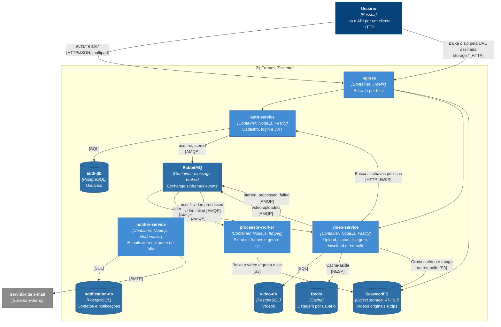

# C4 nível 2: containers

As aplicações e os armazenamentos que formam o ZipFrames, com a tecnologia de cada um e como eles conversam.

Não há interface web. O usuário usa a API com qualquer cliente HTTP (curl, a Swagger UI em `/docs` dos dois serviços HTTP, ou um front-end futuro).

O Ingress separa por host: `auth.zipframes.localhost` vai para o auth-service, `api.zipframes.localhost` para o video-service e `storage.zipframes.localhost` para o SeaweedFS. O storage só é exposto para o download: o video-service assina a URL do zip com esse host público, e o navegador baixa o arquivo direto do storage, sem passar pelo serviço. O upload, ao contrário, passa pelo video-service, que grava o arquivo em stream.

Nenhum serviço lê o banco de outro. O que um contexto precisa saber do outro chega por evento: o notifier-service mantém uma cópia própria dos contatos a partir de `user.registered`, por exemplo.

## Containers

| Container                          | Tecnologia                              | Responsabilidade                     | Escala                    |
| ---------------------------------- | --------------------------------------- | ------------------------------------ | ------------------------- |
| Ingress                            | Traefik                                 | Roteamento por host                  | Uma réplica no kind       |
| auth-service                       | Node.js, TypeScript, Fastify, Prisma    | Identidade e emissão de tokens       | HPA por CPU (1 a 3)       |
| video-service                      | Node.js, TypeScript, Fastify, Prisma    | Ciclo de vida do vídeo               | HPA por CPU (1 a 3)       |
| processor-worker                   | Node.js, TypeScript, ffmpeg             | Processamento                        | KEDA pela fila (1 a 5)    |
| notifier-service                   | Node.js, TypeScript, Nodemailer, Prisma | Notificações por e-mail              | Réplica fixa              |
| RabbitMQ                           | RabbitMQ Cluster Operator               | Transporte dos eventos               | Uma réplica no kind       |
| auth-db, video-db, notification-db | PostgreSQL com CloudNativePG            | Um banco por serviço                 | Uma instância por cluster |
| Redis                              | Redis                                   | Cache da primeira página da listagem | Instância única           |
| SeaweedFS                          | SeaweedFS com gateway S3                | Vídeos originais e zips              | Instância única           |

## Fora do diagrama

O cluster também roda o que sustenta os containers acima, mas não participa do fluxo de negócio: os operators (CloudNativePG, RabbitMQ Cluster Operator e cert-manager), o KEDA, o metrics-server que alimenta os HPAs e o Argo CD. Como tudo isso sobe está em [infra/kind/README.md](../../../infra/kind/README.md).

Os serviços HTTP expõem `GET /metrics` no formato Prometheus, mas o cluster ainda não tem Prometheus nem Grafana coletando essas métricas.
