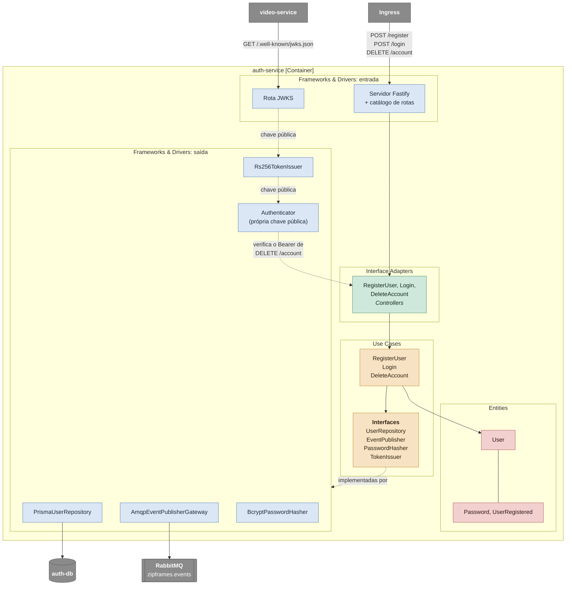

# C4 nível 3: componentes do auth-service

O auth-service por dentro: o cadastro, o login e a publicação da chave pública. Os nomes nas caixas são os nomes das classes no código. As decisões por trás deste desenho estão em [auth-service.md](../services/auth-service.md).

A rota JWKS não tem controller nem caso de uso: ela só publica a parte pública da chave que o `Rs256TokenIssuer` usa para assinar. Quem valida o token é cada serviço que o recebe, com essa chave — inclusive o próprio auth-service: `DELETE /account` exige um Bearer válido, e como o processo já tem a própria chave pública em memória, ele verifica localmente em vez de chamar a própria rota JWKS pela rede.

## Componentes

| Camada               | Componente                   | Responsabilidade                                                                                                             |
| -------------------- | ---------------------------- | ---------------------------------------------------------------------------------------------------------------------------- |
| Entities             | `User`                       | Valida nome e e-mail na criação e gera o próprio id                                                                          |
| Entities             | `Password`, `UserRegistered` | Regra de senha (mínimo de 8 caracteres e máximo de 72 bytes, o limite do bcrypt, com letra e dígito) e o fato de um cadastro |
| Use Cases            | `RegisterUser`               | Valida, recusa e-mail repetido, gera o hash, grava o usuário e publica `user.registered`                                     |
| Use Cases            | `Login`                      | Confere e-mail e senha e emite o token; qualquer falha é a mesma resposta 401                                                |
| Use Cases            | `DeleteAccount`              | Apaga o usuário e publica `user.deleted`; um id que já não existe não é erro                                                 |
| Interface Adapters   | `RegisterUser`, `Login`      | `defineHandler`: validam o corpo, chamam o caso de uso e traduzem o `Result` em resposta HTTP                                |
| Interface Adapters   | `DeleteAccount`              | `defineAuthenticatedHandler`: verifica o Bearer, chama o caso de uso com o `sub` do token e responde 204                     |
| Frameworks & Drivers | `PrismaUserRepository`       | Insere, busca e apaga usuários na tabela `users`                                                                             |
| Frameworks & Drivers | `AmqpEventPublisherGateway`  | Monta o envelope e publica no exchange `zipframes.events` com confirmação do broker                                          |
| Frameworks & Drivers | `BcryptPasswordHasher`       | Hash e comparação de senha                                                                                                   |
| Frameworks & Drivers | `Rs256TokenIssuer`           | Assina o JWT com a chave privada RSA e expõe a chave pública para o JWKS                                                     |
| Frameworks & Drivers | `Authenticator`              | Verifica o Bearer de `DELETE /account` contra a própria chave pública, sem round-trip HTTP                                   |
