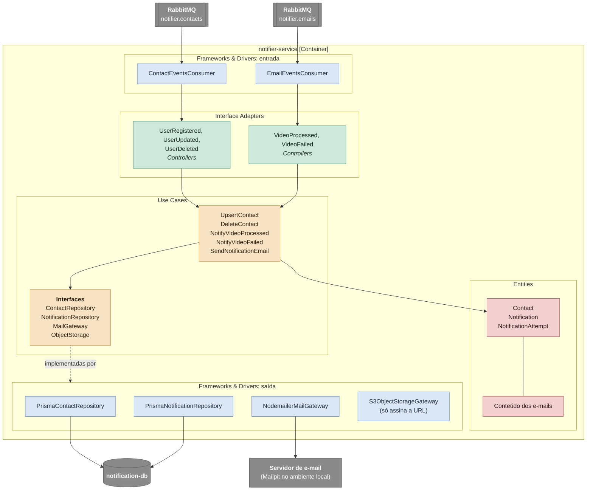

# C4 nível 3: componentes do notifier-service

O notifier-service por dentro: duas filas, uma para manter a cópia local dos contatos e outra para enviar os e-mails de resultado. Os nomes nas caixas são os nomes das classes no código. As decisões por trás deste desenho estão em [notifier-service.md](../services/notifier-service.md).

Cada consumer lê o `eventType` da mensagem e entrega ao controller daquele evento, que valida o envelope com o schema certo. Um evento que a fila não espera vai para a DLQ.

O `S3ObjectStorageGateway` não fala com o storage: ele assina a URL de download do zip com o endpoint público, um cálculo local. Quem baixa o arquivo é o usuário, pelo link do e-mail.

## Componentes

| Camada               | Componente                                                | Responsabilidade                                                                                          |
| -------------------- | --------------------------------------------------------- | --------------------------------------------------------------------------------------------------------- |
| Entities             | `Contact`                                                 | Nome e e-mail do usuário, copiados dos eventos de identidade                                              |
| Entities             | `Notification`, `NotificationAttempt`                     | Um e-mail por vídeo e por tipo, com o status (`PENDING`, `SENT`, `FAILED`) e cada tentativa de envio SMTP |
| Use Cases            | `UpsertContact`, `DeleteContact`                          | Mantêm a cópia do contato; ao gravar um contato, enviam os e-mails que esperavam por ele                  |
| Use Cases            | `NotifyVideoProcessed`, `NotifyVideoFailed`               | Criam a notificação do vídeo (uma por tipo) e pedem o envio                                               |
| Use Cases            | `SendNotificationEmail`                                   | Envia pelo SMTP com até 3 tentativas; sem contato, deixa a notificação `PENDING`                          |
| Interface Adapters   | Controllers                                               | `defineMessageHandler`: um por evento, validam o envelope e chamam o caso de uso                          |
| Frameworks & Drivers | `PrismaContactRepository`, `PrismaNotificationRepository` | Tabelas `contacts`, `notifications` e `notification_attempts`                                             |
| Frameworks & Drivers | `NodemailerMailGateway`                                   | Envio SMTP                                                                                                |
| Frameworks & Drivers | `S3ObjectStorageGateway`                                  | Assina a URL GET do zip, válida por 24 horas                                                              |
