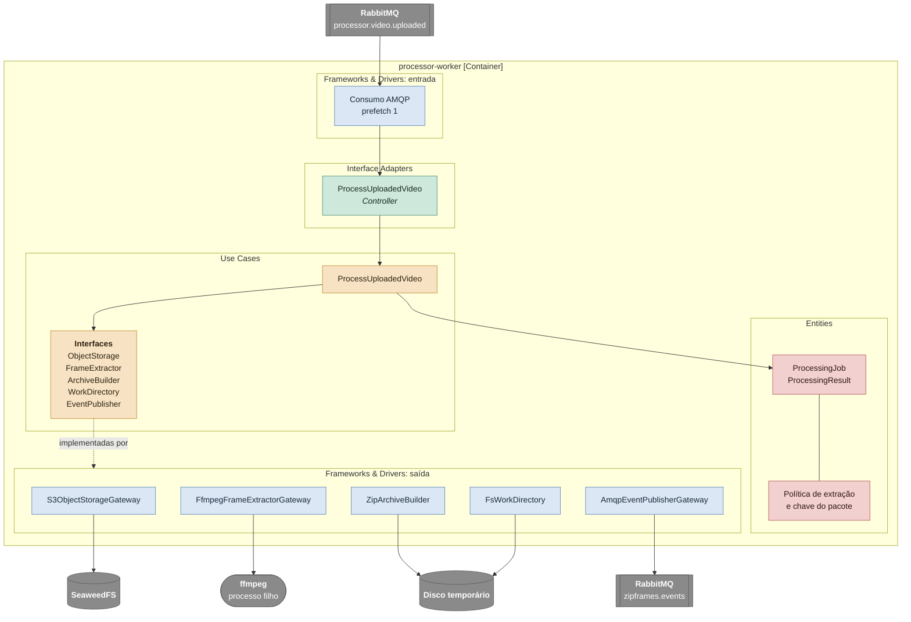

# C4 nível 3: componentes do processor-worker

O processor-worker por dentro: o caminho de uma mensagem `video.uploaded` até o zip gravado e o evento de resultado publicado. Os nomes nas caixas são os nomes das classes no código. As decisões por trás deste desenho estão em [processor-worker.md](../services/processor-worker.md).

O worker não tem banco. Tudo o que ele precisa vem da mensagem (id do vídeo, dono e chave do original), do storage e de um diretório temporário criado para cada tentativa e apagado no fim, com sucesso ou não.

## Componentes

| Camada               | Componente                             | Responsabilidade                                                                                                    |
| -------------------- | -------------------------------------- | ------------------------------------------------------------------------------------------------------------------- |
| Entities             | `ProcessingJob`, `ProcessingResult`    | O trabalho recebido e o desfecho: pacote gerado ou mídia rejeitada                                                  |
| Entities             | Políticas                              | Um frame por segundo em PNG e a chave do zip, `outputs/{ownerId}/{videoId}.zip`                                     |
| Use Cases            | `ProcessUploadedVideo`                 | Publica `started`, baixa o original, extrai os frames, monta o zip, grava no storage e publica o resultado          |
| Interface Adapters   | `ProcessUploadedVideoController`       | `defineMessageHandler`: valida o envelope, chama o caso de uso e publica `video.failed` quando as tentativas acabam |
| Frameworks & Drivers | `S3ObjectStorageGateway`               | Download do original, upload do zip e remoção do original                                                           |
| Frameworks & Drivers | `FfmpegFrameExtractorGateway`          | Roda o `ffmpeg` com prazo, e o cancela se o prazo estourar                                                          |
| Frameworks & Drivers | `ZipArchiveBuilder`, `FsWorkDirectory` | Monta o zip sem recomprimir os PNGs e cuida do diretório da tentativa                                               |
| Frameworks & Drivers | `AmqpEventPublisherGateway`            | Publica `started`, `processed` e `failed` em `zipframes.events`                                                     |

O consumo usa prefetch 1: cada réplica processa um vídeo por vez, e o KEDA sobe réplicas pelo tamanho da fila.
