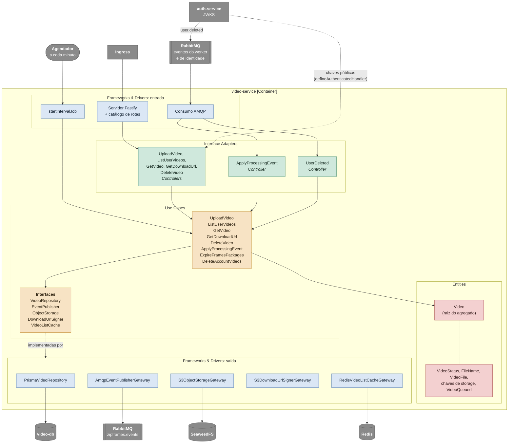

# C4 nível 3: componentes do video-service

O video-service por dentro: o caminho de uma requisição HTTP, de um evento do worker e da varredura de retenção. Os nomes nas caixas são os nomes das classes no código. As decisões por trás deste desenho estão em [video-service.md](../services/video-service.md).

O diagrama segue o caminho em tempo de execução: entra pelos frameworks (HTTP, fila ou relógio), passa pelos controllers, chega aos casos de uso e às entidades, e sai pelas interfaces que o caso de uso declara até as classes que as implementam. O RabbitMQ aparece duas vezes apenas para separar consumo e publicação. O agendador da expiração chama o caso de uso direto: não há controller, porque não há entrada externa a validar.

A idempotência do consumo vem da máquina de estados do `Video`: um evento repetido ou atrasado encontra o vídeo num estado que não aceita aquela transição e é descartado. Por isso o serviço dispensa uma tabela de eventos processados (detalhes em [modelagem de dados](../../data/modelagem-de-dados.md)). O domínio gera o id do vídeo e o caso de uso lê o relógio direto; os testes controlam o tempo com os fake timers do Vitest.

`DeleteAccountVideos` é idempotente de outro jeito: um `user.deleted` repetido encontra os vídeos já apagados, e apagar um objeto ou uma linha que já não existe é inofensivo.

## Componentes

| Camada               | Componente                                             | Responsabilidade                                                                                                                                |
| -------------------- | ------------------------------------------------------ | ----------------------------------------------------------------------------------------------------------------------------------------------- |
| Entities             | `Video`                                                | Mantém o estado do vídeo e aplica as regras de transição, de retenção e de download                                                             |
| Entities             | `FileName`, `VideoFile`, `VideoStatus`, chaves         | Validam o nome e a extensão, enumeram os status e derivam `sourceKey` e `resultKey`                                                             |
| Use Cases            | `UploadVideo`                                          | Valida nome e tipo, grava o arquivo em stream, valida o tamanho, grava `QUEUED` e publica `video.uploaded`; se o broker recusar, marca `FAILED` |
| Use Cases            | `ListUserVideos` e `GetVideo`                          | Consultam os vídeos do dono; a listagem usa o cache na primeira página                                                                          |
| Use Cases            | `GetDownloadUrl`                                       | Verifica se o pacote está disponível e devolve a URL do zip                                                                                     |
| Use Cases            | `DeleteVideo`                                          | Apaga os arquivos e marca o vídeo `DELETED`                                                                                                     |
| Use Cases            | `ApplyProcessingEvent`                                 | Aplica os eventos do worker de forma idempotente e invalida o cache                                                                             |
| Use Cases            | `ExpireFramesPackages`                                 | Apaga os pacotes vencidos e marca os vídeos `EXPIRED`                                                                                           |
| Use Cases            | `DeleteAccountVideos`                                  | Ao consumir `user.deleted`, apaga todos os vídeos e arquivos do dono, em qualquer status                                                        |
| Use Cases            | Interfaces                                             | Declaradas pelos casos de uso em `application/interfaces/`                                                                                      |
| Interface Adapters   | Controllers HTTP                                       | `defineAuthenticatedHandler`: validam o token (JWKS), a entrada e traduzem o `Result` em resposta                                               |
| Interface Adapters   | `ApplyProcessingEventController`                       | `defineMessageHandler`: valida o envelope contra os três eventos do worker e chama o caso de uso                                                |
| Interface Adapters   | `UserDeletedController`                                | `defineMessageHandler`: valida o envelope de `user.deleted` e chama `DeleteAccountVideos`                                                       |
| Frameworks & Drivers | `PrismaVideoRepository`                                | Um `save` que insere (versão 1) ou atualiza com lock otimista (`UPDATE ... WHERE version = $1`)                                                 |
| Frameworks & Drivers | `AmqpEventPublisherGateway`                            | Monta o envelope e publica no exchange `zipframes.events` com confirmação do broker                                                             |
| Frameworks & Drivers | `S3ObjectStorageGateway`, `S3DownloadUrlSignerGateway` | Upload multipart em stream e exclusão de objetos; assinatura da URL de download com o endpoint público                                          |
| Frameworks & Drivers | `RedisVideoListCacheGateway`                           | Cache-aside que degrada para miss quando o Redis cai                                                                                            |

O composition root (`main/`) não aparece no diagrama: ele lê a configuração, abre os clientes uma vez e os injeta pelas factories nos casos de uso e controllers.
