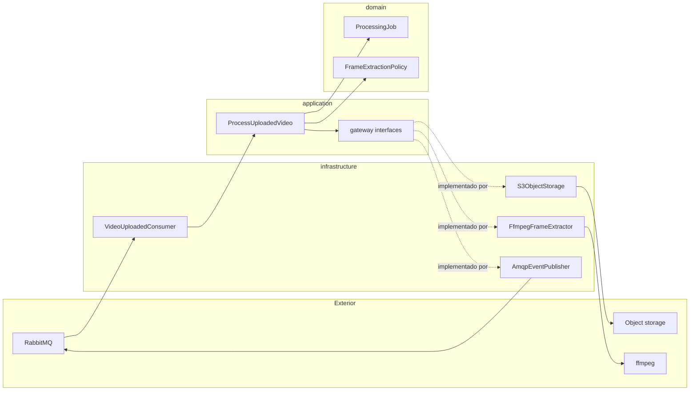

# Arquitetura: processor-worker

Clean Architecture (Uncle Bob) aplicada ao contexto de **Processamento** do ZipFrames.

Referências de domínio: [dominio.md — Processamento](../../domain/dominio.md), [AsyncAPI](../../asyncapi/events.yaml), [modelagem de dados](../../data/modelagem-de-dados.md) (_“O processor-worker não tem banco”_).

## Objetivo do serviço

Consumir `video.uploaded`, extrair frames (1 fps, PNG), empacotar em zip (store), gravar o resultado no object storage e publicar `video.processing.started` / `video.processed` / `video.failed`. Stateless: sem Postgres; estado vem da mensagem, do storage e do disco temporário da tentativa.

## Camadas (Uncle Bob)

As dependências de código apontam **sempre para dentro**.

```
Frameworks & Drivers  →  Interface Adapters  →  Use Cases  →  Entities
        (mais externo)                                      (mais interno)
```

No código do serviço essas camadas se organizam em pastas assim:

| Camada Clean Arch                         | Pasta                 | Conteúdo                                                             |
| ----------------------------------------- | --------------------- | -------------------------------------------------------------------- |
| Entities                                  | `src/domain/`         | Conceitos e regras do Processamento                                  |
| Use Cases                                 | `src/application/`    | Casos de uso e **interfaces de gateway**                             |
| Interface Adapters + Frameworks & Drivers | `src/infrastructure/` | Consumers, implementações de gateway, clientes (amqplib, S3, ffmpeg) |
| Composition root                          | `src/main/`           | Wiring na inicialização                                              |

`infrastructure/` agrupa as duas camadas externas (Interface Adapters e Frameworks & Drivers) numa pasta só, sem misturar Use Cases com detalhes de entrega.

### Por que “gateway” e não “adapter”?

Neste serviço seguimos o vocabulário da Clean Architecture:

- **Gateway** — limite de _saída_ que o use case exige do mundo externo (storage, extração de frames, arquivo zip, publicação de eventos). A **interface** do gateway vive em `application/`; a **implementação** vive em `infrastructure/`.
- **Controller / Consumer** — Interface Adapter de _entrada_: traduz a mensagem do broker em chamada ao use case e cuida de ack / retry / DLQ.
- **Frameworks & Drivers** — bibliotecas e processos concretos (amqplib, `@aws-sdk`, spawn do ffmpeg, filesystem), usados só por `infrastructure/` e montados em `main/`.

“Adapter” (hexagonal) descreve a mesma ideia de implementação de porta; aqui preferimos **gateway** para deixar explícito o alinhamento com Uncle Bob.

## Mapa de pastas (alvo)

```
services/processor-worker/src/
├── domain/
│   ├── processing-job.ts          # ProcessingJob
│   ├── frame-extraction-policy.ts # fps, PNG, frame_0001…
│   ├── frames-package.ts          # chave outputs/{ownerId}/{videoId}.zip
│   └── errors.ts                  # FailureKind permanent | transient
│
├── application/
│   ├── use-cases/
│   │   └── process-uploaded-video.ts
│   └── gateways/                  # só interfaces (ports de saída)
│       ├── object-storage.ts
│       ├── frame-extractor.ts
│       ├── archive-builder.ts
│       ├── event-publisher.ts
│       └── work-directory.ts
│
├── infrastructure/
│   ├── messaging/
│   │   ├── video-uploaded-consumer.ts   # entrada: schema → use case → settle
│   │   └── rabbitmq-connection.ts       # driver AMQP
│   ├── gateways/
│   │   ├── s3-object-storage.ts
│   │   ├── ffmpeg-frame-extractor.ts
│   │   ├── zip-archive-builder.ts
│   │   ├── amqp-event-publisher.ts
│   │   └── fs-work-directory.ts
│   └── config.ts
│
└── main/
    ├── compose.ts
    └── index.ts
```

## Componentes por camada

### Entities (`domain/`)

| Conceito                          | Responsabilidade                                                                   |
| --------------------------------- | ---------------------------------------------------------------------------------- |
| `ProcessingJob`                   | Unidade de trabalho: `videoId`, `ownerId`, `sourceKey`, tentativa, `correlationId` |
| `FrameExtractionPolicy`           | 1 frame/s, PNG, nomes `frame_0001.png`…                                            |
| `FramesPackage`                   | Chave determinística do zip; sem recompressão (store)                              |
| `ProcessingError` / `FailureKind` | Permanente (falha imediata + `video.failed`) vs transitória (retry)                |

Sem import de AMQP, S3, ffmpeg ou `@zipframes/communication`.

### Use Cases (`application/`)

| Caso de uso            | Orquestra                                                                                                                                                                                |
| ---------------------- | ---------------------------------------------------------------------------------------------------------------------------------------------------------------------------------------- |
| `ProcessUploadedVideo` | Publica `started` → download → extract → zip → upload → `processed` → apaga original; em falha permanente publica `failed` e apaga original; em transitória propaga erro para o consumer |

Depende apenas de `domain/` e das **interfaces** em `application/gateways/`. Não importa `infrastructure/`.

### Gateways (interfaces em `application/gateways/`)

| Gateway          | Operações                                                 |
| ---------------- | --------------------------------------------------------- |
| `ObjectStorage`  | `downloadToFile`, `uploadFile`, `deleteObject`            |
| `FrameExtractor` | `extract(input, outputDir) → paths`                       |
| `ArchiveBuilder` | `createZip(files, outputPath)`                            |
| `EventPublisher` | `publish(envelope, routingKey)` (ou contrato equivalente) |
| `WorkDirectory`  | `createTempDir`, `removeDir`                              |

Opcional: `Clock` / `IdGenerator` como gateways se quiser evitar `Date`/`randomUUID` direto no use case (facilita teste).

### Interface Adapters de entrada (`infrastructure/messaging/`)

| Componente              | Responsabilidade                                                                                                                                                     |
| ----------------------- | -------------------------------------------------------------------------------------------------------------------------------------------------------------------- |
| `VideoUploadedConsumer` | Valida envelope (`@zipframes/schemas`), monta `ProcessingJob`, chama o use case, aplica ack / retry / DLQ e, na última tentativa transitória, publica `video.failed` |

Não contém a política de frames nem a chave do zip — isso fica no domínio / use case.

### Implementações de gateway (`infrastructure/gateways/`)

| Implementação          | Driver                                  |
| ---------------------- | --------------------------------------- |
| `S3ObjectStorage`      | `@aws-sdk/client-s3` (SeaweedFS)        |
| `FfmpegFrameExtractor` | processo `ffmpeg`                       |
| `ZipArchiveBuilder`    | `archiver` (store)                      |
| `AmqpEventPublisher`   | canal AMQP / `@zipframes/communication` |
| `FsWorkDirectory`      | `node:fs` sob `WORK_DIR`                |

### Composition root (`main/`)

Lê config, cria drivers e implementações de gateway, instancia o use case, liga o consumer à fila `processor.video.uploaded`, inicia o loop de consumo.

## Fluxo de uma mensagem



## Eventos

| Direção | Evento                     | Papel                                             |
| ------- | -------------------------- | ------------------------------------------------- |
| In      | `video.uploaded`           | Dispara o job                                     |
| Out     | `video.processing.started` | Início da tentativa                               |
| Out     | `video.processed`          | Sucesso (`resultKey`, `frameCount`, `durationMs`) |
| Out     | `video.failed`             | Falha permanente ou esgotamento de tentativas     |

Exchange: `zipframes.events`. Fila do worker: `processor.video.uploaded`.

## Regras de dependência (verificação)

Esperado no dependency-cruiser (quando o serviço for alinhado a este doc):

- `domain/` → não importa `application/`, `infrastructure/`, `main/`, nem libs de infra
- `application/` → só `domain/` e pacotes `@zipframes/*` de domínio/contratos; **não** importa `infrastructure/`
- `infrastructure/` → pode importar `application/` e `domain/` (implementa gateways e chama use cases)
- `main/` → monta o grafo

Pacotes `@zipframes/communication`, `@zipframes/schemas`, `@zipframes/logger` entram pela borda (`infrastructure/` / `main/`), não pelo `domain/`.

## Fora de escopo deste serviço

- Banco de dados e migrations
- HTTP / JWT / JWKS
- Decisão de status do vídeo no agregado `Video` (isso é video-service)
- Envio de e-mail (notification-service consome `video.failed`)

## Relação com o código atual

O PR inicial do worker usou `adapters/` + `frameworks/` no estilo do [layers.md](../layers.md) do monorepo. Este documento define o **alvo** com pastas `domain` / `application` / `infrastructure` / `main` e vocabulário **gateway**. A refatoração do código deve convergir para o mapa de pastas acima sem mudar o comportamento de domínio.
