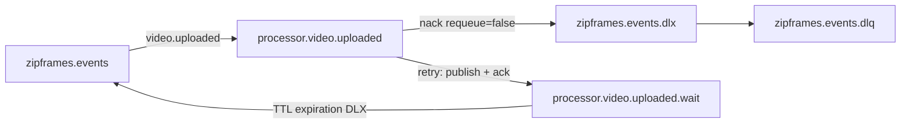

# Arquitetura: processor-worker

Arquitetura do contexto de **Processamento** do ZipFrames. A Clean Architecture é a base; o mapa de pastas está em [layers.md](../layers.md).

Referências: [dominio.md — Processamento](../../domain/dominio.md), [HTTP e OpenAPI gerado](../http.md), [AsyncAPI](../../asyncapi/events.yaml), [modelagem de dados](../../data/modelagem-de-dados.md), [regras de camadas](../layers.md).

## Objetivo do serviço

Consumir `video.uploaded`, extrair frames (1 fps, PNG), empacotar em zip (store), gravar o resultado no object storage e publicar `video.processing.started` / `video.processed` / `video.failed`. Stateless: sem Postgres; estado vem da mensagem, do storage e do disco temporário da tentativa.

## Camadas

As dependências apontam para dentro. `application/` junta o que o livro separa: casos de uso e interface adapters. O caso de uso fica em `application/useCases/` e a interface que ele declara fica em `application/interfaces/`; a classe que implementa essa interface fica em `infrastructure/`. O raciocínio dessa decisão está em [layers.md](../layers.md).

O consumer em `infrastructure/messaging` lê `video.uploaded` e chama `ProcessUploadedVideoController`. O controller entrega o envelope já decodificado a `ProcessUploadedVideoUseCase`. O caso de uso chama `ObjectStorage`, `FrameExtractor` e `EventPublisher` (`application/interfaces/gateways/`) e `ArchiveBuilder` e `WorkDirectory` (`application/interfaces/services/`). `main/compose.ts` cria as implementações — storage S3, ffmpeg, publisher AMQP, zip e o diretório temporário — e as entrega ao caso de uso. O consumer confirma, agenda nova tentativa ou envia à dead-letter a partir do desfecho. O caso de uso não importa o SDK da AWS, o ffmpeg nem o cliente AMQP.

```
infrastructure  →  application  →  domain
```

| Pasta                 | Neste projeto                     | Conteúdo                                                                  |
| --------------------- | --------------------------------- | ------------------------------------------------------------------------- |
| `src/domain/`         | Entidades                         | Value objects, policies e erros (`ProcessingError` com `retryable`)       |
| `src/application/`    | Casos de uso e interface adapters | `ProcessUploadedVideoUseCase`, controller da mensagem, tipos e interfaces |
| `src/infrastructure/` | Implementação e frameworks        | Consumer AMQP, S3/ffmpeg, zip/fs, health HTTP no Fastify                  |
| `src/main/`           | Composition root                  | Wiring na inicialização                                                   |

### Gateway e service

| Categoria   | Neste serviço                                                                    |
| ----------- | -------------------------------------------------------------------------------- |
| `gateways/` | `ObjectStorage`, `EventPublisher`, `FrameExtractor` (o trabalho sai do processo) |
| `services/` | `ArchiveBuilder`, `WorkDirectory` (capacidade local, no mesmo processo)          |

`ObjectStorage` não inclui `ping`: readiness usa `Pingable` à parte (`createReadinessCheck`).

## Mapa de pastas

```
processor-worker/src/
├── domain/
│   ├── valueObjects/{processingJob,processingResult}.ts
│   ├── errors/processingError.ts
│   ├── policies/{frameExtractionPolicy,framesPackage}.ts
│   └── index.ts
├── application/
│   ├── controllers/ProcessUploadedVideoController.ts
│   ├── useCases/processUploadedVideo/
│   │   ├── ProcessUploadedVideoUseCase.ts
│   │   └── processUploadedVideo.types.ts
│   └── interfaces/
│       ├── gateways/{ObjectStorage,EventPublisher,FrameExtractor}.ts
│       └── services/{ArchiveBuilder,WorkDirectory}.ts
├── infrastructure/
│   ├── http/health.routes.ts
│   ├── gateways/
│   │   ├── storage/s3ObjectStorage.gateway.ts
│   │   ├── media/ffmpegFrameExtractor.gateway.ts
│   │   └── amqpEventPublisher.gateway.ts
│   ├── services/
│   │   ├── media/zipArchiveBuilder.service.ts
│   │   └── filesystem/fsWorkDirectory.service.ts
│   ├── messaging/{rabbitmqConnection,topology,videoUploadedConsumer}.ts
│   ├── observability/jobMetrics.ts
│   └── config.ts
└── main/{compose.ts,index.ts}
```

## Casos de uso

| Caso de uso                   | Orquestra                                                                                                                                            |
| ----------------------------- | ---------------------------------------------------------------------------------------------------------------------------------------------------- |
| `ProcessUploadedVideoUseCase` | Publica `started` → baixa original → extrai frames → zip → grava pacote → `processed`; mídia rejeitada publica `failed`; falha transitória é lançada |

Timeout: `AbortController` cancela download/ffmpeg; o diretório temporário é removido no `finally`.

Falhas usam `throw` com `retryable` (alinhado a `InfrastructureError` em `@zipframes/core`), não `Result`.

Payloads de eventos de saída tipados com `@zipframes/schemas/processor-worker`.

## Topologia AMQP (retry real)



| Destino settle | Comportamento                                                                              |
| -------------- | ------------------------------------------------------------------------------------------ |
| `ack`          | Confirma a mensagem                                                                        |
| `retry`        | Publica na fila **wait** com `expiration` (backoff) + header `x-attempt` + ack da original |
| `dlq`          | `nack(requeue=false)` → DLX → `zipframes.events.dlq`                                       |

## Contratos de falha

| Caso                        | Evento            | Settle                       |
| --------------------------- | ----------------- | ---------------------------- |
| Sucesso (`frames_packaged`) | `video.processed` | ack                          |
| Mídia rejeitada             | `video.failed`    | ack                          |
| Transitória, attempts < max | —                 | retry (wait queue + backoff) |
| Transitória, attempt = max  | `video.failed`    | dlq                          |
| Envelope poison             | —                 | dlq                          |

## Observabilidade e operação

- Logs estruturados com `correlationId` via ALS.
- Métricas Prometheus via `@zipframes/telemetry`.
- HTTP no Fastify, na porta `HEALTH_PORT` (padrão 8081): `GET /health/live`, `GET /health/ready` (AMQP + storage), `GET /metrics`, `GET /docs` e `GET /docs/json`. O contrato está em [http.md](../http.md).

## Processo

Um processo consome `processor.video.uploaded` com prefetch 1. `SIGINT`/`SIGTERM` cancelam o consume, drenam o job em andamento e fecham o canal.

Réplicas: KEDA pelo tamanho da fila. No cluster, Argo CD aplica [`infra/k8s/processor-worker`](../../../infra/k8s/processor-worker). Na máquina, Docker Compose na rede `zipframes`.

## Testes

| Pasta               | O que prova                                              |
| ------------------- | -------------------------------------------------------- |
| `tests/unit`        | Regras e contratos com dependências substituídas         |
| `tests/integration` | Um fluxo de `video.uploaded` contra RabbitMQ e SeaweedFS |

Cobertura mínima no `src/` executável: 80%.

## Fora de escopo deste serviço

- Banco de dados e migrations
- HTTP de negócio / JWT / JWKS (apenas health/metrics)
- Decisão de status do vídeo no agregado `Video` (video-service)
- Envio de e-mail (notification-service consome `video.failed`)
