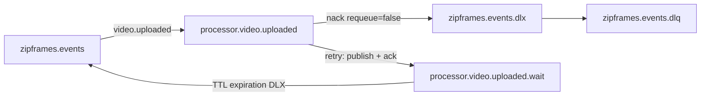

# Arquitetura: processor-worker

Clean Architecture (Uncle Bob) aplicada ao contexto de **Processamento** do ZipFrames.

Referências de domínio: [dominio.md — Processamento](../../domain/dominio.md), [AsyncAPI](../../asyncapi/events.yaml), [modelagem de dados](../../data/modelagem-de-dados.md) (_“O processor-worker não tem banco”_).

## Objetivo do serviço

Consumir `video.uploaded`, extrair frames (1 fps, PNG), empacotar em zip (store), gravar o resultado no object storage e publicar `video.processing.started` / `video.processed` / `video.failed`. Stateless: sem Postgres; estado vem da mensagem, do storage e do disco temporário da tentativa.

## Camadas (Uncle Bob)

As dependências de código apontam **sempre para dentro**.

```
Frameworks & Drivers  →  Interface Adapters  →  Use Cases  →  Entities
        (mais externo)                                      (mais interno)
```

No código do serviço essas camadas se organizam em pastas assim:

| Camada Clean Arch                         | Pasta                 | Conteúdo                                                             |
| ----------------------------------------- | --------------------- | -------------------------------------------------------------------- |
| Entities                                  | `src/domain/`         | Conceitos e regras do Processamento                                  |
| Use Cases                                 | `src/application/`    | Casos de uso e **interfaces de gateway**                             |
| Interface Adapters + Frameworks & Drivers | `src/infrastructure/` | Consumers, implementações de gateway, clientes (amqplib, S3, ffmpeg) |
| Composition root                          | `src/main/`           | Wiring na inicialização                                              |

`infrastructure/` agrupa as duas camadas externas (Interface Adapters e Frameworks & Drivers) numa pasta só, sem misturar Use Cases com detalhes de entrega.

### Por que “gateway” e não “adapter”?

Neste serviço seguimos o vocabulário da Clean Architecture:

- **Gateway** — limite de _saída_ que o use case exige do mundo externo (storage, extração de frames, arquivo zip, publicação de eventos). A **interface** do gateway vive em `application/`; a **implementação** vive em `infrastructure/`.
- **Controller / Consumer** — Interface Adapter de _entrada_: traduz a mensagem do broker em chamada ao use case e cuida de ack / retry / DLQ.
- **Frameworks & Drivers** — bibliotecas e processos concretos (amqplib, `@aws-sdk`, spawn do ffmpeg, filesystem), usados só por `infrastructure/` e montados em `main/`.

“Adapter” (hexagonal) descreve a mesma ideia de implementação de porta; aqui preferimos **gateway** para deixar explícito o alinhamento com Uncle Bob.

## Mapa de pastas

```
services/processor-worker/src/
├── domain/
│   ├── processing-job.ts
│   ├── frame-extraction-policy.ts
│   ├── frames-package.ts
│   └── errors.ts
│
├── application/
│   ├── use-cases/
│   │   └── process-uploaded-video.ts
│   └── gateways/
│       ├── object-storage.ts
│       ├── frame-extractor.ts
│       ├── archive-builder.ts
│       ├── event-publisher.ts
│       └── work-directory.ts
│
├── infrastructure/
│   ├── messaging/
│   │   ├── topology.ts                  # filas main / wait / DLQ
│   │   ├── amqp-settle.ts               # retry ≠ DLQ (TTL wait queue)
│   │   ├── video-uploaded-consumer.ts
│   │   └── rabbitmq-connection.ts
│   ├── gateways/
│   ├── http/
│   │   └── health.ts                    # /livez /readyz + /metrics
│   ├── observability/
│   │   └── job-metrics.ts
│   └── config.ts
│
└── main/
    ├── compose.ts
    └── index.ts
```

## Componentes por camada

### Entities (`domain/`)

| Conceito                          | Responsabilidade                                                                   |
| --------------------------------- | ---------------------------------------------------------------------------------- |
| `ProcessingJob`                   | Unidade de trabalho: `videoId`, `ownerId`, `sourceKey`, tentativa, `correlationId` |
| `FrameExtractionPolicy`           | 1 frame/s, PNG, nomes `frame_0001.png`…                                            |
| `FramesPackage`                   | Chave determinística do zip; sem recompressão (store)                              |
| `ProcessingError` / `FailureKind` | Permanente (falha imediata + `video.failed`) vs transitória (retry)                |

### Use Cases (`application/`)

| Caso de uso            | Orquestra                                                                                                                                                                                              |
| ---------------------- | ------------------------------------------------------------------------------------------------------------------------------------------------------------------------------------------------------ |
| `ProcessUploadedVideo` | Publica `started` → download → extract → zip → upload → `processed` → apaga original; em falha **permanente** publica `failed` e retorna `permanent_failure`; em **transitória** lança para o consumer |

Timeout: `AbortController` cancela download/ffmpeg; o diretório temporário é removido no `finally`.

Ownership de falha:

- **Use case** — falhas permanentes (`video.failed` + outcome).
- **Consumer** — só esgotamento de tentativas transitórias (`video.failed` + DLQ).

### Gateways (interfaces em `application/gateways/`)

| Gateway          | Operações                                                                      |
| ---------------- | ------------------------------------------------------------------------------ |
| `ObjectStorage`  | `downloadToFile`, `uploadFile`, `deleteObject`, `ping` (streams + AbortSignal) |
| `FrameExtractor` | `extract(input, outputDir, signal?) → paths`                                   |
| `ArchiveBuilder` | `createZip(files, outputPath)`                                                 |
| `EventPublisher` | `publish(started \| processed \| failed)` tipado                               |
| `WorkDirectory`  | `createTempDir`, `removeDir`                                                   |

### Interface Adapters de entrada (`infrastructure/messaging/`)

| Componente              | Responsabilidade                                                                                          |
| ----------------------- | --------------------------------------------------------------------------------------------------------- |
| `VideoUploadedConsumer` | Valida envelope, `runWithCorrelationId`, chama use case, settle (ack / retry / DLQ), métricas e logs JSON |

Envelope inválido (poison) → DLQ **sem** `video.failed`.

### Composition root (`main/`)

Lê config, cria drivers, asserta topologia, inicia consume, sobe health/metrics HTTP, shutdown graceful (cancela consume, drena in-flight, fecha canal).

## Topologia AMQP (retry real)



| Destino settle | Comportamento                                                                                                   |
| -------------- | --------------------------------------------------------------------------------------------------------------- |
| `ack`          | Confirma a mensagem                                                                                             |
| `retry`        | Publica na fila **wait** com `expiration` (backoff) + header `x-attempt` + ack da original — **não** é nack→DLQ |
| `dlq`          | `nack(requeue=false)` → DLX da fila principal → `zipframes.events.dlq`                                          |

Config: `MAX_ATTEMPTS`, `RETRY_BASE_DELAY_MS`, `RETRY_MAX_DELAY_MS`.

## Contratos de falha

| Caso                         | Evento            | Settle                       |
| ---------------------------- | ----------------- | ---------------------------- |
| Sucesso                      | `video.processed` | ack                          |
| Permanente (mídia inválida…) | `video.failed`    | ack                          |
| Transitória, attempts < max  | —                 | retry (wait queue + backoff) |
| Transitória, attempt = max   | `video.failed`    | dlq                          |
| Envelope poison              | —                 | dlq                          |

## Eventos

| Direção | Evento                     | Papel                                             |
| ------- | -------------------------- | ------------------------------------------------- |
| In      | `video.uploaded`           | Dispara o job                                     |
| Out     | `video.processing.started` | Início da tentativa                               |
| Out     | `video.processed`          | Sucesso (`resultKey`, `frameCount`, `durationMs`) |
| Out     | `video.failed`             | Falha permanente ou esgotamento de tentativas     |

## Observabilidade e operação

- Logs estruturados: `videoId`, `ownerId`, `attempt`, `errorCode`, `kind`, `durationMs`, `outcome` (com `correlationId` via ALS).
- Métricas Prometheus (`@zipframes/telemetry`): `messages_handled_total` / `message_duration_seconds` por outcome (`success`, `permanent_failure`, `transient_retry`, `exhausted`, `delete_original_failed`).
- HTTP: `GET /livez` (liveness), `GET /readyz` (AMQP conectado + `HeadBucket` no storage), `GET /metrics` na porta de métricas.
- Falha ao apagar o original após sucesso/permanente: log + métrica (cleanup secundário; não falha o job).

## Regras de dependência (verificação)

Verificadas pelo dependency-cruiser (`.dependency-cruiser.mjs`):

- `domain/` → não importa `application/`, `infrastructure/`, `main/`, nem libs de infra
- `application/` → só `domain/`; **não** importa `infrastructure/` nem libs de broker/storage
- `infrastructure/` → pode importar `application/` e `domain/`; não importa `main/`
- `main/` → monta o grafo

Pacotes `@zipframes/communication`, `@zipframes/schemas`, `@zipframes/logger`, `@zipframes/telemetry` entram pela borda (`infrastructure/` / `main/`), não pelo `domain/`.

## Fora de escopo deste serviço

- Banco de dados e migrations
- HTTP de negócio / JWT / JWKS (apenas health/metrics)
- Decisão de status do vídeo no agregado `Video` (isso é video-service)
- Envio de e-mail (notification-service consome `video.failed`)
