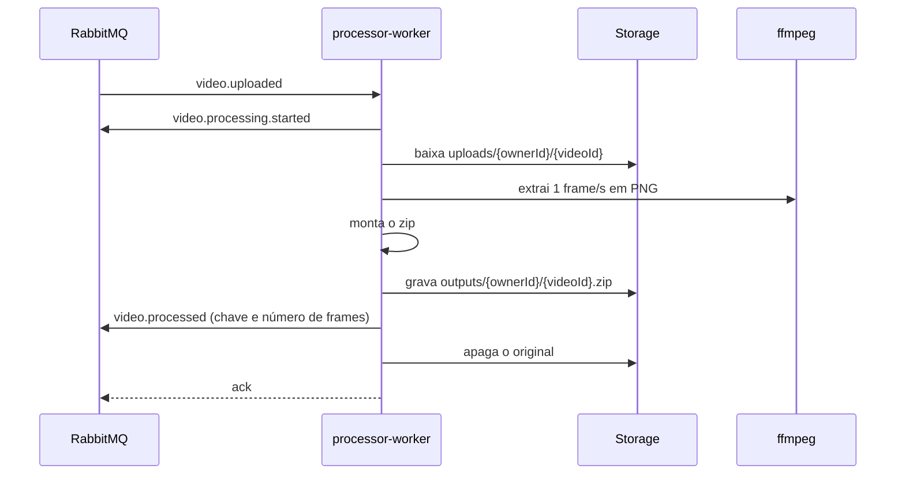

# processor-worker

O processor-worker faz o trabalho pesado: para cada `video.uploaded`, baixa o vídeo, extrai um frame por segundo em PNG com o `ffmpeg`, junta os frames num zip, grava o zip no storage e publica o resultado. Não tem banco nem rotas HTTP de negócio; a porta dele serve só para saúde e métricas.

Os componentes e como eles se ligam estão no [C4 nível 3](../c4/03-componentes-processor-worker.md). A organização de pastas, comum aos quatro serviços, está na [visão geral da arquitetura](../README.md#organização-de-cada-serviço).

## Um processamento

Cada tentativa trabalha num diretório temporário próprio, apagado no fim com sucesso ou não. O zip usa o método store, sem compressão: PNG já é comprimido, e comprimir de novo gastaria CPU para quase nenhum ganho.

A chave do zip é derivada do dono e do vídeo, sempre a mesma para o mesmo vídeo. Reprocessar uma mensagem entregue duas vezes sobrescreve o mesmo objeto em vez de criar um segundo.

## Quando algo dá errado

O worker separa o que é culpa do arquivo do que é culpa do ambiente:

| Situação                                              | O que acontece                                                                              |
| ----------------------------------------------------- | ------------------------------------------------------------------------------------------- |
| O `ffmpeg` recusa o arquivo (não é vídeo, corrompido) | Publica `video.failed`, apaga o original e confirma a mensagem. Tentar de novo não ajudaria |
| Storage ou broker fora, timeout                       | A mensagem volta para a fila depois de uma espera crescente (até 5 tentativas)              |
| Última tentativa falha                                | Publica `video.failed` e manda a mensagem para a DLQ                                        |
| Mensagem que não bate com o schema                    | Vai direto para a DLQ                                                                       |

O processamento inteiro tem um prazo (`PROCESSING_TIMEOUT_MS`, 5 minutos por padrão). Se ele estoura, o download e o `ffmpeg` são cancelados e a tentativa conta como falha transitória.

As filas são `processor.video.uploaded` e `processor.video.uploaded.retry`. O retry volta direto para a fila do worker, e não pelo `zipframes.events`, para o video-service e o notifier-service não receberem o mesmo `video.uploaded` de novo. O desenho completo das filas está na [visão geral](../README.md#entrega-e-falhas).

## Concorrência e escala

Cada réplica consome com prefetch 1, ou seja, processa um vídeo por vez. Extrair frames é pesado em CPU, e uma réplica com vários vídeos ao mesmo tempo só deixaria todos mais lentos. A concorrência vem de mais réplicas: o KEDA observa o tamanho da fila `processor.video.uploaded` e escala o Deployment de 1 a 5 réplicas.

Ao receber SIGTERM, o worker para de pegar mensagens novas, termina o vídeo em andamento e só então fecha a conexão. O Kubernetes espera até 40 segundos por isso.

## Operação

| Item      | Valor                                                                                 |
| --------- | ------------------------------------------------------------------------------------- |
| Consome   | `video.uploaded`                                                                      |
| Publica   | `video.processing.started`, `video.processed`, `video.failed`                         |
| Estado    | Nenhum além do diretório temporário da tentativa                                      |
| Probes    | HTTP na porta de operação 9464: `/health/live` e `/health/ready` (RabbitMQ e storage) |
| Escala    | KEDA pela fila, de 1 a 5 réplicas                                                     |
| Manifests | [`infra/k8s/processor-worker`](../../../infra/k8s/processor-worker)                   |

## Testes

Os testes de unidade cobrem o caso de uso e a classificação das falhas com implementações falsas de storage, `ffmpeg` e broker. O teste de integração publica um `video.uploaded` real num RabbitMQ em container, com o vídeo num SeaweedFS também em container, e confere o zip gravado e os eventos publicados. Ele usa o binário do `ffmpeg-static`, então não depende do `ffmpeg` da máquina.
