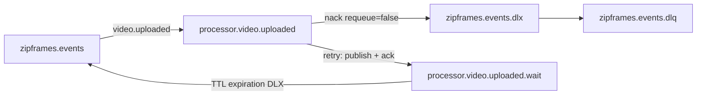

# Arquitetura: processor-worker

Arquitetura do contexto de **Processamento** do ZipFrames. A Clean Architecture é a base; o mapa de pastas está em [layers.md](../layers.md).

Referências: [dominio.md — Processamento](../../domain/dominio.md), [HTTP e OpenAPI gerado](../http.md), [AsyncAPI](../../asyncapi/events.yaml), [modelagem de dados](../../data/modelagem-de-dados.md), [regras de camadas](../layers.md).

## Objetivo do serviço

Consumir `video.uploaded`, extrair frames (1 fps, PNG), empacotar em zip (store), gravar o resultado no object storage e publicar `video.processing.started` / `video.processed` / `video.failed`. Stateless: sem Postgres; estado vem da mensagem, do storage e do disco temporário da tentativa.

## Camadas

As dependências apontam para dentro. Os quatro anéis e o composition root estão em [layers.md](../layers.md).

O consumer em `infrastructure/messaging` lê `video.uploaded` e chama `ProcessUploadedVideoController`. O controller entrega o envelope já decodificado a `ProcessUploadedVideoUseCase`. O caso de uso chama `ObjectStorage`, `FrameExtractor` e `EventPublisher` (`application/interfaces/gateways/`) e `ArchiveBuilder` e `WorkDirectory` (`application/interfaces/services/`). `start.ts` chama as factories — `new S3Client` em `externals/s3.ts`, `new S3ObjectStorage(s3)` em `gateways/objectStorage.ts`, ffmpeg, publisher AMQP, zip e o diretório temporário — e dá `consume`. Não há `handlers/` HTTP. O consumer confirma, agenda nova tentativa ou envia à dead-letter a partir do desfecho. O caso de uso não importa o SDK da AWS, o ffmpeg nem o cliente AMQP.

```
main  →  interface-adapters / infrastructure  →  application  →  domain
```

| Pasta                     | Neste projeto        | Conteúdo                                                                                |
| ------------------------- | -------------------- | --------------------------------------------------------------------------------------- |
| `src/domain/`             | Entidades            | Value objects, policies e erros de domínio (`ValidationError` do core quando aplicável) |
| `src/application/`        | Casos de uso e ports | `ProcessUploadedVideoUseCase`, tipos e interfaces                                       |
| `src/interface-adapters/` | Controllers          | `ProcessUploadedVideoController`                                                        |
| `src/infrastructure/`     | Drivers              | Consumer AMQP, S3/ffmpeg, zip/fs                                                        |
| `src/main/`               | Composition root     | `index.ts`, `start.ts`, `factories/` — sem `handlers/`                                  |

### Gateway e service

| Categoria   | Neste serviço                                                                    |
| ----------- | -------------------------------------------------------------------------------- |
| `gateways/` | `ObjectStorage`, `EventPublisher`, `FrameExtractor` (o trabalho sai do processo) |
| `services/` | `ArchiveBuilder`, `WorkDirectory`, `Clock`, `IdGenerator` (capacidade local)     |

`ObjectStorage` não inclui `ping`. `S3ObjectStorage` implementa `Pingable` à parte (ISP). Sem HTTP de readiness neste processo.

## Mapa de pastas

```
processor-worker/src/
├── domain/
│   ├── valueObjects/{processingJob,processingResult}.ts
│   ├── policies/{frameExtractionPolicy,framesPackage}.ts
│   └── index.ts
├── application/
│   ├── useCases/processUploadedVideo/
│   │   ├── ProcessUploadedVideoUseCase.ts
│   │   └── processUploadedVideo.types.ts  ← reexporta `ProcessingJob` / `ProcessingResult` do domínio
│   └── interfaces/
│       ├── gateways/{ObjectStorage,EventPublisher,FrameExtractor}.ts
│       └── services/{ArchiveBuilder,WorkDirectory,Clock,IdGenerator}.ts
├── interface-adapters/ProcessUploadedVideoController.ts
├── infrastructure/
│   ├── gateways/
│   │   ├── storage/s3ObjectStorage.gateway.ts
│   │   ├── media/ffmpegFrameExtractor.gateway.ts
│   │   └── amqpEventPublisher.gateway.ts
│   ├── services/
│   │   ├── media/zipArchiveBuilder.service.ts
│   │   ├── filesystem/fsWorkDirectory.service.ts
│   │   ├── systemClock.ts
│   │   └── uuidIdGenerator.ts
│   ├── messaging/{rabbitmqConnection,topology,videoUploadedConsumer}.ts
│   ├── observability/jobMetrics.ts
│   └── loadEnvConfig.ts
└── main/
    ├── index.ts
    ├── start.ts
    └── factories/{externals,gateways,services,use-cases,controllers}/
```

## Casos de uso

| Caso de uso                   | Orquestra                                                                                                                                            |
| ----------------------------- | ---------------------------------------------------------------------------------------------------------------------------------------------------- |
| `ProcessUploadedVideoUseCase` | Publica `started` → baixa original → extrai frames → zip → grava pacote → `processed`; mídia rejeitada publica `failed`; falha transitória é lançada |

Timeout: `AbortController` cancela download/ffmpeg; o diretório temporário é removido no `finally`.

Falhas usam `throw` com `retryable` (alinhado a `InfrastructureError` em `@zipframes/core`), não `Result`.

Payloads de eventos de saída tipados com `@zipframes/schemas/processor-worker`.

O exchange de eventos é `EVENT_EXCHANGE` de `@zipframes/schemas/shared`; `topology.ts` reexporta o nome.



| Destino settle | Comportamento                                                                              |
| -------------- | ------------------------------------------------------------------------------------------ |
| `ack`          | Confirma a mensagem                                                                        |
| `retry`        | Publica na fila **wait** com `expiration` (backoff) + header `x-attempt` + ack da original |
| `dlq`          | `nack(requeue=false)` → DLX → `zipframes.events.dlq`                                       |

## Contratos de falha

| Caso                        | Evento            | Settle                       |
| --------------------------- | ----------------- | ---------------------------- |
| Sucesso (`frames_packaged`) | `video.processed` | ack                          |
| Mídia rejeitada             | `video.failed`    | ack                          |
| Transitória, attempts < max | —                 | retry (wait queue + backoff) |
| Transitória, attempt = max  | `video.failed`    | dlq                          |
| Envelope poison             | —                 | dlq                          |

## Observabilidade e operação

- Logs estruturados com `correlationId` via ALS.
- Métricas Prometheus via `@zipframes/telemetry` (sem scrape HTTP neste processo).
- Sem Fastify, OpenAPI ou porta 8081. Liveness e readiness no Compose e no Kubernetes são probes exec (`kill -0 1`).

## Processo

Um processo consome `processor.video.uploaded` com prefetch 1. `SIGINT`/`SIGTERM` cancelam o consume, drenam o job em andamento e fecham o canal. O `index.ts` usa o mesmo guard `stopping` do auth-service: dois SIGTERMs não fecham o canal duas vezes. `runService()` em `@zipframes/core` é candidato a extrair esse laço quando aparecer o terceiro serviço.

Réplicas: KEDA pelo tamanho da fila. No cluster, Argo CD aplica [`infra/k8s/processor-worker`](../../../infra/k8s/processor-worker). Na máquina, Docker Compose na rede `zipframes`.

## Testes

| Pasta               | O que prova                                              |
| ------------------- | -------------------------------------------------------- |
| `tests/unit`        | Regras e contratos com dependências substituídas         |
| `tests/integration` | Um fluxo de `video.uploaded` contra RabbitMQ e SeaweedFS |

Cobertura mínima no `src/` executável: 80%.

## Fora de escopo deste serviço

- Banco de dados e migrations
- HTTP de negócio / JWT / JWKS / health HTTP
- Decisão de status do vídeo no agregado `Video` (video-service)
- Envio de e-mail (notification-service consome `video.failed`)
