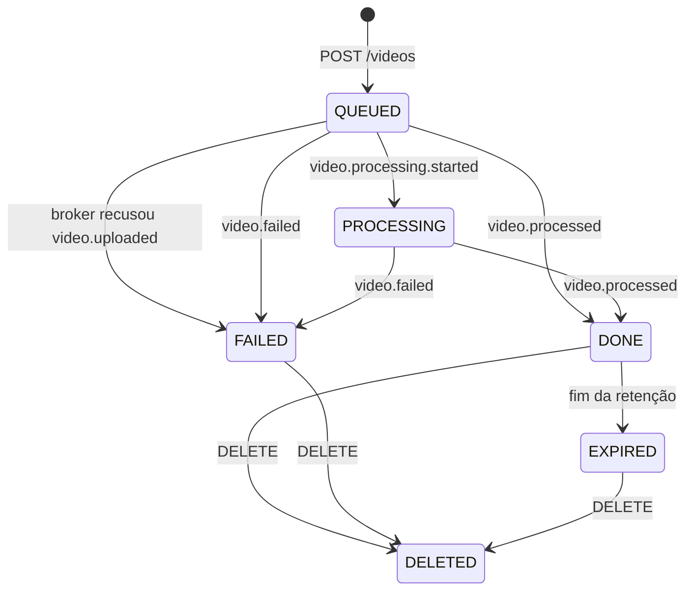

# video-service

O video-service responde pelo vídeo do começo ao fim: recebe o arquivo, registra o pedido, acompanha o processamento pelos eventos do worker, lista os vídeos do usuário, entrega o link do zip e apaga os arquivos no fim da retenção ou quando o usuário pede.

Os componentes e como eles se ligam estão no [C4 nível 3](../c4/03-componentes-video-service.md). A organização de pastas, comum aos quatro serviços, está na [visão geral da arquitetura](../README.md#organização-de-cada-serviço).

## Rotas

Todas exigem `Authorization: Bearer <token>`. O dono do vídeo é sempre o `sub` do token; um vídeo de outra pessoa responde 404, como se não existisse.

| Rota                               | Sucesso | Falhas                                                       |
| ---------------------------------- | ------- | ------------------------------------------------------------ |
| `POST /videos` (multipart, `file`) | 201     | 400 arquivo inválido ou vazio, 401, 413 acima do limite, 503 |
| `GET /videos?limit&before`         | 200     | 400, 401                                                     |
| `GET /videos/{videoId}`            | 200     | 401, 404                                                     |
| `GET /videos/{videoId}/download`   | 200     | 401, 404, 409 ainda não pronto, 410 expirado ou excluído     |
| `DELETE /videos/{videoId}`         | 204     | 401, 404, 409 na fila ou em processamento                    |

A listagem é paginada por keyset: a próxima página usa `before` com o `createdAt` do último item recebido. Ela mostra o histórico, inclusive vídeos que falharam ou expiraram, com o status e o motivo da falha.

As rotas de operação (`/health/*`, `/metrics`, `/docs`) estão na [visão geral](../README.md#http). A porta padrão é 3001.

## Estados de um vídeo

A máquina de estados é o que torna o consumo dos eventos seguro contra repetição. Um evento que chega depois de `DONE`, `FAILED`, `EXPIRED` ou `DELETED` é confirmado e ignorado, e um `processing.started` atrasado não tira um vídeo de `DONE`.

Duas regras protegem o usuário:

- `video.processed` só é aceito se a chave do zip for exatamente `outputs/{ownerId}/{videoId}.zip`. O serviço calcula a chave esperada em vez de confiar na que veio no evento; um evento apontando para outro objeto daria ao dono um link para o arquivo de outra pessoa.
- Um vídeo em `QUEUED` ou `PROCESSING` não pode ser excluído (409). Se pudesse, o worker encontraria o original apagado, publicaria `video.failed` e o usuário receberia um e-mail de falha sobre um vídeo que ele mesmo apagou.

## Upload

O vídeo chega numa única chamada, `POST /videos` com `multipart/form-data`. O serviço grava o arquivo ele mesmo, então sabe quando o envio terminou e quantos bytes chegaram, sem precisar de uma URL pré-assinada e de uma confirmação do cliente.

1. Nome, extensão (mp4, avi, mov, mkv, wmv, flv, webm) e tipo são validados antes de ler qualquer byte.
2. O arquivo vai em stream para `uploads/{ownerId}/{videoId}`, em partes de 5 MB. A memória usada por envio fica limitada às partes em trânsito, qualquer que seja o tamanho do vídeo.
3. O tamanho recebido é validado. O limite padrão é 500 MB (`MAX_UPLOAD_BYTES`); acima dele, o objeto parcial é apagado e a resposta é 413.
4. O vídeo é gravado como `QUEUED`.
5. `video.uploaded` é publicado com confirmação do broker, e a resposta é 201.

O vídeo é gravado antes do evento para que o worker nunca publique um resultado sobre um vídeo que este serviço ainda não conhece.

| Falha                                    | Resultado                                                                                                                                                   |
| ---------------------------------------- | ----------------------------------------------------------------------------------------------------------------------------------------------------------- |
| Storage cai no meio do envio             | Nada é gravado no banco; 503, e o cliente envia de novo                                                                                                     |
| O broker não confirma o evento           | O vídeo vai para `FAILED` (`VIDEO_NOT_QUEUED`), o original é apagado e a resposta é 503. O usuário vê a falha na listagem em vez de um vídeo parado na fila |
| O processo morre entre gravar e publicar | O vídeo fica em `QUEUED` sem evento. É a janela que um outbox fecharia, descrita na [visão geral](../README.md#publicação-depois-da-gravação)               |

## Download e retenção

O download devolve uma URL assinada do storage, válida por 5 minutos (`DOWNLOAD_URL_TTL_SECONDS`). A URL é assinada com o endereço público do storage, porque quem baixa é o navegador do usuário, que não alcança o endereço interno. O arquivo sai direto do storage, sem passar pelo serviço.

O zip fica disponível por 24 horas (`RESULT_RETENTION_SECONDS`). Uma varredura roda a cada minuto, apaga os zips vencidos (e um original que tenha sobrado) e move os vídeos para `EXPIRED`. O registro do vídeo continua na listagem.

## Eventos do worker

O serviço consome `video.processing.started`, `video.processed` e `video.failed` pela fila `video-service.processing-status`, com retry e DLQ como descrito na [visão geral](../README.md#entrega-e-falhas).

| Caso                                      | O que acontece com a mensagem                         |
| ----------------------------------------- | ----------------------------------------------------- |
| Transição aplicada ou evento ignorado     | Confirmada                                            |
| Vídeo desconhecido                        | Confirmada: tentar de novo não faria o vídeo aparecer |
| Banco fora ou conflito de versão          | Volta para a fila de retry                            |
| Tentativas esgotadas ou envelope inválido | DLQ                                                   |

## Escritas concorrentes

Toda gravação de um vídeo passa por um único método do repositório, com trava otimista: cada `UPDATE` exige a versão lida (`WHERE version = $n`) e incrementa a versão. Se outra escrita chegou antes, nenhuma linha muda e o repositório recusa com `ConflictError`.

Dois usuários enviando o mesmo arquivo nunca se chocam, porque cada upload é um vídeo novo. Os conflitos reais são internos: dois eventos do worker para o mesmo vídeo consumidos ao mesmo tempo, ou a expiração correndo junto com uma exclusão. No consumo, o conflito vira retry e a nova tentativa relê o vídeo. No HTTP, só o `DELETE` pode encontrá-lo e responde 409.

## Cache da listagem

A primeira página da listagem de cada usuário fica no Redis por 60 segundos (`LIST_CACHE_TTL_SECONDS`). Qualquer mudança nos vídeos do usuário apaga a entrada.

O Redis nunca é a fonte da verdade. Se ele cair, a leitura vai ao Postgres e a queda aparece uma vez no log; por isso a readiness não depende dele. Uma leitura que corre junto com uma gravação pode repor no cache o estado anterior, e o TTL curto limita quanto tempo isso dura.

## Operação

| Item      | Valor                                                         |
| --------- | ------------------------------------------------------------- |
| Banco     | `video-db` (Postgres), tabela `videos`                        |
| Cache     | Redis                                                         |
| Storage   | Originais em `uploads/`, zips em `outputs/`, bucket `videos`  |
| Publica   | `video.uploaded`                                              |
| Consome   | `video.processing.started`, `video.processed`, `video.failed` |
| Readiness | Postgres, RabbitMQ e o bucket                                 |
| Escala    | HPA por CPU, de 1 a 3 réplicas, alvo de 70%                   |
| Manifests | [`infra/k8s/video-service`](../../../infra/k8s/video-service) |

## Testes

Os testes de unidade cobrem a máquina de estados, os casos de uso (com repositório falso que respeita a trava de versão), o servidor HTTP inteiro com multipart e o consumo dos eventos. O teste de integração sobe o processo de verdade contra Postgres, RabbitMQ, SeaweedFS e Redis em containers, com um JWKS servido por HTTP, e passa pelo upload, pelos eventos do worker, pelo download, pela exclusão, pelo 413, pelo 401 e pela expiração. A cobertura mínima é de 95% das linhas e 90% dos branches.

## Limitações

- `user.deleted` ainda não é consumido: quando o auth-service publicar o evento, os vídeos e arquivos daquele usuário precisarão ser apagados aqui.
- Um vídeo `FAILED` cujo original o worker não conseguiu apagar fica com o arquivo no storage. Em `DONE`, a expiração apaga o que sobrou.
- Não há detecção de vídeos parados em `QUEUED` ou `PROCESSING` por muito tempo. O índice `idx_videos_em_andamento` já existe para essa consulta.
