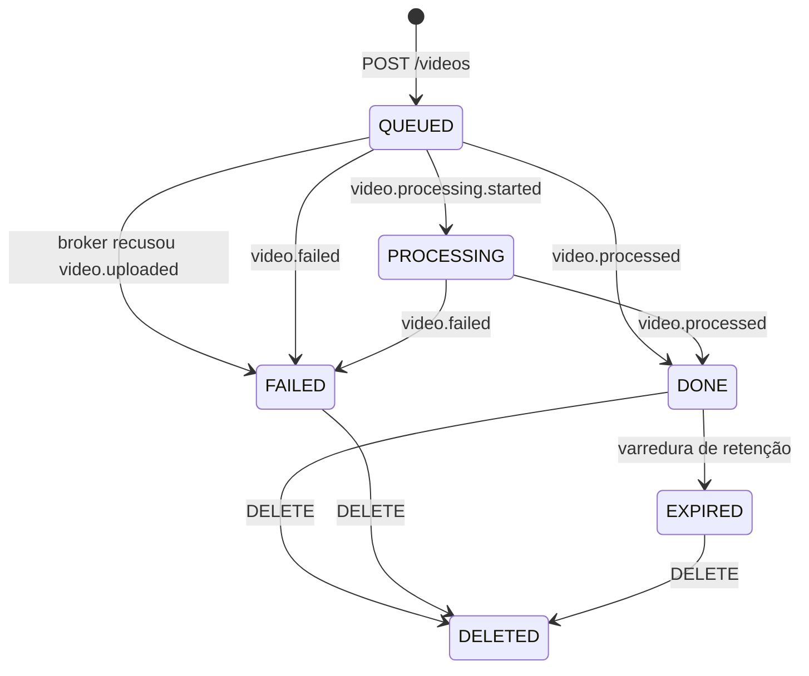
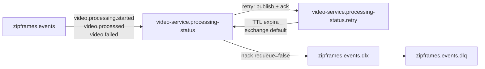
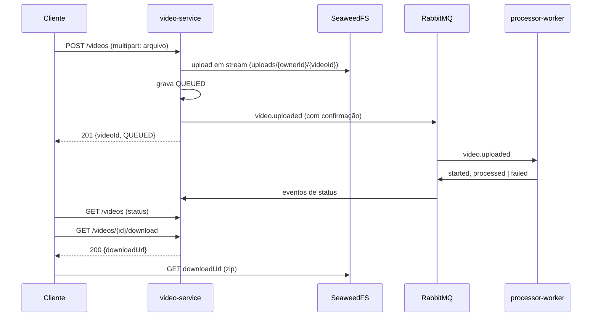

# Arquitetura: video-service

Arquitetura do contexto de **Gestão de Vídeos** do ZipFrames. A Clean Architecture é a base; o mapa de pastas está em [layers.md](../layers.md).

Referências: [dominio.md — Gestão de Vídeos](../../domain/dominio.md), [C4 nível 3](../../domain/c4/03-componentes-video-service.md), [HTTP e OpenAPI gerado](../http.md), [AsyncAPI](../../asyncapi/events.yaml), [modelagem de dados](../../data/modelagem-de-dados.md), [regras de camadas](../layers.md).

## Objetivo do serviço

Receber o vídeo em um único `POST /videos` (multipart), gravá-lo no storage, registrar o pedido como `QUEUED` e publicar `video.uploaded`. Depois, acompanhar o processamento pelos eventos do worker (`video.processing.started`, `video.processed`, `video.failed`), listar os vídeos do dono, entregar a URL de download do zip e apagar os arquivos no fim da retenção ou a pedido do dono. É o dono do agregado `Video` e da máquina de estados.

O nome é `video-service` porque o contexto é o ciclo inteiro de um vídeo, não só o envio: só aceita vídeo (mp4, avi, mov, mkv, wmv, flv, webm) e responde por ele do upload até a expiração ou a exclusão. A listagem é o histórico dos pedidos: o registro continua depois que o worker apaga o original e depois que o zip expira, com o status e o motivo de uma falha.

## Camadas

As dependências apontam para dentro. Os quatro anéis e o composition root estão em [layers.md](../layers.md).

```
main  →  interface-adapters / infrastructure  →  application  →  domain
```

| Pasta                     | Neste projeto        | O que há aqui                                                                                                                  |
| ------------------------- | -------------------- | ------------------------------------------------------------------------------------------------------------------------------ |
| `src/domain/`             | Entidades            | Agregado `Video` e sua máquina de estados, `FileName`, `VideoFile`, `VideoStatus`, chaves de storage, `VideoQueued`, erros     |
| `src/application/`        | Casos de uso e ports | Sete casos de uso e as interfaces `VideoRepository`, `EventPublisher`, `ObjectStorage`, `DownloadUrlSigner`, `VideoListCache`  |
| `src/interface-adapters/` | Controllers          | Cinco controllers HTTP (`defineAuthenticatedHandler`), `ApplyProcessingEventController` (`defineMessageHandler`) e o presenter |
| `src/infrastructure/`     | Drivers              | Prisma, amqplib, S3 (SDK, lib-storage e presigner), Redis (ioredis), Fastify com multipart, observabilidade e o agendador      |
| `src/main/`               | Composition root     | `index.ts` trata sinal; `start.ts` abre os clientes uma vez, liga rotas, consumidor e varredura; `factories/` dá `new`         |

O controller HTTP é a borda: `defineAuthenticatedHandler` de `@zipframes/http` valida o token contra o JWKS do auth-service (`@zipframes/authenticator`), valida a entrada e traduz o `Result` do caso de uso em `HttpReply`. O `ownerId` vem só do `sub` do token. Como `HttpRequest` só carrega `body`, o serviço estende o tipo em `RoutedHttpRequest` (com `params` e `query`) e cada controller escolhe o que vira a entrada validada. No upload, o adapter do Fastify coloca no `body` a parte do arquivo (`originalFileName`, `contentType` e um `Readable` ainda não lido); se a requisição é recusada antes de o arquivo ser lido (token inválido, extensão errada), o adapter descarta o stream. Os casos de uso devolvem o próprio `Video`; `videoPresenter.ts` o transforma no item que o cliente vê (`VideoListItem` de `@zipframes/schemas`), sem chaves de storage. As rotas em `infrastructure/http/routes/` são só catálogo, um arquivo por endpoint, e `videoRoutes.ts` junta os cinco.

O controller de mensagem valida o envelope contra a união discriminada (por `eventType`) dos três eventos do worker, mapeia para `ApplyProcessingEventUseCase` e deixa com `defineMessageHandler` o ack, o retry e a DLQ.

### Repository, gateway e service

| Categoria       | Neste serviço                                                              |
| --------------- | -------------------------------------------------------------------------- |
| `repositories/` | `VideoRepository` (devolve e recebe o agregado)                            |
| `gateways/`     | `EventPublisher`, `ObjectStorage`, `DownloadUrlSigner`, `VideoListCache`   |
| `services/`     | Nenhum: não há capacidade técnica local que o caso de uso precise declarar |

`ObjectStorage` e `DownloadUrlSigner` ficam separados (ISP): um fala com o storage (upload multipart em stream e `DeleteObject`), o outro só assina a URL de download localmente e é construído com o endpoint **público**, porque o navegador não alcança o endereço interno (`storage:8333` no Compose). `S3ObjectStorageGateway` implementa `Pingable` à parte, para a readiness.

## Mapa de pastas

```
video-service/src/
├── domain/
│   ├── entities/video.ts
│   ├── valueObjects/{fileName,videoFile,videoStatus}.ts
│   ├── policies/storageKeys.ts
│   ├── events/videoQueued.ts
│   ├── errors/videoErrors.ts
│   └── index.ts
├── application/
│   ├── useCases/
│   │   ├── uploadVideo/  listUserVideos/  getVideo/  getDownloadUrl/
│   │   └── deleteVideo/  applyProcessingEvent/  expireFramesPackages/
│   ├── errors/VideoNotFoundError.ts
│   └── interfaces/
│       ├── repositories/VideoRepository.ts
│       └── gateways/{EventPublisher,ObjectStorage,DownloadUrlSigner,VideoListCache}.ts
├── interface-adapters/
│   ├── {UploadVideo,ListUserVideos,GetVideo,GetDownloadUrl,DeleteVideo}Controller.ts
│   ├── ApplyProcessingEventController.ts
│   ├── RoutedHttpRequest.ts
│   └── videoPresenter.ts
├── infrastructure/
│   ├── http/{httpRoute.ts,openapi.ts,problemDetails.schema.ts,routes/,fastify/}
│   ├── repositories/prisma/{schema.prisma,migrations/,video.repository.ts}
│   ├── gateways/{amqpEventPublisherGateway.ts,storage/,cache/}
│   ├── messaging/amqplib/{connection.ts,amqpTopology.ts,amqpSettle.ts}
│   ├── observability/processingStatusObserver.ts
│   ├── scheduling/intervalJob.ts
│   └── loadEnvConfig.ts
└── main/
    ├── index.ts
    ├── start.ts
    └── factories/{externals,repositories,gateways,use-cases,controllers}/
```

## Casos de uso

| Caso de uso                   | Entrada   | O que faz                                                                                                                                     |
| ----------------------------- | --------- | --------------------------------------------------------------------------------------------------------------------------------------------- |
| `UploadVideoUseCase`          | HTTP      | Valida nome e tipo, grava o arquivo no storage contando os bytes, `Video.receive` valida o tamanho, grava `QUEUED` e publica `video.uploaded` |
| `ListUserVideosUseCase`       | HTTP      | Vídeos do dono, mais recentes primeiro, sem os excluídos; a primeira página passa pelo cache                                                  |
| `GetVideoUseCase`             | HTTP      | Status de um vídeo                                                                                                                            |
| `GetDownloadUrlUseCase`       | HTTP      | `DONE` dentro da janela → URL de 5 minutos; em andamento → 409; expirado ou excluído → 410                                                    |
| `DeleteVideoUseCase`          | HTTP      | Apaga os arquivos que ainda existem e só então marca `DELETED`                                                                                |
| `ApplyProcessingEventUseCase` | AMQP      | Aplica `started`/`processed`/`failed` pela máquina de estados; evento repetido ou atrasado é ignorado                                         |
| `ExpireFramesPackagesUseCase` | Agendador | Varre os `DONE` vencidos, apaga o zip (e um original que tenha sobrado) e move para `EXPIRED`                                                 |

Casos de uso HTTP devolvem `Result` (como no auth). Os de mensagem e do agendador lançam (como no worker): exceção falha a tentativa e `defineMessageHandler` decide entre retry e DLQ. Nenhum caso de uso mistura os dois estilos.

Todo acesso a um vídeo pelo dono passa por `VideoRepository.findByIdForOwner(videoId, ownerId)`, que filtra pelo dono na própria consulta: vídeo de outro dono e vídeo inexistente dão o mesmo `VideoNotFoundError` (404). O repositório também expõe `findById(videoId)`, sem dono, só para o caminho que já confia no id por vir de um evento (`ApplyProcessingEventUseCase`).

## Máquina de estados



- Eventos que chegam depois de `DONE`, `FAILED`, `EXPIRED` ou `DELETED` são ignorados (ack). É isso que torna o consumo idempotente sem tabela de deduplicação.
- `video.processed` só é aceito se `resultKey` for exatamente `outputs/{ownerId}/{videoId}.zip`. A chave é derivada, nunca confiada: um evento apontando para outro objeto daria ao dono uma URL para ele.
- `QUEUED` e `PROCESSING` não podem ser excluídos (409). Se pudessem, o worker leria um original já apagado e publicaria um `video.failed` que o notifier-service transformaria num e-mail de falha para um vídeo que o dono excluiu.

## Upload e publicação de `video.uploaded`

O vídeo chega em uma chamada: `POST /videos` com `multipart/form-data` e um campo `file`. Não há URL pré-assinada de upload nem confirmação: o serviço é quem grava o arquivo, então já sabe quando ele terminou de chegar e quantos bytes tem.

1. `createVideoFile` valida nome, extensão e tipo antes de ler qualquer byte.
2. O id do vídeo é gerado e o arquivo vai em stream para `uploads/{ownerId}/{videoId}` (`@aws-sdk/lib-storage`, partes de 5 MB). A memória por envio fica limitada às partes em trânsito, não ao tamanho do vídeo.
3. `Video.receive` valida o tamanho recebido. O `@fastify/multipart` corta o stream um byte depois de `MAX_UPLOAD_BYTES`: um arquivo maior chega com um byte a mais, o domínio recusa (`FILE_TOO_LARGE`, 413) e o objeto é apagado. Arquivo vazio é 400.
4. `save` grava o vídeo `QUEUED`.
5. `video.uploaded` é publicado com confirmação do broker.

A ordem é **gravar, depois publicar**. Assim o worker nunca reporta sobre um vídeo que este serviço não conhece, e o consumidor não precisa de um caminho "vídeo ainda não existe, tente de novo".

| Falha                                    | Resultado                                                                                                                                                                                      |
| ---------------------------------------- | ---------------------------------------------------------------------------------------------------------------------------------------------------------------------------------------------- |
| Storage falha no meio                    | Nada é gravado no banco. `503`, o cliente envia de novo                                                                                                                                        |
| Arquivo acima do limite                  | O objeto parcial é apagado e nada é gravado. `413`                                                                                                                                             |
| Broker não confirma o evento             | Compensação: o vídeo vai para `FAILED` (`VIDEO_NOT_QUEUED`, com o motivo), o original é apagado e o cliente recebe `503`. O dono vê a falha na listagem, em vez de um vídeo parado em `QUEUED` |
| O processo morre entre gravar e publicar | O vídeo fica `QUEUED` sem evento. É a janela que um outbox fecharia; aqui ela é um único `await` e está em [Fora de escopo](#fora-de-escopo-deste-serviço)                                     |

## Mensageria



A fila de retry devolve a mensagem **direto para a fila principal** pelo exchange default (`''`), e não para `zipframes.events`. Republicar no exchange compartilhado entregaria o `video.failed` de novo a todo assinante (o notifier-service) a cada retry.

| Caso                                  | Settle                          |
| ------------------------------------- | ------------------------------- |
| Transição aplicada ou evento ignorado | ack                             |
| Vídeo desconhecido                    | ack (retry não o faria surgir)  |
| Falha de banco, conflito de versão    | retry (fila de retry + backoff) |
| Tentativas esgotadas                  | dlq                             |
| Envelope inválido (poison)            | dlq                             |

## Concorrência

`VideoRepository.save(video)` é o único método de escrita: grava um vídeo novo ou uma transição e devolve o vídeo como ficou gravado, como o `create` do auth devolve o usuário. Quem chama não precisa saber se o vídeo já existe no banco. `version` é 0 enquanto o vídeo nunca foi gravado; o `INSERT` grava 1. Depois disso cada gravação é um `UPDATE ... WHERE id = $1 AND version = $2` que incrementa `version`. Se nenhuma linha muda, o repositório lança `ConflictError` (`VIDEO_CHANGED_CONCURRENTLY`).

A trava protege **a mesma linha** de duas escritas baseadas na mesma leitura; não é regra de negócio. Dois usuários enviando o mesmo arquivo nunca se chocam: cada upload é um vídeo com id próprio. Os casos reais são internos: dois eventos do worker para o mesmo vídeo consumidos ao mesmo tempo (sem a trava, um `processing.started` atrasado rebaixaria `DONE` para `PROCESSING`) e a expiração correndo contra uma exclusão. No consumidor, o conflito vira retry e a nova tentativa relê o vídeo; no HTTP, só o `DELETE` pode encontrá-lo (409, tente de novo). A varredura de expiração não usa `FOR UPDATE SKIP LOCKED`: réplicas que peguem o mesmo vídeo apagam o mesmo objeto (idempotente) e só uma gravação vence.

## Cache da listagem

Cache-aside no Redis, só para a primeira página (sem `before`): um hash por dono (`video-service:videos:{ownerId}`), um campo por tamanho de página, TTL de 60 s. O valor é o próprio agregado serializado (`Video.toJSON()`), reidratado com `Video.fromPersistence`; a formatação para o cliente acontece depois, no presenter. Toda mudança nos vídeos do dono faz `DEL` da chave. O Redis nunca é fonte da verdade: se cair, o gateway responde miss, o log registra a queda uma vez e a listagem vem do Postgres. Por isso a readiness não consulta o Redis.

Uma leitura concorrente com uma gravação pode repovoar o cache com o estado anterior; o TTL curto limita essa janela.

## HTTP

| Método e path                                            | Sucesso | Falhas                                                   |
| -------------------------------------------------------- | ------- | -------------------------------------------------------- |
| `POST /videos` (multipart, campo `file`)                 | 201     | 400 arquivo inválido ou vazio, 401, 413, 503             |
| `GET /videos?limit&before`                               | 200     | 400, 401                                                 |
| `GET /videos/{videoId}`                                  | 200     | 401, 404                                                 |
| `GET /videos/{videoId}/download`                         | 200     | 401, 404, 409 ainda não pronto, 410 expirado ou excluído |
| `DELETE /videos/{videoId}`                               | 204     | 401, 404, 409 na fila ou em processamento                |
| `GET /health/live`, `/health/ready`, `/metrics`, `/docs` | —       | Ver [http.md](../http.md)                                |

Porta `PORT` (padrão 3001). Paginação por keyset: a próxima página usa `before` com o `createdAt` do último item. Entradas e saídas vêm de `@zipframes/schemas/video-service`, inclusive `videoIdParamsSchema` e `listVideosQuerySchema`. Enquanto o [PR #48 do zipframes-packages](https://github.com/zipframes/zipframes-packages/pull/48) não gera a versão estável, o serviço usa o snapshot `1.0.0-pr48-20260927232137`, com versão exata (um `^` aceitaria snapshots posteriores). Só o 204 do `DELETE` (`z.undefined()`) fica no controller.

### Fluxo do cliente



## Observabilidade

- Logs estruturados (`@zipframes/logger`) com `correlationId` do header `x-correlation-id`, repassado no envelope de `video.uploaded` e restaurado ao consumir. Logs levam identificadores, nunca nome de arquivo nem o motivo da falha.
- `GET /metrics`: `http_requests_total` e `http_request_duration_seconds` por padrão de rota (`/videos/:videoId`, não o id), e `messages_handled_total` por desfecho (`applied`, `ignored`, `unknown_video`, `retry`, `exhausted`, `poison`).

## Onde o processo sobe

Na máquina, o Compose (profile `apps`) sobe o serviço depois de `video-db`, RabbitMQ, Redis e do bucket, aplica as migrations e publica a porta 3001. `S3_PUBLIC_ENDPOINT` é `http://localhost:8333`, para a URL de download funcionar fora da rede do Compose.

No cluster, o Argo CD aplica [`infra/k8s/video-service`](../../../infra/k8s/video-service) pela Application [`infra/argocd/video-service.yaml`](../../../infra/argocd/video-service.yaml). HPA por CPU (1 a 3 réplicas, alvo 70%). O Secret fica de fora do apply.

## Testes

| Pasta               | O que prova                                                                                                                                                                                                                                                                                                                                                                                                           |
| ------------------- | --------------------------------------------------------------------------------------------------------------------------------------------------------------------------------------------------------------------------------------------------------------------------------------------------------------------------------------------------------------------------------------------------------------------- |
| `tests/unit`        | Máquina de estados, casos de uso com fakes que mantêm o lock otimista, o servidor HTTP inteiro por `inject` (com multipart), controller de mensagem, gateways, config                                                                                                                                                                                                                                                 |
| `tests/integration` | `videoFlow`: o processo real (`startVideoService()`, configurado por env) contra Postgres, RabbitMQ, SeaweedFS e Redis em Testcontainers, com o JWKS servido por HTTP. Upload multipart, `video.uploaded`, eventos do worker publicados no broker, download, exclusão, 413, 401 e expiração (o serviço é reiniciado com retenção de 1 s). `videoRepository`: o adapter Prisma, a trava de versão e os CHECKs do banco |

Cobertura mínima no código testado por unidade: 95% de linhas e 90% de branches.

## Fora de escopo deste serviço

- Consumo de `user.deleted`: o auth-service ainda não publica o evento. Quando publicar, entra um caso de uso que apaga os objetos e os metadados do dono.
- Varredura de originais que o worker não apagou em vídeos `FAILED`. Em `DONE`, a expiração já apaga o original que tenha sobrado, e a exclusão apaga o original em qualquer status.
- Outbox para `video.uploaded`: cobriria o processo morrer entre gravar o vídeo e publicar o evento. A recusa do broker já é tratada pela compensação para `FAILED`.
- Detecção de vídeos parados em `QUEUED` ou `PROCESSING` (o índice `idx_videos_em_andamento` existe para isso).
