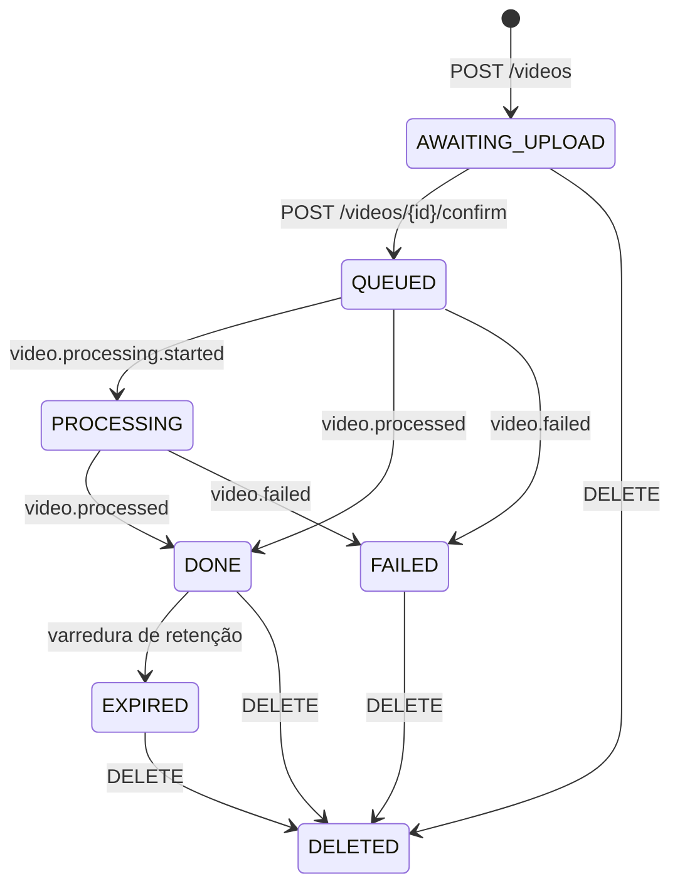
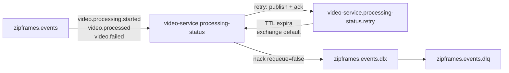
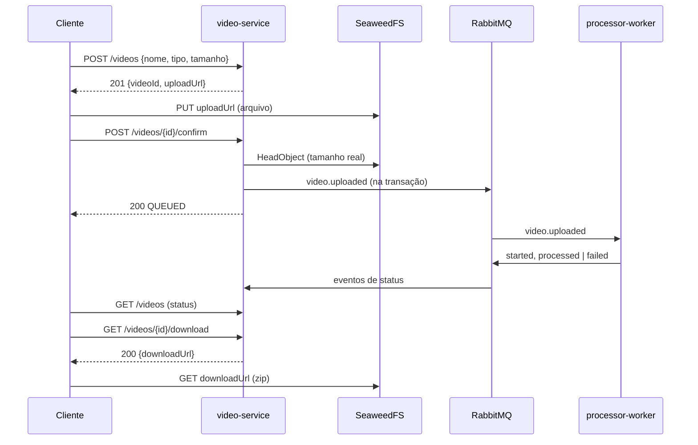

# Arquitetura: video-service

Arquitetura do contexto de **Gestão de Vídeos** do ZipFrames. A Clean Architecture é a base; o mapa de pastas está em [layers.md](../layers.md).

Referências: [dominio.md — Gestão de Vídeos](../../domain/dominio.md), [C4 nível 3](../../domain/c4/03-componentes-video-service.md), [HTTP e OpenAPI gerado](../http.md), [AsyncAPI](../../asyncapi/events.yaml), [modelagem de dados](../../data/modelagem-de-dados.md), [regras de camadas](../layers.md).

## Objetivo do serviço

Receber o pedido de upload, entregar uma URL pré-assinada para o cliente enviar o arquivo direto ao storage, confirmar o upload e publicar `video.uploaded`. Depois, acompanhar o processamento pelos eventos do worker (`video.processing.started`, `video.processed`, `video.failed`), listar os vídeos do dono, entregar a URL de download do zip e apagar os arquivos no fim da retenção ou a pedido do dono. É o dono do agregado `Video` e da máquina de estados; o arquivo nunca passa por este processo.

## Camadas

As dependências apontam para dentro. Os quatro anéis e o composition root estão em [layers.md](../layers.md).

```
main  →  interface-adapters / infrastructure  →  application  →  domain
```

| Pasta                     | Neste projeto        | O que há aqui                                                                                                                 |
| ------------------------- | -------------------- | ----------------------------------------------------------------------------------------------------------------------------- |
| `src/domain/`             | Entidades            | Agregado `Video` e sua máquina de estados, `FileName`, `VideoStatus`, chaves de storage, `VideoQueued`, erros de transição    |
| `src/application/`        | Casos de uso e ports | Oito casos de uso e as interfaces `VideoRepository`, `EventPublisher`, `ObjectStorage`, `StorageUrlSigner`, `VideoListCache`  |
| `src/interface-adapters/` | Controllers          | Seis controllers HTTP (`defineAuthenticatedHandler`), `ApplyProcessingEventController` (`defineMessageHandler`) e o presenter |
| `src/infrastructure/`     | Drivers              | Prisma, amqplib, S3 (SDK e presigner), Redis (ioredis), Fastify, observabilidade e o agendador da expiração                   |
| `src/main/`               | Composition root     | `index.ts` trata sinal; `start.ts` abre os clientes uma vez, liga rotas, consumidor e varredura; `factories/` dá `new`        |

O controller HTTP é a borda: `defineAuthenticatedHandler` de `@zipframes/http` valida o token contra o JWKS do auth-service (`@zipframes/authenticator`), valida a entrada e traduz o `Result` do caso de uso em `HttpReply`. O `ownerId` vem só do `sub` do token. Como `HttpRequest` só carrega `body`, o serviço estende o tipo em `RoutedHttpRequest` (com `params` e `query`) e cada controller escolhe o que vira a entrada validada. Os casos de uso devolvem o próprio `Video`; `videoPresenter.ts` o transforma no item que o cliente vê (`VideoListItem` de `@zipframes/schemas`), sem chaves de storage. As rotas em `infrastructure/http/routes/` são só catálogo, um arquivo por endpoint, e `videoRoutes.ts` junta os seis.

O controller de mensagem valida o envelope contra a união discriminada (por `eventType`) dos três eventos do worker, mapeia para `ApplyProcessingEventUseCase` e deixa com `defineMessageHandler` o ack, o retry e a DLQ.

### Repository, gateway e service

| Categoria       | Neste serviço                                                              |
| --------------- | -------------------------------------------------------------------------- |
| `repositories/` | `VideoRepository` (devolve e recebe o agregado)                            |
| `gateways/`     | `EventPublisher`, `ObjectStorage`, `StorageUrlSigner`, `VideoListCache`    |
| `services/`     | Nenhum: não há capacidade técnica local que o caso de uso precise declarar |

`ObjectStorage` e `StorageUrlSigner` ficam separados (ISP): um fala com o storage (`HeadObject`, `DeleteObject`), o outro só assina URLs localmente e é construído com o endpoint **público**, porque o navegador não alcança o endereço interno (`storage:8333` no Compose). `S3ObjectStorageGateway` implementa `Pingable` à parte, para a readiness.

## Mapa de pastas

```
video-service/src/
├── domain/
│   ├── entities/video.ts
│   ├── valueObjects/{fileName,videoStatus}.ts
│   ├── policies/storageKeys.ts
│   ├── events/videoQueued.ts
│   ├── errors/videoErrors.ts
│   └── index.ts
├── application/
│   ├── useCases/
│   │   ├── requestUpload/  confirmUpload/  listUserVideos/  getVideo/
│   │   └── getDownloadUrl/ deleteVideo/    applyProcessingEvent/  expireFramesPackages/
│   ├── errors/VideoNotFoundError.ts
│   └── interfaces/
│       ├── repositories/VideoRepository.ts
│       └── gateways/{EventPublisher,ObjectStorage,StorageUrlSigner,VideoListCache}.ts
├── interface-adapters/
│   ├── {RequestUpload,ConfirmUpload,ListUserVideos,GetVideo,GetDownloadUrl,DeleteVideo}Controller.ts
│   ├── ApplyProcessingEventController.ts
│   ├── RoutedHttpRequest.ts
│   └── videoPresenter.ts
├── infrastructure/
│   ├── http/{httpRoute.ts,openapi.ts,problemDetails.schema.ts,routes/,fastify/}
│   ├── repositories/prisma/{schema.prisma,migrations/,video.repository.ts}
│   ├── gateways/{amqpEventPublisherGateway.ts,storage/,cache/}
│   ├── messaging/amqplib/{connection.ts,amqpTopology.ts,amqpSettle.ts}
│   ├── observability/processingStatusObserver.ts
│   ├── scheduling/intervalJob.ts
│   └── loadEnvConfig.ts
└── main/
    ├── index.ts
    ├── start.ts
    └── factories/{externals,repositories,gateways,use-cases,controllers}/
```

## Casos de uso

| Caso de uso                   | Entrada   | O que faz                                                                                                                                           |
| ----------------------------- | --------- | --------------------------------------------------------------------------------------------------------------------------------------------------- |
| `RequestUploadUseCase`        | HTTP      | `Video.requestUpload` valida nome, extensão, tipo e tamanho; grava `AWAITING_UPLOAD` e assina um `PUT` que prende `Content-Type` e `Content-Length` |
| `ConfirmUploadUseCase`        | HTTP      | Lê o tamanho real no storage, move para `QUEUED` e publica `video.uploaded` dentro da mesma transação                                               |
| `ListUserVideosUseCase`       | HTTP      | Vídeos do dono, mais recentes primeiro, sem os excluídos; a primeira página passa pelo cache                                                        |
| `GetVideoUseCase`             | HTTP      | Status de um vídeo                                                                                                                                  |
| `GetDownloadUrlUseCase`       | HTTP      | `DONE` dentro da janela → URL de 5 minutos; em andamento → 409; expirado ou excluído → 410                                                          |
| `DeleteVideoUseCase`          | HTTP      | Apaga os arquivos que ainda existem e só então marca `DELETED`                                                                                      |
| `ApplyProcessingEventUseCase` | AMQP      | Aplica `started`/`processed`/`failed` pela máquina de estados; evento repetido ou atrasado é ignorado                                               |
| `ExpireFramesPackagesUseCase` | Agendador | Varre os `DONE` vencidos, apaga o zip (e um original que tenha sobrado) e move para `EXPIRED`                                                       |

Casos de uso HTTP devolvem `Result` (como no auth). Os de mensagem e do agendador lançam (como no worker): exceção falha a tentativa e `defineMessageHandler` decide entre retry e DLQ. Nenhum caso de uso mistura os dois estilos.

Todo acesso a um vídeo pelo dono passa por `VideoRepository.findByIdForOwner(videoId, ownerId)`, que filtra pelo dono na própria consulta: vídeo de outro dono e vídeo inexistente dão o mesmo `VideoNotFoundError` (404). O repositório também expõe `findById(videoId)`, sem dono, só para o caminho que já confia no id por vir de um evento (`ApplyProcessingEventUseCase`).

## Máquina de estados



- Eventos que chegam depois de `DONE`, `FAILED`, `EXPIRED` ou `DELETED` são ignorados (ack). É isso que torna o consumo idempotente sem tabela de deduplicação.
- `video.processed` só é aceito se `resultKey` for exatamente `outputs/{ownerId}/{videoId}.zip`. A chave é derivada, nunca confiada: um evento apontando para outro objeto daria ao dono uma URL para ele.
- `QUEUED` e `PROCESSING` não podem ser excluídos (409). Se pudessem, o worker leria um original já apagado e publicaria um `video.failed` que o notification-service transformaria num e-mail de falha para um vídeo que o dono excluiu.

## Publicação de `video.uploaded`

`VideoRepository` não sabe nada sobre publicar eventos — `save(video)` só grava. A ordem de quem chama o quê é decisão do caso de uso: `ConfirmUploadUseCase` publica `video.uploaded` **antes** de chamar `save`, não depois.

A ordem inversa (persistir e só então publicar, como o auth faz) tem uma consequência pior aqui: no auth, um usuário gravado sem `user.registered` ainda consegue logar; um vídeo gravado `QUEUED` sem `video.uploaded` ficaria parado para sempre, sem o worker jamais saber dele, e uma nova tentativa de confirmar já bateria em "upload já confirmado" (409) sem consertar nada. Publicar primeiro elimina esse desfecho: se o broker não confirma, nada muda no banco.

| Falha                                   | Resultado                                                                                                                                                                                                                    |
| --------------------------------------- | ---------------------------------------------------------------------------------------------------------------------------------------------------------------------------------------------------------------------------- |
| Broker não confirma                     | Nada é gravado. O cliente recebe `503` e confirma de novo                                                                                                                                                                    |
| `save` falha depois do publish          | O evento já saiu; o vídeo continua `AWAITING_UPLOAD`. O `started` do worker chega, encontra um vídeo ainda não `QUEUED` e a mensagem volta com backoff até o `save` ter tempo de suceder (ver `ApplyProcessingEventUseCase`) |
| Confirmação concorrente perde a corrida | As duas leituras publicam (evento duplicado, tolerado: chave de resultado determinística, consumidor idempotente); só um `save` vence, o outro recebe `409`                                                                  |

O preço dessa ordem é uma corrida mais estreita: duas confirmações (ou uma confirmação e uma exclusão) simultâneas para o mesmo vídeo podem publicar antes que o `save` decida qual delas venceu. O sistema já tolera isso — reprocessar a mesma chave de resultado não duplica nada, e um evento para um vídeo que acabou `DELETED` é apenas ignorado (estado terminal) — então o efeito é, no pior caso, uma tentativa de processamento desperdiçada, nunca dado corrompido.

## Mensageria



A fila de retry devolve a mensagem **direto para a fila principal** pelo exchange default (`''`), e não para `zipframes.events`. Republicar no exchange compartilhado entregaria o `video.failed` de novo a todo assinante (o notification-service) a cada retry.

| Caso                                  | Settle                          |
| ------------------------------------- | ------------------------------- |
| Transição aplicada ou evento ignorado | ack                             |
| Vídeo desconhecido                    | ack (retry não o faria surgir)  |
| Falha de banco, conflito de versão    | retry (fila de retry + backoff) |
| Vídeo ainda `AWAITING_UPLOAD`         | retry                           |
| Tentativas esgotadas                  | dlq                             |
| Envelope inválido (poison)            | dlq                             |

## Concorrência

Cada gravação é um `UPDATE ... WHERE id = $1 AND version = $2` que incrementa `version`. Se nenhuma linha muda, o repositório lança `ConflictError` (`VIDEO_CONCURRENT_UPDATE`): em HTTP isso é 409; no consumidor, uma nova tentativa relê o vídeo. A varredura de expiração não usa `FOR UPDATE SKIP LOCKED`: réplicas que peguem o mesmo vídeo apagam o mesmo objeto (idempotente) e só uma gravação vence.

## Cache da listagem

Cache-aside no Redis, só para a primeira página (sem `before`): um hash por dono (`video-service:videos:{ownerId}`), um campo por tamanho de página, TTL de 60 s. O valor é o próprio agregado serializado (`Video.toJSON()`), reidratado com `Video.fromPersistence`; a formatação para o cliente acontece depois, no presenter. Toda mudança nos vídeos do dono faz `DEL` da chave. O Redis nunca é fonte da verdade: se cair, o gateway responde miss, o log registra a queda uma vez e a listagem vem do Postgres. Por isso a readiness não consulta o Redis.

Uma leitura concorrente com uma gravação pode repovoar o cache com o estado anterior; o TTL curto limita essa janela.

## HTTP

| Método e path                                            | Sucesso | Falhas                                                   |
| -------------------------------------------------------- | ------- | -------------------------------------------------------- |
| `POST /videos`                                           | 201     | 400 dados inválidos, 401                                 |
| `POST /videos/{videoId}/confirm`                         | 200     | 400 arquivo vazio ou grande demais, 401, 404, 409, 503   |
| `GET /videos?limit&before`                               | 200     | 400, 401                                                 |
| `GET /videos/{videoId}`                                  | 200     | 401, 404                                                 |
| `GET /videos/{videoId}/download`                         | 200     | 401, 404, 409 ainda não pronto, 410 expirado ou excluído |
| `DELETE /videos/{videoId}`                               | 204     | 401, 404, 409 na fila ou em processamento                |
| `GET /health/live`, `/health/ready`, `/metrics`, `/docs` | —       | Ver [http.md](../http.md)                                |

Porta `PORT` (padrão 3001). Paginação por keyset: a próxima página usa `before` com o `createdAt` do último item. Entradas e saídas vêm de `@zipframes/schemas/video-service`, inclusive `videoIdParamsSchema` e `listVideosQuerySchema`. Enquanto o [PR #45 do zipframes-packages](https://github.com/zipframes/zipframes-packages/pull/45) não gera a versão estável, o serviço usa o snapshot `0.2.0-pr45-20260927180514`. Só o 204 do `DELETE` (`z.undefined()`) fica no controller.

### Fluxo do cliente



## Observabilidade

- Logs estruturados (`@zipframes/logger`) com `correlationId` do header `x-correlation-id`, repassado no envelope de `video.uploaded` e restaurado ao consumir. Logs levam identificadores, nunca nome de arquivo nem o motivo da falha.
- `GET /metrics`: `http_requests_total` e `http_request_duration_seconds` por padrão de rota (`/videos/:videoId`, não o id), e `messages_handled_total` por desfecho (`applied`, `ignored`, `unknown_video`, `retry`, `exhausted`, `poison`).

## Onde o processo sobe

Na máquina, o Compose (profile `apps`) sobe o serviço depois de `video-db`, RabbitMQ, Redis e do bucket, aplica as migrations e publica a porta 3001. `S3_PUBLIC_ENDPOINT` é `http://localhost:8333`, para as URLs funcionarem fora da rede do Compose.

No cluster, o Argo CD aplica [`infra/k8s/video-service`](../../../infra/k8s/video-service) pela Application [`infra/argocd/video-service.yaml`](../../../infra/argocd/video-service.yaml). HPA por CPU (1 a 3 réplicas, alvo 70%). O Secret fica de fora do apply.

## Testes

| Pasta               | O que prova                                                                                                                                                             |
| ------------------- | ----------------------------------------------------------------------------------------------------------------------------------------------------------------------- |
| `tests/unit`        | Máquina de estados, casos de uso com fakes que mantêm o lock otimista, o servidor HTTP inteiro por `inject`, controller de mensagem, gateways, config                   |
| `tests/integration` | Ciclo de vida completo contra Postgres, RabbitMQ, SeaweedFS e Redis: upload pré-assinado, `video.uploaded`, eventos do worker, download, exclusão, invariantes do banco |

Cobertura mínima no código testado por unidade: 95% de linhas e 90% de branches.

## Fora de escopo deste serviço

- Consumo de `user.deleted`: o auth-service ainda não publica o evento. Quando publicar, entra um caso de uso que apaga os objetos e os metadados do dono.
- Varredura de originais que o worker não apagou em vídeos `FAILED`. Em `DONE`, a expiração já apaga o original que tenha sobrado.
- Detecção de vídeos parados em `QUEUED` ou `PROCESSING` (o índice `idx_videos_em_andamento` existe para isso).
