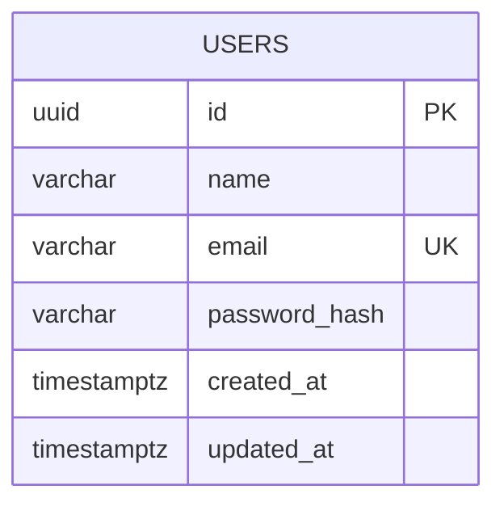
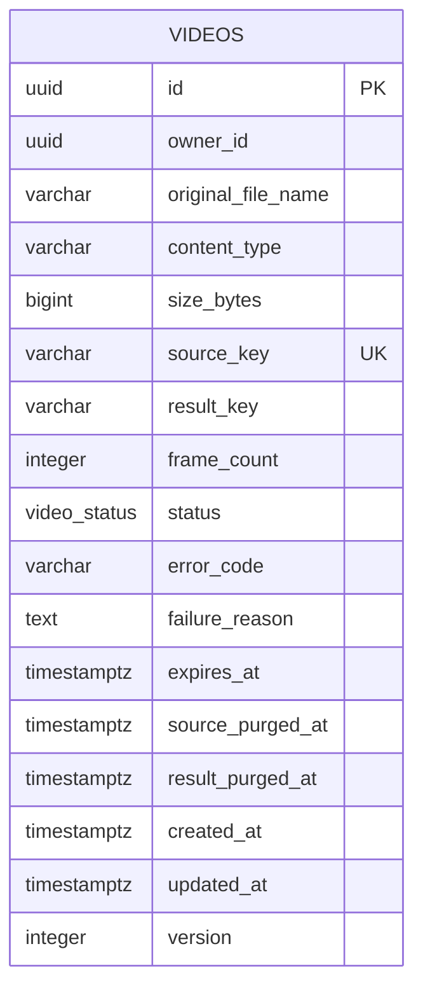
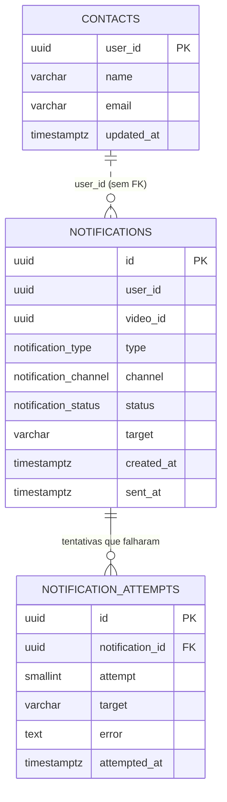

# Planejamento para data models

Cada serviço tem sua própria instância de PostgreSQL e nenhum acessa o banco de outro. Não existe chave estrangeira entre bancos: a ligação entre `users` e `videos`, por exemplo, é feita apenas pelo identificador do usuário, que chega no token.

Os schemas são criados por migrations do Prisma. O SQL desta página é a referência do que as migrations devem gerar e também o script de criação entregue no hackathon.

## Decisões comuns a todos os bancos

| Decisão                                                                   | Motivo                                                                                                                                                                                                           |
| ------------------------------------------------------------------------- | ---------------------------------------------------------------------------------------------------------------------------------------------------------------------------------------------------------------- |
| Chaves primárias em `uuid` v7                                             | Identificadores únicos entre serviços, gerados pela aplicação, e ordenáveis por tempo, o que mantém a localidade nos índices                                                                                     |
| Todos os horários em `timestamptz`, gravados em UTC                       | Evita ambiguidade entre fusos e horário de verão                                                                                                                                                                 |
| Status como `enum` do PostgreSQL                                          | Restringe os valores no banco e é mapeado diretamente pelo Prisma                                                                                                                                                |
| `created_at` e `updated_at` em toda tabela mutável                        | Auditoria mínima                                                                                                                                                                                                 |
| Sem exclusão física dos metadados de vídeos e notificações                | O histórico é parte da funcionalidade. Os arquivos, esses sim, são apagados no prazo definido                                                                                                                    |
| Marcas de eliminação (`*_purged_at`) em vez de simplesmente limpar campos | Permite comprovar quando cada arquivo foi apagado, sem guardar o conteúdo                                                                                                                                        |
| Publicação direta no broker, sem tabela `outbox`                          | O auth grava e depois publica. O video-service publica e só então grava (ordem invertida: ver `docs/architecture/services/video-service.md`). Nos dois, se o processo cair no meio, fato e recado podem divergir |
| Idempotência garantida por chaves de negócio, sem tabela de deduplicação  | As restrições que já existem (upsert por chave primária, unicidade e o próprio status do agregado) tornam a reentrega inofensiva                                                                                 |

Não existe tabela `outbox`. No auth-service a publicação é dual-write de propósito: o caso de uso persiste o agregado e em seguida chama `EventPublisher`. `/health/ready` exige AMQP. O consumidor continua idempotente. Se o publish falhar com o agregado já gravado, o HTTP ainda responde sucesso (no cadastro, um retry cairia em e-mail duplicado); o erro de publish vai para o log.

No video-service a ordem muda: o `publish` de `video.uploaded` roda **dentro** da transação que grava `QUEUED`, depois do `UPDATE` e antes do commit, e só resolve com o confirm do broker. Se o broker falhar, o rollback desfaz a gravação e o cliente recebe 503 para confirmar de novo. A razão é a consequência: um usuário gravado sem `user.registered` ainda consegue usar o sistema, mas um vídeo `QUEUED` sem evento ficaria parado para sempre. O furo que sobra (o commit falhar depois do confirm) é o mesmo de qualquer dual-write, e o consumidor do video-service devolve à fila, com backoff, eventos do worker que chegam antes do commit.

Não existe tabela de deduplicação de eventos. A entrega é "pelo menos uma vez", e cada consumidor é idempotente por uma chave que o próprio domínio já impõe:

| Consumidor                             | O que impede o efeito duplicado                                                            |
| -------------------------------------- | ------------------------------------------------------------------------------------------ |
| Atualização de status no video-service | A máquina de estados do agregado: um evento já aplicado não produz transição válida        |
| Projeção de contatos                   | `INSERT ... ON CONFLICT (user_id) DO UPDATE`, com `updated_at` descartando eventos antigos |
| Notificação de falha                   | A restrição única `(video_id, type)`                                                       |

A decisão é deliberada: uma tabela genérica de eventos processados seria uma segunda trava para portas que o domínio já fecha. Se algum consumidor futuro tiver um efeito sem chave natural, a tabela volta para aquele serviço.

## auth-db



### `users`

| Coluna          | Tipo           | Restrições                | Observação                                                                                                                                   |
| --------------- | -------------- | ------------------------- | -------------------------------------------------------------------------------------------------------------------------------------------- |
| `id`            | `uuid`         | PK                        | Vai no `sub` do JWT e identifica o dono dos vídeos                                                                                           |
| `name`          | `varchar(120)` | not null                  |                                                                                                                                              |
| `email`         | `varchar(255)` | not null, unique          | O value object `Email` valida o formato e normaliza para minúsculas antes de persistir. O banco garante apenas a unicidade do valor recebido |
| `password_hash` | `char(60)`     | not null                  | Hash bcrypt, que tem tamanho fixo                                                                                                            |
| `created_at`    | `timestamptz`  | not null, default `now()` |                                                                                                                                              |
| `updated_at`    | `timestamptz`  | not null, default `now()` |                                                                                                                                              |

O índice único de `email` atende tanto à regra de unicidade quanto à busca do login, que consulta o valor já normalizado pelo value object.

O `auth-db` só tem `users`. Depois do `INSERT`, o auth-service publica `user.registered` pelo `EventPublisher`. Dual-write é decisão explícita: se o processo cair entre o commit e o ack do Rabbit, o usuário existe e o evento não sai.

### DDL

```sql
CREATE TABLE users (
  id            uuid         PRIMARY KEY,
  name          varchar(120) NOT NULL,
  email         varchar(255) NOT NULL UNIQUE,
  password_hash char(60)     NOT NULL,
  created_at    timestamptz  NOT NULL DEFAULT now(),
  updated_at    timestamptz  NOT NULL DEFAULT now()
);
```

## video-db



### `videos`

| Coluna               | Tipo           | Restrições                          | Observação                                                                 |
| -------------------- | -------------- | ----------------------------------- | -------------------------------------------------------------------------- |
| `id`                 | `uuid`         | PK                                  | Também compõe as chaves no storage                                         |
| `owner_id`           | `uuid`         | not null                            | Vem do `sub` do token, sem FK entre bancos                                 |
| `original_file_name` | `varchar(255)` | not null                            | Nome informado pelo usuário                                                |
| `content_type`       | `varchar(100)` | not null                            |                                                                            |
| `size_bytes`         | `bigint`       | not null, `> 0`                     | Confirmado com o tamanho real no storage                                   |
| `source_key`         | `varchar(512)` | not null, unique                    | `uploads/{owner_id}/{id}`                                                  |
| `result_key`         | `varchar(512)` |                                     | `outputs/{owner_id}/{id}.zip`, preenchido ao concluir                      |
| `frame_count`        | `integer`      |                                     | Quantidade de frames extraídos                                             |
| `status`             | `video_status` | not null, default `AWAITING_UPLOAD` | Enum do banco, agora com `EXPIRED` e `DELETED`                             |
| `error_code`         | `varchar(50)`  |                                     | Código da falha, usado em métricas                                         |
| `failure_reason`     | `text`         |                                     | Motivo legível, exibido ao usuário                                         |
| `expires_at`         | `timestamptz`  |                                     | Momento em que o pacote deixa de ficar disponível, preenchido na conclusão |
| `source_purged_at`   | `timestamptz`  |                                     | Quando o vídeo original foi apagado do storage                             |
| `result_purged_at`   | `timestamptz`  |                                     | Quando o pacote foi apagado, por expiração ou a pedido                     |
| `created_at`         | `timestamptz`  | not null, default `now()`           |                                                                            |
| `updated_at`         | `timestamptz`  | not null, default `now()`           |                                                                            |
| `version`            | `integer`      | not null, default 0                 | Controle de concorrência otimista                                          |

As invariantes do agregado também são garantidas no banco, para que nenhum caminho de escrita as contorne:

```sql
CONSTRAINT ck_videos_done     CHECK (status <> 'DONE' OR (result_key IS NOT NULL AND frame_count > 0 AND expires_at IS NOT NULL)),
CONSTRAINT ck_videos_failed   CHECK (status <> 'FAILED' OR failure_reason IS NOT NULL),
CONSTRAINT ck_videos_sem_arquivo CHECK (status NOT IN ('EXPIRED', 'DELETED') OR result_key IS NULL)
```

A última restrição garante no banco o que a regra de retenção exige: um vídeo expirado ou excluído não pode manter a chave de um arquivo que já não existe.

Índices:

| Índice                    | Colunas                                                     | Uso                                                     |
| ------------------------- | ----------------------------------------------------------- | ------------------------------------------------------- |
| `idx_videos_owner`        | `(owner_id, created_at DESC)`                               | Listagem paginada do usuário, a consulta mais frequente |
| `uq_videos_source_key`    | `(source_key)`                                              | Garante um upload por vídeo                             |
| `idx_videos_em_andamento` | `(status, created_at)` parcial para `QUEUED` e `PROCESSING` | Monitoramento e detecção de vídeos presos               |
| `idx_videos_a_expirar`    | `(expires_at)` parcial para `DONE`                          | Rotina de expiração, que busca só o que já venceu       |

### DDL

```sql
CREATE TYPE video_status AS ENUM (
  'AWAITING_UPLOAD',
  'QUEUED',
  'PROCESSING',
  'DONE',
  'FAILED',
  'EXPIRED',
  'DELETED'
);

CREATE TABLE videos (
  id                 uuid         PRIMARY KEY,
  owner_id           uuid         NOT NULL,
  original_file_name varchar(255) NOT NULL,
  content_type       varchar(100) NOT NULL,
  size_bytes         bigint       NOT NULL CHECK (size_bytes > 0),
  source_key         varchar(512) NOT NULL UNIQUE,
  result_key         varchar(512),
  frame_count        integer      CHECK (frame_count IS NULL OR frame_count > 0),
  status             video_status NOT NULL DEFAULT 'AWAITING_UPLOAD',
  error_code         varchar(50),
  failure_reason     text,
  expires_at         timestamptz,
  source_purged_at   timestamptz,
  result_purged_at   timestamptz,
  created_at         timestamptz  NOT NULL DEFAULT now(),
  updated_at         timestamptz  NOT NULL DEFAULT now(),
  version            integer      NOT NULL DEFAULT 0,
  CONSTRAINT ck_videos_done        CHECK (status <> 'DONE' OR (result_key IS NOT NULL AND frame_count > 0 AND expires_at IS NOT NULL)),
  CONSTRAINT ck_videos_failed      CHECK (status <> 'FAILED' OR failure_reason IS NOT NULL),
  CONSTRAINT ck_videos_sem_arquivo CHECK (status NOT IN ('EXPIRED', 'DELETED') OR result_key IS NULL)
);

CREATE INDEX idx_videos_owner ON videos (owner_id, created_at DESC);

CREATE INDEX idx_videos_em_andamento ON videos (status, created_at)
  WHERE status IN ('QUEUED', 'PROCESSING');

CREATE INDEX idx_videos_a_expirar ON videos (expires_at)
  WHERE status = 'DONE';
```

O schema está em `services/video-service/src/infrastructure/repositories/prisma/` (`schema.prisma` e a migration `20260927000000_init`, que acrescenta à mão as `CHECK` e os índices parciais). Toda gravação de uma transição é `UPDATE ... WHERE id = $1 AND version = $2`, com `version = version + 1`: se nenhuma linha muda, outro escritor venceu e o repositório lança `ConflictError`. Sem tabela `outbox` (ver a publicação de `video.uploaded` acima).

## notification-db



Não há chave estrangeira de `notifications` para `contacts` de propósito: uma falha de processamento pode chegar antes do evento de cadastro do usuário. Nesse caso a notificação nasce `PENDING` e é enviada quando o contato aparece.

### `contacts`

| Coluna       | Tipo           | Restrições                | Observação                        |
| ------------ | -------------- | ------------------------- | --------------------------------- |
| `user_id`    | `uuid`         | PK                        | Projeção de `user.registered`     |
| `name`       | `varchar(120)` | not null                  |                                   |
| `email`      | `varchar(255)` | not null                  | Destino das notificações          |
| `updated_at` | `timestamptz`  | not null, default `now()` | Permite descartar eventos antigos |

A projeção é gravada com `INSERT ... ON CONFLICT (user_id) DO UPDATE`, o que torna o consumo idempotente também no nível da escrita.

### `notifications`

| Coluna       | Tipo                   | Restrições                  | Observação                                                                   |
| ------------ | ---------------------- | --------------------------- | ---------------------------------------------------------------------------- |
| `id`         | `uuid`                 | PK                          |                                                                              |
| `user_id`    | `uuid`                 | not null                    |                                                                              |
| `video_id`   | `uuid`                 | not null                    |                                                                              |
| `type`       | `notification_type`    | not null                    | `VIDEO_FAILED`                                                               |
| `channel`    | `notification_channel` | not null, default `EMAIL`   | Abre espaço para outros canais                                               |
| `status`     | `notification_status`  | not null, default `PENDING` | `PENDING`, `SENT` ou `FAILED`                                                |
| `target`     | `varchar(255)`         |                             | Endereço usado no envio, copiado do contato no momento em que a mensagem sai |
| `created_at` | `timestamptz`          | not null, default `now()`   |                                                                              |
| `sent_at`    | `timestamptz`          |                             | Preenchido no envio                                                          |

O `target` guarda um fato histórico: para onde a mensagem foi de verdade. `contacts.email` guarda o estado atual. Se o usuário trocar de e-mail depois, o histórico continua mostrando o endereço usado na época, e é por isso que os dois campos coexistem.

### `notification_attempts`

**Só as tentativas que falharam viram linha aqui.** A tabela existe para controlar o limite de tentativas e para registrar por que cada uma falhou. O envio bem-sucedido não precisa de linha própria: ele já está em `notifications`, com `status` em `SENT`, `sent_at` e `target`.

| Coluna            | Tipo           | Restrições                                                | Observação                         |
| ----------------- | -------------- | --------------------------------------------------------- | ---------------------------------- |
| `id`              | `uuid`         | PK                                                        |                                    |
| `notification_id` | `uuid`         | not null, FK para `notifications` com `ON DELETE CASCADE` | Mesma base, então a FK é permitida |
| `attempt`         | `smallint`     | not null, `> 0`                                           | 1 na primeira falha                |
| `target`          | `varchar(255)` | not null                                                  | Endereço tentado                   |
| `error`           | `text`         | not null                                                  | Motivo da falha                    |
| `attempted_at`    | `timestamptz`  | not null, default `now()`                                 |                                    |

A regra de negócio é direta: **no máximo três tentativas**. Antes de tentar de novo, o serviço conta as linhas da notificação. Se já houver três, ele desiste e marca a notificação como `FAILED`, em vez de reenfileirar a mensagem.

```sql
SELECT count(*) FROM notification_attempts WHERE notification_id = $1;
```

O limite fica na configuração do serviço, não em uma restrição do banco.

Índices:

| Índice                        | Colunas                               | Uso                                                           |
| ----------------------------- | ------------------------------------- | ------------------------------------------------------------- |
| `uq_notifications_video_tipo` | `(video_id, type)` único              | Garante uma notificação por vídeo e tipo, mesmo com reentrega |
| `idx_notifications_pendentes` | `(created_at)` parcial para `PENDING` | Rotina que envia o que ficou aguardando contato               |
| `idx_notifications_user`      | `(user_id, created_at DESC)`          | Histórico do usuário                                          |
| `uq_attempts_notificacao`     | `(notification_id, attempt)` único    | Impede registrar a mesma tentativa duas vezes                 |

### DDL

```sql
CREATE TYPE notification_type    AS ENUM ('VIDEO_FAILED');
CREATE TYPE notification_channel AS ENUM ('EMAIL');
CREATE TYPE notification_status  AS ENUM ('PENDING', 'SENT', 'FAILED');

CREATE TABLE contacts (
  user_id    uuid         PRIMARY KEY,
  name       varchar(120) NOT NULL,
  email      varchar(255) NOT NULL,
  updated_at timestamptz  NOT NULL DEFAULT now()
);

CREATE TABLE notifications (
  id         uuid                 PRIMARY KEY,
  user_id    uuid                 NOT NULL,
  video_id   uuid                 NOT NULL,
  type       notification_type    NOT NULL,
  channel    notification_channel NOT NULL DEFAULT 'EMAIL',
  status     notification_status  NOT NULL DEFAULT 'PENDING',
  target     varchar(255),
  created_at timestamptz          NOT NULL DEFAULT now(),
  sent_at    timestamptz,
  CONSTRAINT uq_notifications_video_tipo UNIQUE (video_id, type),
  CONSTRAINT ck_notifications_sent CHECK (status <> 'SENT' OR (sent_at IS NOT NULL AND target IS NOT NULL))
);

-- Guarda apenas as tentativas que falharam.
CREATE TABLE notification_attempts (
  id              uuid         PRIMARY KEY,
  notification_id uuid         NOT NULL REFERENCES notifications (id) ON DELETE CASCADE,
  attempt         smallint     NOT NULL CHECK (attempt > 0),
  target          varchar(255) NOT NULL,
  error           text         NOT NULL,
  attempted_at    timestamptz  NOT NULL DEFAULT now(),
  CONSTRAINT uq_attempts_notificacao UNIQUE (notification_id, attempt)
);

CREATE INDEX idx_notifications_pendentes ON notifications (created_at) WHERE status = 'PENDING';
CREATE INDEX idx_notifications_user ON notifications (user_id, created_at DESC);
```

## Retenção e eliminação

Os arquivos ficam no storage apenas enquanto são necessários (ver a seção de retenção em `docs/domain/dominio.md`). O banco guarda somente metadados e as marcas de quando cada arquivo foi eliminado.

| Dado                      | Prazo                           | Efeito no banco                                                         |
| ------------------------- | ------------------------------- | ----------------------------------------------------------------------- |
| Vídeo original            | Apagado ao fim do processamento | `source_purged_at` preenchido                                           |
| Pacote de frames          | 24 horas após a conclusão       | `result_key` nulo, `result_purged_at` preenchido, `status` em `EXPIRED` |
| Exclusão a pedido do dono | Imediata                        | Arquivos apagados, `status` em `DELETED`                                |
| Exclusão da conta         | Ao consumir `user.deleted`      | Vídeos e contato do usuário removidos                                   |

A rotina de expiração busca o que venceu usando o índice parcial `idx_videos_a_expirar`:

```sql
SELECT *
  FROM videos
 WHERE status = 'DONE'
   AND expires_at <= now()
 ORDER BY expires_at
 LIMIT 100;
```

Depois de apagar os objetos no storage, a transição é registrada com o lock otimista:

```sql
UPDATE videos
   SET status = 'EXPIRED',
       result_key = NULL,
       result_purged_at = now(),
       source_purged_at = COALESCE(source_purged_at, now()),
       updated_at = now(),
       version = version + 1
 WHERE id = $1
   AND version = $2;
```

A leitura não trava linhas (`FOR UPDATE SKIP LOCKED` exigiria manter a transação aberta durante as chamadas ao storage). Se duas réplicas pegarem o mesmo vídeo, as duas apagam o mesmo objeto, o que é idempotente, e só uma gravação vence: a outra encontra `version` diferente e desiste. A mesma condição impede que a expiração sobrescreva uma exclusão feita pelo dono no meio do caminho.

## Dados fora do PostgreSQL

| Onde      | O que                                   | Observação                                                                                               |
| --------- | --------------------------------------- | -------------------------------------------------------------------------------------------------------- |
| SeaweedFS | Vídeos originais e pacotes de frames    | Chaves determinísticas. O original é apagado ao fim do processamento e o pacote expira em 24 horas       |
| Redis     | Primeira página da listagem por usuário | Cache-aside com TTL de 60 s, um hash por dono (`video-service:videos:{ownerId}`), nunca fonte da verdade |
| RabbitMQ  | Eventos em trânsito e mensagens na DLQ  | Filas duráveis com mensagens persistentes                                                                |

O `processor-worker` não tem banco: tudo de que ele precisa vem na mensagem e no storage.
