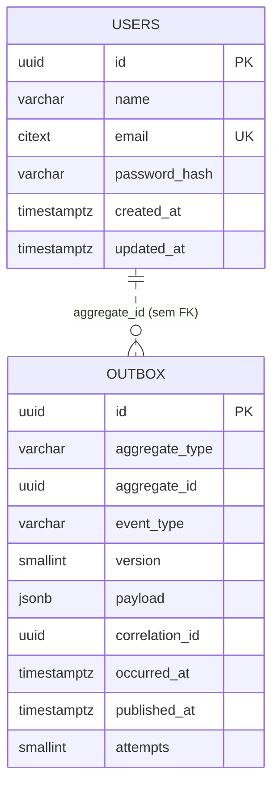
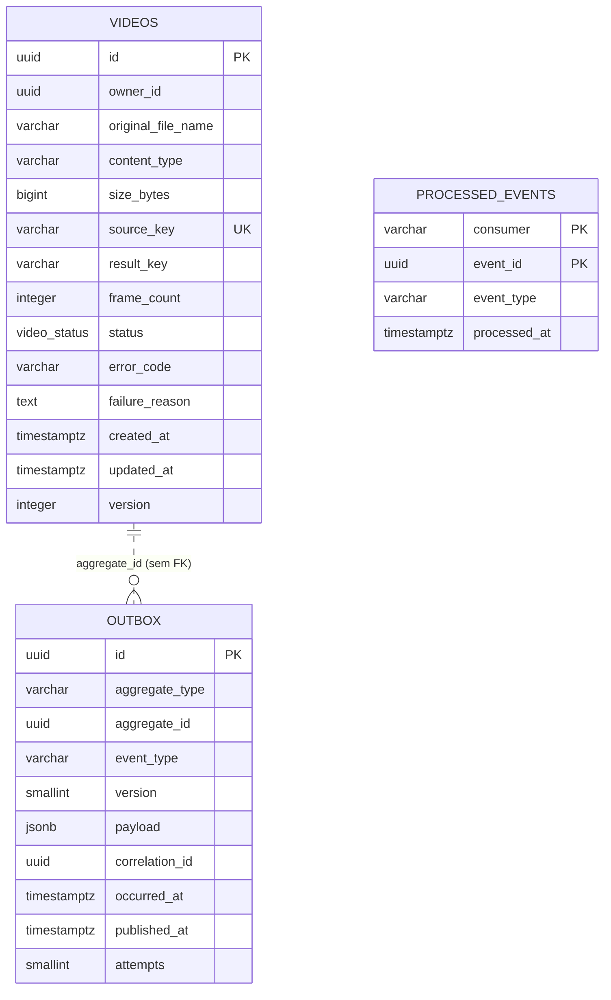
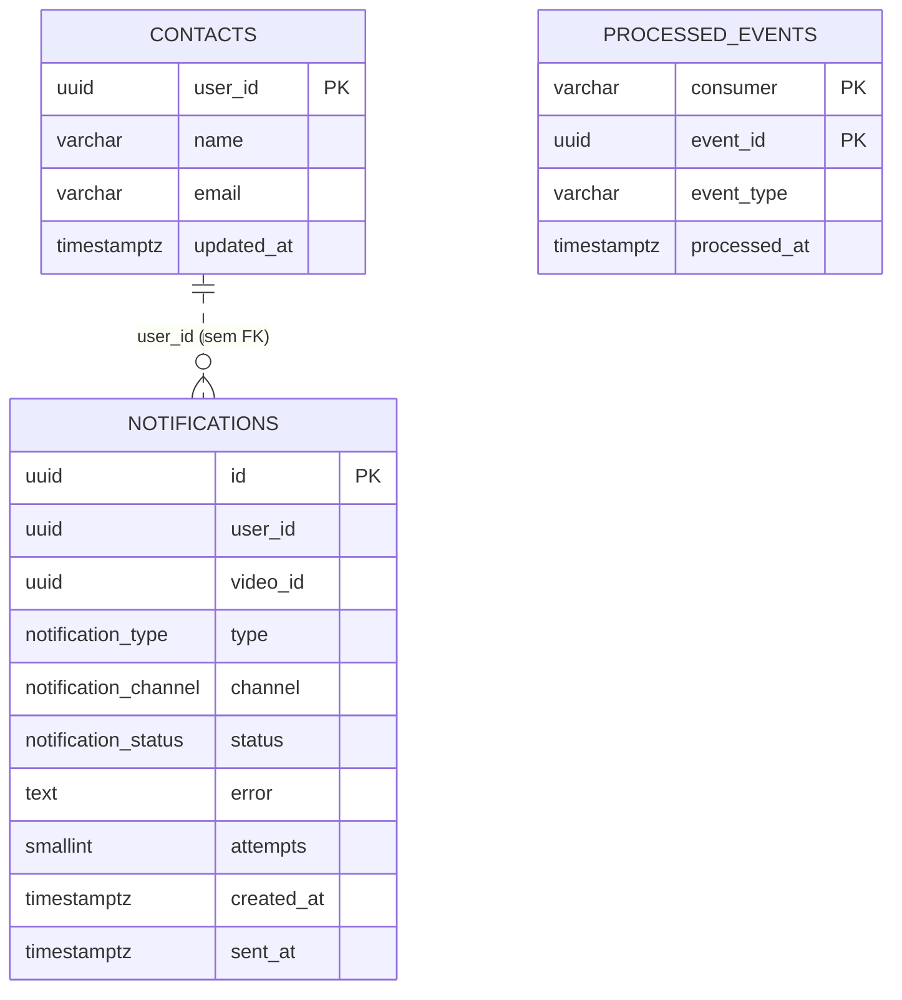

# Planejamento para data models

Cada serviço tem sua própria instância de PostgreSQL e nenhum acessa o banco de outro. Não existe chave estrangeira entre bancos: a ligação entre `users` e `videos`, por exemplo, é feita apenas pelo identificador do usuário, que chega no token.

Os schemas são criados por migrations do Prisma. O SQL desta página é a referência do que as migrations devem gerar e também o script de criação entregue no hackathon.

## Decisões comuns a todos os bancos

| Decisão | Motivo |
|---|---|
| Chaves primárias em `uuid` v7 | Identificadores únicos entre serviços, gerados pela aplicação, e ordenáveis por tempo, o que mantém a localidade nos índices |
| Todos os horários em `timestamptz`, gravados em UTC | Evita ambiguidade entre fusos e horário de verão |
| Status como `enum` do PostgreSQL | Restringe os valores no banco e é mapeado diretamente pelo Prisma |
| `created_at` e `updated_at` em toda tabela mutável | Auditoria mínima |
| Sem exclusão física de vídeos e notificações | O histórico é parte da funcionalidade |
| Tabelas `outbox` e `processed_events` em todo serviço com eventos | Publicação confiável e consumo idempotente ([ADR-0008](adr/0008-outbox-e-idempotencia.md)) |

As tabelas de infraestrutura têm a mesma estrutura em todos os serviços:

- **`outbox`**: eventos gravados na mesma transação da mudança do agregado, publicados depois pelo relay.
- **`processed_events`**: identificadores de eventos já tratados. A chave primária é composta por `consumer` e `event_id`, porque um mesmo serviço pode ter mais de um consumidor e cada um precisa tratar o evento uma vez.

Ambas crescem sem parar e são limpas por rotina periódica: `outbox` remove linhas publicadas há mais de sete dias, e `processed_events` remove registros mais antigos que o prazo máximo de reentrega.

## auth-db



### `users`

| Coluna | Tipo | Restrições | Observação |
|---|---|---|---|
| `id` | `uuid` | PK | Vai no `sub` do JWT e identifica o dono dos vídeos |
| `name` | `varchar(120)` | not null | |
| `email` | `citext` | not null, unique | `citext` torna a comparação insensível a maiúsculas sem precisar de índice funcional |
| `password_hash` | `char(60)` | not null | Hash bcrypt, que tem tamanho fixo |
| `created_at` | `timestamptz` | not null, default `now()` | |
| `updated_at` | `timestamptz` | not null, default `now()` | |

O índice único de `email` atende tanto à regra de unicidade quanto à busca do login.

### `outbox`

| Coluna | Tipo | Restrições | Observação |
|---|---|---|---|
| `id` | `uuid` | PK | |
| `aggregate_type` | `varchar(50)` | not null | `User` |
| `aggregate_id` | `uuid` | not null | Sem FK, para que a limpeza do outbox seja independente |
| `event_type` | `varchar(100)` | not null | `user.registered` |
| `version` | `smallint` | not null, default 1 | Versão do contrato do evento |
| `payload` | `jsonb` | not null | Já no formato publicado |
| `correlation_id` | `uuid` | | Propagado para rastreamento |
| `occurred_at` | `timestamptz` | not null, default `now()` | |
| `published_at` | `timestamptz` | | Nulo enquanto pendente |
| `attempts` | `smallint` | not null, default 0 | Tentativas de publicação |

O relay busca as linhas pendentes mais antigas primeiro. Como a maioria das linhas fica publicada, o índice é parcial:

```sql
CREATE INDEX idx_outbox_pendentes ON outbox (occurred_at) WHERE published_at IS NULL;
```

### DDL

```sql
CREATE EXTENSION IF NOT EXISTS citext;

CREATE TABLE users (
  id            uuid        PRIMARY KEY,
  name          varchar(120) NOT NULL,
  email         citext      NOT NULL UNIQUE,
  password_hash char(60)    NOT NULL,
  created_at    timestamptz NOT NULL DEFAULT now(),
  updated_at    timestamptz NOT NULL DEFAULT now()
);

CREATE TABLE outbox (
  id             uuid         PRIMARY KEY,
  aggregate_type varchar(50)  NOT NULL,
  aggregate_id   uuid         NOT NULL,
  event_type     varchar(100) NOT NULL,
  version        smallint     NOT NULL DEFAULT 1,
  payload        jsonb        NOT NULL,
  correlation_id uuid,
  occurred_at    timestamptz  NOT NULL DEFAULT now(),
  published_at   timestamptz,
  attempts       smallint     NOT NULL DEFAULT 0
);

CREATE INDEX idx_outbox_pendentes ON outbox (occurred_at) WHERE published_at IS NULL;
```

## video-db



### `videos`

| Coluna | Tipo | Restrições | Observação |
|---|---|---|---|
| `id` | `uuid` | PK | Também compõe as chaves no storage |
| `owner_id` | `uuid` | not null | Vem do `sub` do token, sem FK entre bancos |
| `original_file_name` | `varchar(255)` | not null | Nome informado pelo usuário |
| `content_type` | `varchar(100)` | not null | |
| `size_bytes` | `bigint` | not null, `> 0` | Confirmado com o tamanho real no storage |
| `source_key` | `varchar(512)` | not null, unique | `uploads/{owner_id}/{id}` |
| `result_key` | `varchar(512)` | | `outputs/{owner_id}/{id}.zip`, preenchido ao concluir |
| `frame_count` | `integer` | | Quantidade de frames extraídos |
| `status` | `video_status` | not null, default `AWAITING_UPLOAD` | Enum do banco |
| `error_code` | `varchar(50)` | | Código da falha, usado em métricas |
| `failure_reason` | `text` | | Motivo legível, exibido ao usuário |
| `created_at` | `timestamptz` | not null, default `now()` | |
| `updated_at` | `timestamptz` | not null, default `now()` | |
| `version` | `integer` | not null, default 0 | Controle de concorrência otimista |

As invariantes do agregado também são garantidas no banco, para que nenhum caminho de escrita as contorne:

```sql
CONSTRAINT ck_videos_done   CHECK (status <> 'DONE'   OR (result_key IS NOT NULL AND frame_count > 0)),
CONSTRAINT ck_videos_failed CHECK (status <> 'FAILED' OR failure_reason IS NOT NULL)
```

Índices:

| Índice | Colunas | Uso |
|---|---|---|
| `idx_videos_owner` | `(owner_id, created_at DESC)` | Listagem paginada do usuário, a consulta mais frequente |
| `uq_videos_source_key` | `(source_key)` | Garante um upload por vídeo |
| `idx_videos_em_andamento` | `(status, created_at)` parcial para `QUEUED` e `PROCESSING` | Monitoramento e detecção de vídeos presos |

### `processed_events`

| Coluna | Tipo | Restrições |
|---|---|---|
| `consumer` | `varchar(100)` | PK composta |
| `event_id` | `uuid` | PK composta |
| `event_type` | `varchar(100)` | not null |
| `processed_at` | `timestamptz` | not null, default `now()` |

A linha é gravada na mesma transação do efeito do evento. Se o mesmo `event_id` chegar de novo, a inserção falha na chave primária e o consumidor apenas confirma a mensagem.

### DDL

```sql
CREATE TYPE video_status AS ENUM (
  'AWAITING_UPLOAD',
  'QUEUED',
  'PROCESSING',
  'DONE',
  'FAILED'
);

CREATE TABLE videos (
  id                 uuid         PRIMARY KEY,
  owner_id           uuid         NOT NULL,
  original_file_name varchar(255) NOT NULL,
  content_type       varchar(100) NOT NULL,
  size_bytes         bigint       NOT NULL CHECK (size_bytes > 0),
  source_key         varchar(512) NOT NULL UNIQUE,
  result_key         varchar(512),
  frame_count        integer      CHECK (frame_count IS NULL OR frame_count > 0),
  status             video_status NOT NULL DEFAULT 'AWAITING_UPLOAD',
  error_code         varchar(50),
  failure_reason     text,
  created_at         timestamptz  NOT NULL DEFAULT now(),
  updated_at         timestamptz  NOT NULL DEFAULT now(),
  version            integer      NOT NULL DEFAULT 0,
  CONSTRAINT ck_videos_done   CHECK (status <> 'DONE'   OR (result_key IS NOT NULL AND frame_count > 0)),
  CONSTRAINT ck_videos_failed CHECK (status <> 'FAILED' OR failure_reason IS NOT NULL)
);

CREATE INDEX idx_videos_owner ON videos (owner_id, created_at DESC);

CREATE INDEX idx_videos_em_andamento ON videos (status, created_at)
  WHERE status IN ('QUEUED', 'PROCESSING');

CREATE TABLE outbox (
  id             uuid         PRIMARY KEY,
  aggregate_type varchar(50)  NOT NULL,
  aggregate_id   uuid         NOT NULL,
  event_type     varchar(100) NOT NULL,
  version        smallint     NOT NULL DEFAULT 1,
  payload        jsonb        NOT NULL,
  correlation_id uuid,
  occurred_at    timestamptz  NOT NULL DEFAULT now(),
  published_at   timestamptz,
  attempts       smallint     NOT NULL DEFAULT 0
);

CREATE INDEX idx_outbox_pendentes ON outbox (occurred_at) WHERE published_at IS NULL;

CREATE TABLE processed_events (
  consumer     varchar(100) NOT NULL,
  event_id     uuid         NOT NULL,
  event_type   varchar(100) NOT NULL,
  processed_at timestamptz  NOT NULL DEFAULT now(),
  PRIMARY KEY (consumer, event_id)
);
```

## notification-db



Não há chave estrangeira de `notifications` para `contacts` de propósito: uma falha de processamento pode chegar antes do evento de cadastro do usuário. Nesse caso a notificação nasce `PENDING` e é enviada quando o contato aparece.

### `contacts`

| Coluna | Tipo | Restrições | Observação |
|---|---|---|---|
| `user_id` | `uuid` | PK | Projeção de `user.registered` |
| `name` | `varchar(120)` | not null | |
| `email` | `varchar(255)` | not null | Destino das notificações |
| `updated_at` | `timestamptz` | not null, default `now()` | Permite descartar eventos antigos |

A projeção é gravada com `INSERT ... ON CONFLICT (user_id) DO UPDATE`, o que torna o consumo idempotente também no nível da escrita.

### `notifications`

| Coluna | Tipo | Restrições | Observação |
|---|---|---|---|
| `id` | `uuid` | PK | |
| `user_id` | `uuid` | not null | |
| `video_id` | `uuid` | not null | |
| `type` | `notification_type` | not null | `VIDEO_FAILED` |
| `channel` | `notification_channel` | not null, default `EMAIL` | Abre espaço para outros canais |
| `status` | `notification_status` | not null, default `PENDING` | `PENDING`, `SENT` ou `FAILED` |
| `error` | `text` | | Último erro de envio |
| `attempts` | `smallint` | not null, default 0 | |
| `created_at` | `timestamptz` | not null, default `now()` | |
| `sent_at` | `timestamptz` | | Preenchido no envio |

Índices:

| Índice | Colunas | Uso |
|---|---|---|
| `uq_notifications_video_tipo` | `(video_id, type)` único | Garante uma notificação por vídeo e tipo, mesmo com reentrega |
| `idx_notifications_pendentes` | `(created_at)` parcial para `PENDING` | Rotina que envia o que ficou aguardando contato |
| `idx_notifications_user` | `(user_id, created_at DESC)` | Histórico do usuário |

### DDL

```sql
CREATE TYPE notification_type    AS ENUM ('VIDEO_FAILED');
CREATE TYPE notification_channel AS ENUM ('EMAIL');
CREATE TYPE notification_status  AS ENUM ('PENDING', 'SENT', 'FAILED');

CREATE TABLE contacts (
  user_id    uuid         PRIMARY KEY,
  name       varchar(120) NOT NULL,
  email      varchar(255) NOT NULL,
  updated_at timestamptz  NOT NULL DEFAULT now()
);

CREATE TABLE notifications (
  id         uuid                 PRIMARY KEY,
  user_id    uuid                 NOT NULL,
  video_id   uuid                 NOT NULL,
  type       notification_type    NOT NULL,
  channel    notification_channel NOT NULL DEFAULT 'EMAIL',
  status     notification_status  NOT NULL DEFAULT 'PENDING',
  error      text,
  attempts   smallint             NOT NULL DEFAULT 0,
  created_at timestamptz          NOT NULL DEFAULT now(),
  sent_at    timestamptz,
  CONSTRAINT uq_notifications_video_tipo UNIQUE (video_id, type),
  CONSTRAINT ck_notifications_sent CHECK (status <> 'SENT' OR sent_at IS NOT NULL)
);

CREATE INDEX idx_notifications_pendentes ON notifications (created_at) WHERE status = 'PENDING';
CREATE INDEX idx_notifications_user ON notifications (user_id, created_at DESC);

CREATE TABLE processed_events (
  consumer     varchar(100) NOT NULL,
  event_id     uuid         NOT NULL,
  event_type   varchar(100) NOT NULL,
  processed_at timestamptz  NOT NULL DEFAULT now(),
  PRIMARY KEY (consumer, event_id)
);
```

## Dados fora do PostgreSQL

| Onde | O que | Observação |
|---|---|---|
| SeaweedFS | Vídeos originais e pacotes de frames | Chaves determinísticas, descritas em [Arquitetura](03-arquitetura.md) |
| Redis | Primeira página da listagem por usuário | Cache-aside com TTL curto, nunca fonte da verdade |
| RabbitMQ | Eventos em trânsito e mensagens na DLQ | Filas duráveis com mensagens persistentes |

O `processor-worker` não tem banco: tudo de que ele precisa vem na mensagem e no storage.
