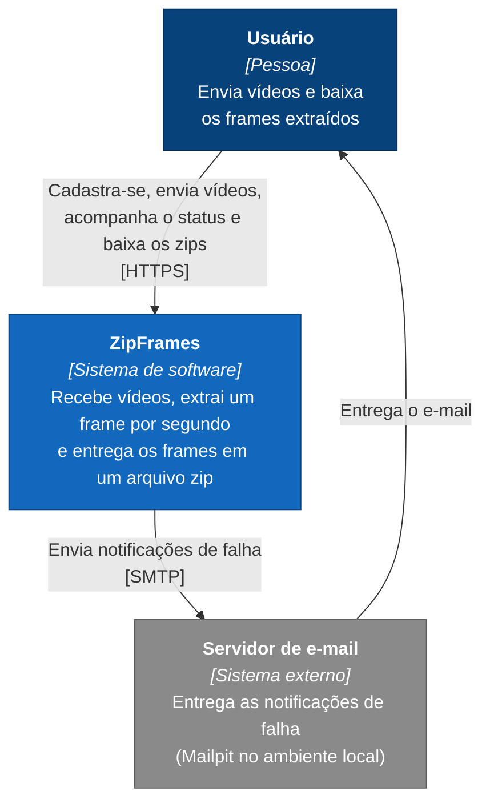

# C4 nível 1: contexto

Mostra o sistema como uma caixa única, quem o usa e com quais sistemas externos ele se relaciona.

## Elementos

| Elemento | Tipo | Descrição |
|---|---|---|
| Usuário | Pessoa | Qualquer pessoa cadastrada. Não há perfis diferentes na primeira versão |
| ZipFrames | Sistema interno | O sistema construído para a FIAP X, objeto desta documentação |
| Servidor de e-mail | Sistema externo | Qualquer servidor SMTP. No ambiente local, o Mailpit captura as mensagens e as exibe em uma interface web |

## Legenda

| Cor | Significado |
|---|---|
| Azul escuro | Pessoa |
| Azul | Sistema construído neste projeto |
| Cinza | Sistema externo |
