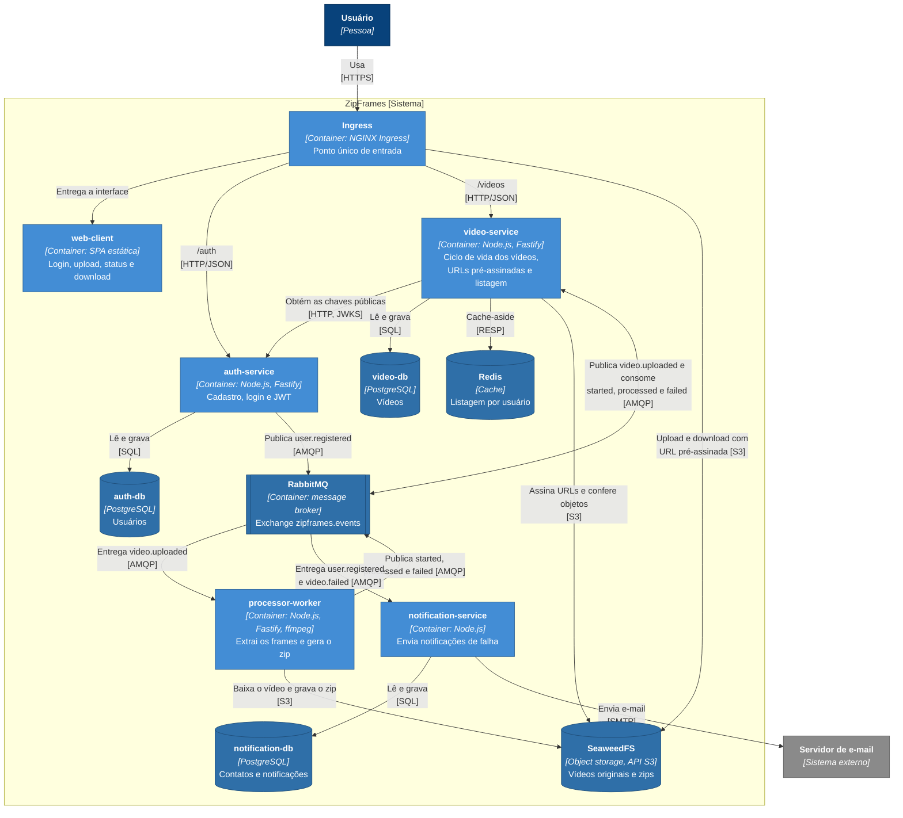

# C4 nível 2: containers

Abre o sistema e mostra as aplicações e os armazenamentos que o compõem, com as tecnologias e os protocolos de comunicação.

A interface roda no navegador do usuário, então as chamadas à API e ao storage partem do navegador e passam pelo Ingress.

## Containers

| Container                          | Tecnologia                              | Responsabilidade                                               | Escala                            |
| ---------------------------------- | --------------------------------------- | -------------------------------------------------------------- | --------------------------------- |
| web-client                         | SPA estática                            | Interface do usuário                                           | Réplicas fixas                    |
| Ingress                            | NGINX Ingress Controller                | Roteamento, TLS e exposição do storage para URLs pré-assinadas | Gerenciado pelo cluster           |
| auth-service                       | Node.js, TypeScript, Fastify, Prisma    | Identidade e emissão de tokens                                 | HPA por CPU                       |
| video-service                      | Node.js, TypeScript, Fastify, Prisma    | Gestão de vídeos                                               | HPA por CPU                       |
| processor-worker                   | Node.js, TypeScript, ffmpeg             | Processamento                                                  | KEDA pelo tamanho da fila         |
| notification-service               | Node.js, TypeScript, Nodemailer, Prisma | Notificações                                                   | Réplicas fixas                    |
| RabbitMQ                           | RabbitMQ Cluster Operator               | Transporte dos eventos                                         | Cluster do operator               |
| auth-db, video-db, notification-db | PostgreSQL com CloudNativePG            | Persistência de cada serviço                                   | Instância por serviço             |
| Redis                              | Redis                                   | Cache da listagem                                              | Instância única                   |
| SeaweedFS                          | SeaweedFS com gateway S3                | Armazenamento de arquivos                                      | Instância única no ambiente local |

## Infraestrutura de suporte

Fora do fluxo de negócio, o cluster também executa Prometheus, Grafana e Jaeger (observabilidade), KEDA (escala do worker) e Argo CD (entrega contínua). Eles não aparecem no diagrama para manter o foco nos containers do sistema.
