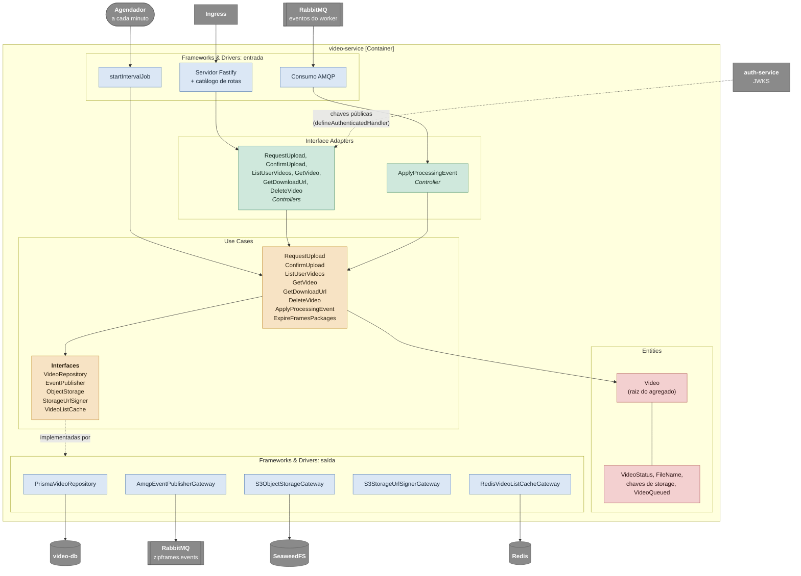

# C4 nível 3: componentes do video-service

Abre o video-service e mostra o caminho de uma requisição e de um evento. Os nomes das caixas são os nomes das classes no código; o mapa de pastas e o porquê de cada camada estão em [video-service.md](../../architecture/services/video-service.md) e [layers.md](../../architecture/layers.md).

O diagrama segue o caminho em tempo de execução: entra pelos frameworks (HTTP, fila ou relógio), passa pelos controllers, chega aos casos de uso e às entidades, e sai pelas interfaces que o caso de uso declara até as classes que as implementam. O RabbitMQ aparece duas vezes apenas para separar consumo e publicação. O agendador da expiração chama o caso de uso direto: não há controller, porque não há entrada externa a validar.

Não existe `ProcessedEventStore` nem tabela de eventos processados: a máquina de estados do `Video` já torna o consumo idempotente (ver [modelagem de dados](../../data/modelagem-de-dados.md)). Também não há ports `Clock` e `IdGenerator`: a entidade gera o próprio id e o caso de uso lê `new Date()`, como no auth-service. Os testes controlam o tempo com os fake timers do Vitest.

## Componentes

| Camada               | Componente                                            | Responsabilidade                                                                                  |
| -------------------- | ----------------------------------------------------- | ------------------------------------------------------------------------------------------------- |
| Entities             | `Video`                                               | Mantém o estado do vídeo e aplica as regras de transição, de retenção e de download               |
| Entities             | `FileName`, `VideoStatus`, chaves                     | Validam o nome e a extensão, enumeram os status e derivam `sourceKey` e `resultKey`               |
| Use Cases            | `RequestUpload`                                       | Valida nome, tipo e tamanho, cria o vídeo e devolve a URL de upload                               |
| Use Cases            | `ConfirmUpload`                                       | Confere o objeto no storage, grava `QUEUED` e publica `video.uploaded` na mesma transação         |
| Use Cases            | `ListUserVideos` e `GetVideo`                         | Consultam os vídeos do dono; a listagem usa o cache na primeira página                            |
| Use Cases            | `GetDownloadUrl`                                      | Verifica se o pacote está disponível e devolve a URL do zip                                       |
| Use Cases            | `DeleteVideo`                                         | Apaga os arquivos e marca o vídeo `DELETED`                                                       |
| Use Cases            | `ApplyProcessingEvent`                                | Aplica os eventos do worker de forma idempotente e invalida o cache                               |
| Use Cases            | `ExpireFramesPackages`                                | Apaga os pacotes vencidos e marca os vídeos `EXPIRED`                                             |
| Use Cases            | Interfaces                                            | Declaradas pelos casos de uso em `application/interfaces/`                                        |
| Interface Adapters   | Controllers HTTP                                      | `defineAuthenticatedHandler`: validam o token (JWKS), a entrada e traduzem o `Result` em resposta |
| Interface Adapters   | `ApplyProcessingEventController`                      | `defineMessageHandler`: valida o envelope contra os três eventos do worker e chama o caso de uso  |
| Frameworks & Drivers | `PrismaVideoRepository`                               | Persistência com lock otimista por `version` (`UPDATE ... WHERE version = $1`)                    |
| Frameworks & Drivers | `AmqpEventPublisherGateway`                           | Monta o envelope e publica no exchange `zipframes.events` com confirmação do broker               |
| Frameworks & Drivers | `S3ObjectStorageGateway`, `S3StorageUrlSignerGateway` | Conferem e apagam objetos; assinam URLs com o endpoint público                                    |
| Frameworks & Drivers | `RedisVideoListCacheGateway`                          | Cache-aside que degrada para miss quando o Redis cai                                              |

O composition root (`main/`) não aparece no diagrama: ele lê a configuração, abre os clientes uma vez e os injeta pelas factories nos casos de uso e controllers.
