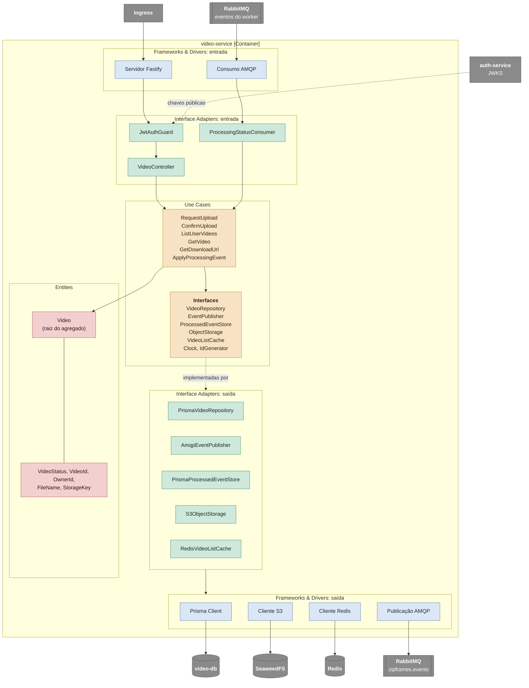

# C4 nível 3: componentes do video-service

Abre o video-service e mostra o caminho de uma requisição. Os nomes das caixas ajudam a ler o fluxo. Não são o mapa de pastas do repositório. Nos serviços que já existem, `application/` junta casos de uso e interface adapters, e a implementação fica em `infrastructure/`; o porquê está em [layers.md](../../architecture/layers.md). O video-service ainda não está implementado.

O diagrama segue o caminho de uma requisição em tempo de execução: entra pelos frameworks, passa pelos controllers e consumers, chega aos use cases e às entidades, e sai pelas interfaces que o caso de uso declara até as implementações e seus clientes. A coluna da tabela abaixo repete o nome da caixa do diagrama. Esse nome não é uma pasta do repositório.

No código dos serviços que já existem, o caso de uso e a interface que ele declara ficam juntos em `application/`. A classe que implementa a interface fica em `infrastructure/` e importa essa interface; o caso de uso não importa a implementação. É isso que permite gravar no banco sem conhecer o Prisma. O diagrama acima separa caixas para ler o fluxo; essa separação não é uma camada a mais no repositório. O RabbitMQ aparece duas vezes apenas para separar consumo e publicação. As interfaces seguem `application/interfaces/`. Quando o video-service existir, ele publica como o auth-service e o processor-worker: repositório e depois `EventPublisher`, sem tabela outbox e sem relay.

## Componentes

| Camada               | Componente                    | Responsabilidade                                                                                            |
| -------------------- | ----------------------------- | ----------------------------------------------------------------------------------------------------------- |
| Entities             | `Video`                       | Mantém o estado do vídeo e aplica as regras de transição                                                    |
| Entities             | Value objects                 | Validam e representam status, identificadores, nome de arquivo e chaves                                     |
| Use Cases            | `RequestUpload`               | Valida nome, tipo e tamanho, cria o vídeo e devolve a URL de upload                                         |
| Use Cases            | `ConfirmUpload`               | Confere o objeto, grava o vídeo e publica `video.uploaded` pelo `EventPublisher`                            |
| Use Cases            | `ListUserVideos` e `GetVideo` | Consultam os vídeos do dono, usando o cache na listagem                                                     |
| Use Cases            | `GetDownloadUrl`              | Verifica se o vídeo está `DONE` e devolve a URL do zip                                                      |
| Use Cases            | `ApplyProcessingEvent`        | Aplica os eventos do worker de forma idempotente e invalida o cache                                         |
| Use Cases            | Interfaces                    | Interfaces que os use cases declaram; no código ficam em `application/interfaces/`, junto dos casos de uso  |
| Interface Adapters   | `JwtAuthGuard`                | Extrai e valida o token e disponibiliza o `ownerId`                                                         |
| Interface Adapters   | `VideoController`             | Converte HTTP em chamadas aos use cases e os resultados em respostas                                        |
| Interface Adapters   | `ProcessingStatusConsumer`    | Valida as mensagens contra os contratos e chama `ApplyProcessingEvent`                                      |
| Interface Adapters   | `AmqpEventPublisher`          | Monta o envelope e publica no exchange `zipframes.events`                                                   |
| Interface Adapters   | Repositórios, storage e cache | Implementam as interfaces com Prisma, S3 e Redis, com mappers entre o modelo de domínio e o de persistência |
| Frameworks & Drivers | Servidor e clientes           | Configuração do Fastify, do Prisma Client, da conexão AMQP e dos clientes S3 e Redis                        |

O composition root (`main/`) não aparece no diagrama: ele lê a configuração, cria os clientes e as implementações e os injeta nos use cases e controllers na inicialização.
