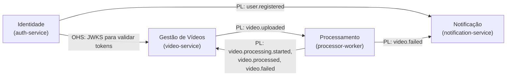
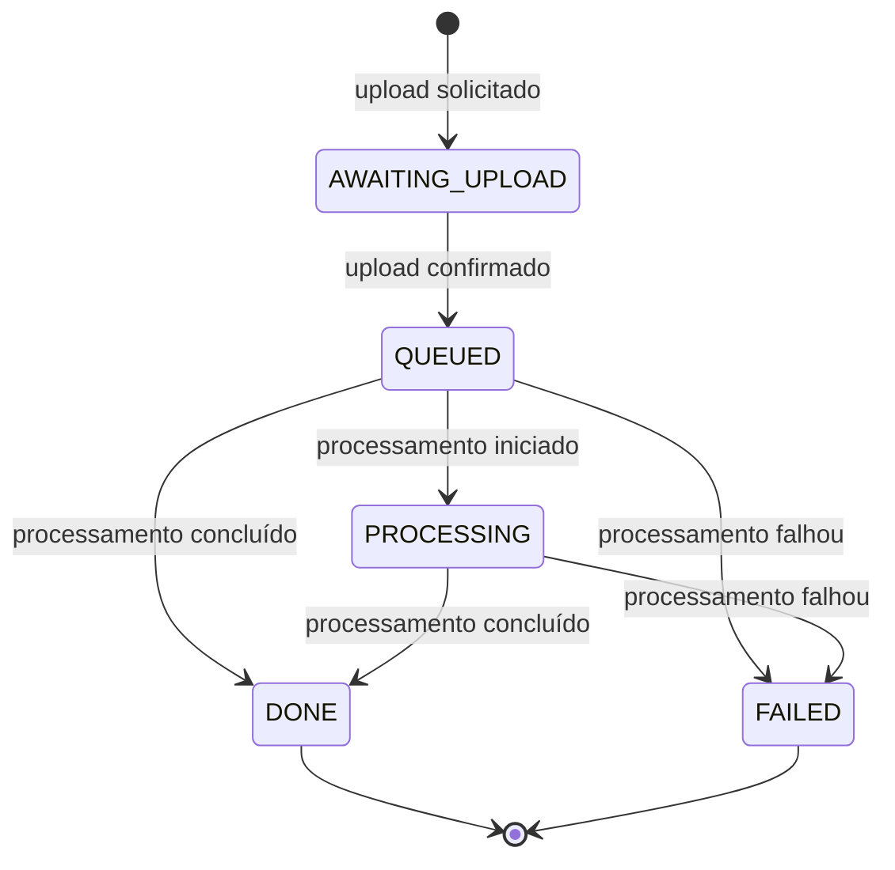

# Domínio

## Visão geral

Um usuário cadastrado envia um vídeo e recebe, de forma assíncrona, um arquivo zip com um frame por segundo do vídeo. Ele acompanha o andamento de cada envio e é avisado por e-mail quando algo dá errado.

## Linguagem ubíqua

Os termos abaixo são usados igualmente no código, nos eventos, na API e nesta documentação. No código, os nomes ficam em inglês (coluna da direita).

| Termo | Significado | No código |
|---|---|---|
| Usuário | Pessoa cadastrada que envia vídeos | `User` |
| Contato | Cópia dos dados de contato de um usuário mantida pelo contexto de notificação | `Contact` |
| Vídeo | Arquivo enviado por um usuário e todo o seu ciclo de vida no sistema | `Video` |
| Dono | Usuário que enviou o vídeo e o único que pode vê-lo | `ownerId` |
| Solicitação de upload | Pedido de uma URL para enviar o arquivo ao storage | `RequestUpload` |
| Confirmação de upload | Aviso do cliente de que o arquivo foi enviado, que coloca o vídeo na fila | `ConfirmUpload` |
| Processamento | Extração dos frames e geração do pacote | `Processing` |
| Frame | Imagem PNG extraída do vídeo, uma por segundo | `Frame` |
| Pacote de frames | Arquivo zip com todos os frames de um vídeo | `FramesPackage` (`resultKey`) |
| Status | Etapa atual do vídeo no ciclo de vida | `VideoStatus` |
| Falha de processamento | Término do processamento sem gerar o pacote | `video.failed` |
| Falha transitória | Erro que pode desaparecer em nova tentativa, como storage indisponível | `TransientProcessingError` |
| Falha permanente | Erro que se repetiria em qualquer tentativa, como arquivo inválido | `PermanentProcessingError` |
| Notificação | Mensagem enviada ao usuário sobre uma falha | `Notification` |

## Subdomínios

| Subdomínio | Tipo | Justificativa |
|---|---|---|
| Processamento de vídeo | Principal (core) | É o que os investidores compraram: transformar vídeo em frames de forma confiável e escalável |
| Gestão de vídeos | Suporte | Controla o ciclo de vida e a visibilidade dos vídeos, específico do negócio mas sem diferencial próprio |
| Identidade e acesso | Genérico | Cadastro e login são problemas resolvidos, sem regra de negócio própria |
| Notificação | Genérico | Envio de mensagens é uma capacidade comum a qualquer sistema |

## Bounded contexts

Cada bounded context corresponde a um microsserviço, com modelo e banco de dados próprios.

| Contexto | Serviço | Responsabilidade |
|---|---|---|
| Identidade | `auth-service` | Cadastro, autenticação e emissão de tokens |
| Gestão de Vídeos | `video-service` | Ciclo de vida do vídeo, acesso ao storage por URLs pré-assinadas e listagem |
| Processamento | `processor-worker` | Extração de frames e geração do pacote |
| Notificação | `notification-service` | Contatos e envio de notificações |

### Mapa de contextos



- **Open Host Service (OHS):** o contexto de Identidade expõe as chaves públicas (JWKS) em um endpoint padronizado. Os outros contextos validam tokens sem conhecer o modelo de usuário.
- **Published Language (PL):** os contextos conversam por eventos de integração versionados, definidos em `packages/contracts` e documentados em AsyncAPI. Nenhum contexto acessa o banco de outro.
- **Conformista:** Processamento e Notificação consomem os eventos como publicados, sem camada de tradução própria, porque os contratos já foram desenhados para eles.
- **Sem dependência de dados de usuário na Gestão de Vídeos:** o dono do vídeo é identificado apenas pelo `sub` do token, sem consulta ao contexto de Identidade.
## Modelo por contexto

### Identidade

**Agregado `User`**

| Elemento | Tipo | Descrição |
|---|---|---|
| `id` | `UserId` (UUID) | Identificador |
| `name` | string | Nome de exibição |
| `email` | `Email` (value object) | Normalizado em minúsculas, formato validado |
| `passwordHash` | `PasswordHash` (value object) | Hash bcrypt, nunca a senha |
| `createdAt` | data | Criação |

Regras:
- O e-mail é único no sistema.
- A senha segue uma política mínima (ao menos 8 caracteres, com letras e números) validada pelo value object `Password` antes de gerar o hash.
- O login falha com a mesma mensagem para e-mail inexistente e senha errada, para não revelar quais e-mails estão cadastrados.
Evento de domínio: `UserRegistered`.

### Gestão de Vídeos

**Agregado `Video`**

| Elemento | Tipo | Descrição |
|---|---|---|
| `id` | `VideoId` (UUID) | Identificador, também usado nas chaves do storage |
| `ownerId` | `OwnerId` | `sub` do token de quem enviou |
| `originalFileName` | `FileName` (value object) | Nome informado, com extensão validada |
| `contentType` | string | Tipo declarado pelo cliente |
| `sizeBytes` | número | Tamanho declarado e depois conferido no storage |
| `sourceKey` | `StorageKey` | `uploads/{ownerId}/{videoId}` |
| `resultKey` | `StorageKey` opcional | `outputs/{ownerId}/{videoId}.zip`, presente quando concluído |
| `frameCount` | número opcional | Quantidade de frames gerados |
| `status` | `VideoStatus` | Etapa atual |
| `failureReason` | string opcional | Motivo legível da falha |
| `createdAt`, `updatedAt` | datas | Auditoria |
| `version` | número | Controle de concorrência otimista |

**Ciclo de vida**



Regras:
- **Extensões aceitas:** `mp4`, `avi`, `mov`, `mkv`, `wmv`, `flv` e `webm`, as mesmas do projeto base.
- **Tamanho máximo configurável** (por exemplo, 500 MB), verificado na solicitação e novamente na confirmação, com o tamanho real do objeto no storage.
- **Confirmação** só é aceita quando o vídeo está em `AWAITING_UPLOAD` e o objeto existe no storage.
- **Transições inválidas são rejeitadas pela entidade.** Por exemplo, um vídeo `DONE` nunca volta para `PROCESSING`.
- **`DONE` e `FAILED` são estados finais.** Eventos que chegarem depois deles são ignorados, o que torna o agregado tolerante a mensagens duplicadas ou fora de ordem.
- **`QUEUED` pode ir direto para `DONE` ou `FAILED`**, porque o evento de início pode chegar atrasado ou depois do resultado.
- **`DONE` exige `resultKey` e `frameCount` maior que zero, e `FAILED` exige `failureReason`.**
- **Somente o dono** vê, confirma e baixa o vídeo. Para outros usuários, o vídeo simplesmente não existe (resposta 404, e não 403).
- **URLs pré-assinadas têm validade curta:** 15 minutos para upload e 5 minutos para download.
Eventos de domínio: `VideoQueued`, `VideoProcessingStarted`, `VideoCompleted`, `VideoFailed`. Apenas `VideoQueued` gera evento de integração (`video.uploaded`), já que os demais são reações a eventos que vieram do Processamento.

### Processamento

O contexto de Processamento não persiste estado próprio: cada mensagem carrega o que é necessário, e o resultado vive no storage e nos eventos publicados.

**Conceitos**

- **`ProcessingJob`**: a unidade de trabalho criada a partir de `video.uploaded`, com `videoId`, `ownerId`, `sourceKey` e o número da tentativa.
- **`FrameExtractionPolicy`**: um frame por segundo, em PNG, nomeados `frame_0001.png` em diante.
- **`FramesPackage`**: o zip resultante, gravado sem recompressão (os PNGs já são comprimidos).
Regras:
- **A chave do resultado é determinística** (`outputs/{ownerId}/{videoId}.zip`). Reprocessar a mesma mensagem sobrescreve o mesmo objeto, sem duplicar resultados.
- **Um vídeo sem nenhum frame extraído é uma falha permanente.**
- **Falhas são classificadas:**
  - *permanentes* (arquivo corrompido, formato não suportado pelo `ffmpeg`, nenhum frame) geram `video.failed` imediatamente;
  - *transitórias* (storage ou broker indisponível, falta de espaço temporário) são reprocessadas com backoff até o limite de tentativas. Na última, o worker publica `video.failed` e a mensagem segue para a DLQ.
- **O processamento tem tempo máximo configurável.** Estourar o prazo conta como falha transitória.
- **Arquivos temporários são sempre removidos** ao fim da tentativa, com sucesso ou falha.
### Notificação

**Entidade `Contact`** (projeção local de `user.registered`): `userId`, `name`, `email`, `updatedAt`.

**Agregado `Notification`**: `id`, `userId`, `videoId`, `type` (`VIDEO_FAILED`), `channel` (`EMAIL`), `status` (`PENDING`, `SENT`, `FAILED`), `error`, `createdAt`, `sentAt`.

Regras:
- **No máximo uma notificação por vídeo e tipo.** Reentregas de `video.failed` não geram e-mails duplicados.
- **Contato ausente não perde a notificação:** se `video.failed` chegar antes de `user.registered`, a notificação fica `PENDING` e é enviada quando o contato for projetado.
- **Falha no envio do e-mail** é transitória e segue a mesma política de retry das mensagens.
## Eventos de integração

Todos os eventos são publicados no exchange `zipframes.events` com o mesmo envelope:

```json
{
  "eventId": "uuid",
  "eventType": "video.uploaded",
  "version": 1,
  "occurredAt": "2026-09-17T12:00:00.000Z",
  "correlationId": "uuid",
  "payload": {}
}
```

| Evento | Publicado por | Consumido por | Payload |
|---|---|---|---|
| `user.registered` | auth-service | notification-service | `userId`, `name`, `email` |
| `video.uploaded` | video-service | processor-worker | `videoId`, `ownerId`, `sourceKey`, `originalFileName`, `sizeBytes` |
| `video.processing.started` | processor-worker | video-service | `videoId`, `attempt` |
| `video.processed` | processor-worker | video-service | `videoId`, `resultKey`, `frameCount`, `durationMs` |
| `video.failed` | processor-worker | video-service, notification-service | `videoId`, `ownerId`, `errorCode`, `reason`, `attempts` |

Regras dos contratos:
- **Mudanças compatíveis** (novo campo opcional) mantêm a versão. **Mudanças incompatíveis** criam uma nova versão, publicada em paralelo até todos os consumidores migrarem.
- **Consumidores ignoram campos desconhecidos.**
- **A entrega é "pelo menos uma vez"** e todo consumidor é idempotente pelo `eventId`.
- **Retenção:** remoção automática dos zips após um período de 5 (cinco) dias.
