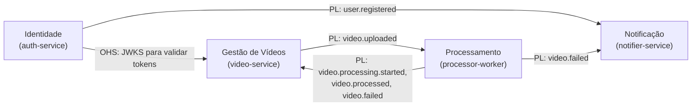
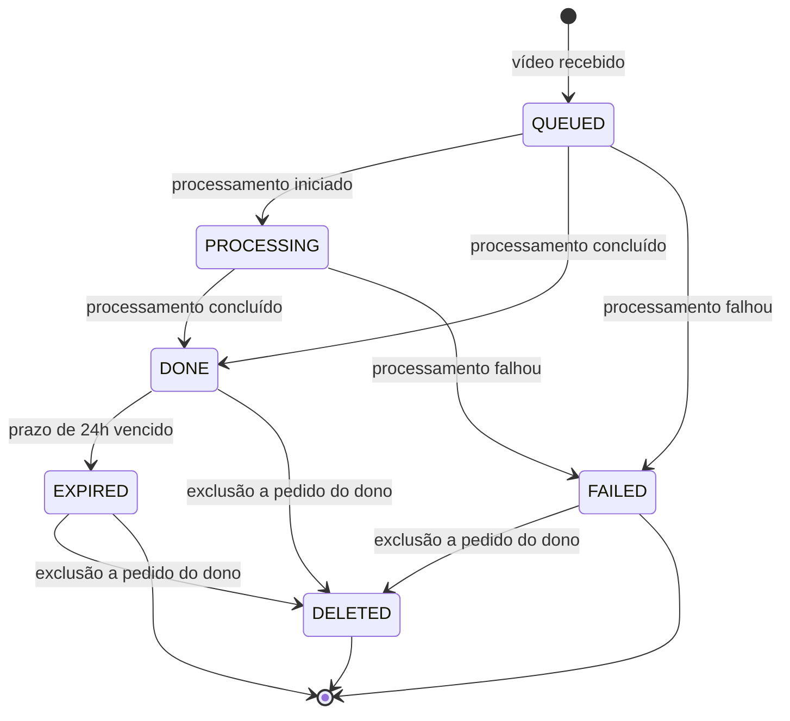

# Domínio

## Visão geral

Um usuário cadastrado envia um vídeo e recebe, de forma assíncrona, um arquivo zip com um frame por segundo do vídeo. Ele acompanha o andamento de cada envio e é avisado por e-mail quando o zip fica pronto ou quando o processamento falha.

## Linguagem ubíqua

Os termos abaixo são usados igualmente no código, nos eventos, na API e nesta documentação. No código, os nomes ficam em inglês (coluna da direita).

| Termo                  | Significado                                                                          | No código                     |
| ---------------------- | ------------------------------------------------------------------------------------ | ----------------------------- |
| Usuário                | Pessoa cadastrada que envia vídeos                                                   | `User`                        |
| Contato                | Cópia dos dados de contato de um usuário mantida pelo contexto de notificação        | `Contact`                     |
| Vídeo                  | Arquivo enviado por um usuário e todo o seu ciclo de vida no sistema                 | `Video`                       |
| Dono                   | Usuário que enviou o vídeo e o único que pode vê-lo                                  | `ownerId`                     |
| Envio do vídeo         | Upload do arquivo em uma chamada; o vídeo já entra na fila de processamento          | `UploadVideo`                 |
| Processamento          | Extração dos frames e geração do pacote                                              | `Processing`                  |
| Frame                  | Imagem PNG extraída do vídeo, uma por segundo                                        | `Frame`                       |
| Pacote de frames       | Arquivo zip com todos os frames de um vídeo                                          | `FramesPackage` (`resultKey`) |
| Status                 | Etapa atual do vídeo no ciclo de vida                                                | `VideoStatus`                 |
| Falha de processamento | Término do processamento sem gerar o pacote                                          | `video.failed`                |
| Falha transitória      | Erro que pode desaparecer em nova tentativa, como storage indisponível               | `TransientProcessingError`    |
| Falha permanente       | Erro que se repetiria em qualquer tentativa, como arquivo inválido                   | `PermanentProcessingError`    |
| Notificação            | Mensagem enviada ao usuário sobre o resultado ou a falha                             | `Notification`                |
| Expiração              | Fim do prazo em que o pacote fica disponível, seguido do apagamento do arquivo       | `VideoStatus.EXPIRED`         |
| Eliminação             | Apagamento definitivo de um arquivo do storage, por expiração ou a pedido do titular | `purge`                       |

## Subdomínios

| Subdomínio             | Tipo             | Justificativa                                                                                           |
| ---------------------- | ---------------- | ------------------------------------------------------------------------------------------------------- |
| Processamento de vídeo | Principal (core) | É o que os investidores compraram: transformar vídeo em frames de forma confiável e escalável           |
| Gestão de vídeos       | Suporte          | Controla o ciclo de vida e a visibilidade dos vídeos, específico do negócio mas sem diferencial próprio |
| Identidade e acesso    | Genérico         | Cadastro e login são problemas resolvidos, sem regra de negócio própria                                 |
| Notificação            | Genérico         | Envio de mensagens é uma capacidade comum a qualquer sistema                                            |

## Bounded contexts

Cada bounded context corresponde a um microsserviço, com modelo e banco de dados próprios.

| Contexto         | Serviço            | Responsabilidade                                                           |
| ---------------- | ------------------ | -------------------------------------------------------------------------- |
| Identidade       | `auth-service`     | Cadastro, autenticação e emissão de tokens                                 |
| Gestão de Vídeos | `video-service`    | Ciclo de vida do vídeo: recebimento, status, listagem, download e retenção |
| Processamento    | `processor-worker` | Extração de frames e geração do pacote                                     |
| Notificação      | `notifier-service` | Contatos e envio de notificações                                           |

### Mapa de contextos



- **Open Host Service (OHS):** o contexto de Identidade expõe as chaves públicas (JWKS) em um endpoint padronizado. Os outros contextos validam tokens sem conhecer o modelo de usuário.
- **Published Language (PL):** os contextos conversam por eventos de integração versionados, implementados em `@zipframes/schemas` e documentados em [AsyncAPI](../asyncapi/events.yaml). Nenhum contexto acessa o banco de outro.
- **Conformista:** Processamento e Notificação consomem os eventos como publicados, sem camada de tradução própria, porque os contratos já foram desenhados para eles.
- **Sem dependência de dados de usuário na Gestão de Vídeos:** o dono do vídeo é identificado apenas pelo `sub` do token, sem consulta ao contexto de Identidade.

## Modelo por contexto

### Identidade

**Agregado `User`**

| Elemento       | Tipo                          | Descrição                                   |
| -------------- | ----------------------------- | ------------------------------------------- |
| `id`           | `UserId` (UUID)               | Identificador                               |
| `name`         | string                        | Nome de exibição                            |
| `email`        | `Email` (value object)        | Normalizado em minúsculas, formato validado |
| `passwordHash` | `PasswordHash` (value object) | Hash bcrypt, nunca a senha                  |
| `createdAt`    | data                          | Criação                                     |

Regras:

- O e-mail é único no sistema.
- A senha segue uma política mínima (ao menos 8 caracteres, com letras e números) validada pelo value object `Password` antes de gerar o hash.
- O login falha com a mesma mensagem para e-mail inexistente e senha errada, para não revelar quais e-mails estão cadastrados.
  Evento de domínio: `UserRegistered`.

### Gestão de Vídeos

**Agregado `Video`**

| Elemento                 | Tipo                      | Descrição                                                                |
| ------------------------ | ------------------------- | ------------------------------------------------------------------------ |
| `id`                     | `VideoId` (UUID)          | Identificador, também usado nas chaves do storage                        |
| `ownerId`                | `OwnerId`                 | `sub` do token de quem enviou                                            |
| `originalFileName`       | `FileName` (value object) | Nome informado, com extensão validada                                    |
| `contentType`            | string                    | Tipo declarado pelo cliente                                              |
| `sizeBytes`              | número                    | Tamanho que o storage recebeu                                            |
| `sourceKey`              | `StorageKey`              | `uploads/{ownerId}/{videoId}`                                            |
| `resultKey`              | `StorageKey` opcional     | `outputs/{ownerId}/{videoId}.zip`, presente enquanto o pacote existe     |
| `frameCount`             | número opcional           | Quantidade de frames gerados                                             |
| `status`                 | `VideoStatus`             | Etapa atual                                                              |
| `failureReason`          | string opcional           | Motivo legível da falha                                                  |
| `expiresAt`              | data opcional             | Momento em que o pacote deixa de ficar disponível, definido na conclusão |
| `createdAt`, `updatedAt` | datas                     | Auditoria                                                                |
| `version`                | número                    | Controle de concorrência otimista                                        |

**Ciclo de vida**



Regras:

- **Extensões aceitas:** `mp4`, `avi`, `mov`, `mkv`, `wmv`, `flv` e `webm`, as mesmas do projeto base.
- **Nome e tipo são validados antes de qualquer byte ser recebido.** Um arquivo que não é vídeo é recusado sem ocupar o storage.
- **Tamanho máximo configurável** (500 MB por padrão), medido nos bytes que chegam, não num valor declarado pelo cliente. Um arquivo vazio ou acima do limite é recusado e o que já tinha sido gravado é apagado.
- **O vídeo nasce `QUEUED`**: só existe depois que o arquivo inteiro está no storage, então não há um estado de "aguardando envio".
- **Transições inválidas são rejeitadas pela entidade.** Por exemplo, um vídeo `DONE` nunca volta para `PROCESSING`.
- **`DONE` e `FAILED` encerram o processamento.** Eventos de processamento que chegarem depois deles (ou de `EXPIRED` e `DELETED`) são ignorados, o que torna o agregado tolerante a mensagens duplicadas ou fora de ordem. As únicas transições posteriores são a expiração e a exclusão a pedido, que não vêm de eventos do worker.
- **`QUEUED` pode ir direto para `DONE` ou `FAILED`**, porque o evento de início pode chegar atrasado ou depois do resultado.
- **A chave do pacote é derivada, nunca aceita do evento.** `video.processed` só vale se `resultKey` for `outputs/{ownerId}/{videoId}.zip`; qualquer outra chave é ignorada, para um evento não dar ao dono uma URL de outro objeto.
- **`DONE` exige `resultKey`, `frameCount` maior que zero e `expiresAt`, e `FAILED` exige `failureReason`.**
- **`EXPIRED` e `DELETED` exigem `resultKey` nulo**, porque o arquivo já não existe.
- **Somente o dono** vê, baixa e exclui o vídeo. Para outros usuários, o vídeo simplesmente não existe (resposta 404, e não 403).
- **A URL de download tem validade curta:** 5 minutos, restrita ao pacote daquele vídeo.
- **O pacote fica disponível por 24 horas** contadas da conclusão. Depois disso o arquivo é apagado e o vídeo passa a `EXPIRED`.
- **Download de um vídeo `EXPIRED` ou `DELETED`** responde 410 Gone, com a orientação de enviar o vídeo novamente. Um `DONE` cujo `expiresAt` já passou também responde 410, mesmo antes da rotina de expiração rodar.
- **O vídeo original nunca é guardado depois do processamento.** Ele é apagado assim que o resultado final é conhecido, com sucesso ou com falha. Para tentar de novo, o usuário envia o arquivo outra vez.
- **O dono pode excluir um vídeo a qualquer momento, exceto enquanto ele está `QUEUED` ou `PROCESSING`.** A exclusão apaga os arquivos que ainda existirem e leva o vídeo a `DELETED`, preservando apenas os metadados mínimos do histórico. Durante o processamento ela é recusada (409): o worker leria um original já apagado e publicaria um `video.failed` que viraria um e-mail de falha para um vídeo que o dono excluiu. Excluir de novo um vídeo `DELETED` não muda nada.
- **O vídeo é gravado antes de `video.uploaded` ser publicado.** Assim o worker nunca reporta sobre um vídeo que o contexto não conhece. Se o broker recusar o evento, o vídeo vai para `FAILED` com o motivo e o original é apagado: o dono vê a falha e envia de novo, em vez de ficar com um vídeo parado na fila.
  Eventos de domínio: `VideoQueued`, `VideoProcessingStarted`, `VideoCompleted`, `VideoFailed`, `VideoExpired`, `VideoDeleted`. Apenas `VideoQueued` gera evento de integração (`video.uploaded`), já que os demais são reações a eventos vindos do Processamento ou efeitos internos de retenção.

### Processamento

O contexto de Processamento não persiste estado próprio: cada mensagem carrega o que é necessário, e o resultado vive no storage e nos eventos publicados.

**Conceitos**

- **`ProcessingJob`**: a unidade de trabalho criada a partir de `video.uploaded`, com `videoId`, `ownerId`, `sourceKey`, o número da tentativa e `uploadedAt` (`video.uploaded.occurredAt`, quando o job entrou na fila).
- **`FrameExtractionPolicy`**: um frame por segundo, em PNG, nomeados `frame_0001.png` em diante.
- **`FramesPackage`**: o zip resultante, gravado sem recompressão (os PNGs já são comprimidos).
  Regras:
- **A chave do resultado é determinística** (`outputs/{ownerId}/{videoId}.zip`). Reprocessar a mesma mensagem sobrescreve o mesmo objeto, sem duplicar resultados.
- **Um vídeo sem nenhum frame extraído é uma falha permanente.**
- **Falhas são classificadas:**
  - _permanentes_ (arquivo corrompido, formato não suportado pelo `ffmpeg`, nenhum frame) geram `video.failed` imediatamente;
  - _transitórias_ (storage ou broker indisponível, falta de espaço temporário) são reprocessadas com backoff até o limite de tentativas. Na última, o worker publica `video.failed` e a mensagem segue para a DLQ.
- **O processamento tem tempo máximo configurável.** Estourar o prazo conta como falha transitória.
- **Arquivos temporários são sempre removidos** ao fim da tentativa, com sucesso ou falha.
- **O vídeo original é apagado do storage ao final do trabalho**, logo após publicar `video.processed` ou `video.failed`. Entre tentativas de uma falha transitória ele permanece, porque ainda será lido.
- **A eliminação do original faz parte do trabalho, não é opcional.** Se o apagamento falhar, o worker registra o erro e uma rotina de limpeza remove os originais que sobraram.

### Notificação

**Entidade `Contact`** (projeção local dos eventos de Identidade): `userId`, `name`, `email`, `updatedAt`.

A projeção é mantida por _event-carried state transfer_: o contexto de Identidade publica os eventos de cadastro, alteração e exclusão, e o de Notificação mantém sua própria cópia. Não existe consulta ao auth-service nem acesso ao banco dele. A gravação é um upsert por `userId`, e o `updatedAt` descarta eventos que chegarem fora de ordem.

**Agregado `Notification`**: `id`, `userId`, `videoId`, `type` (`VIDEO_PROCESSED` ou `VIDEO_FAILED`), `channel` (`EMAIL`), `status` (`PENDING`, `SENT`, `FAILED`), `target`, `originalFileName`, `uploadedAt` (quando o vídeo entrou na fila), `createdAt`, `sentAt`, e a coleção de tentativas SMTP que falharam (`NotificationAttempt`: número da tentativa, destino, erro e data). `FAILED` na linha principal é o esgotamento das tentativas de envio, não o motivo do processamento.

O `target` registra o endereço usado no envio, que é copiado do contato no momento em que a mensagem sai. O contato guarda o estado atual, e a notificação guarda o fato histórico.

Regras:

- **No máximo uma notificação por vídeo e tipo.** Reentregas de `video.processed` / `video.failed` não geram e-mails duplicados.
- **Contato ausente não perde a notificação:** se o resultado chegar antes de `user.registered`, a notificação fica `PENDING` e é enviada quando o contato for projetado.
- **Cada tentativa SMTP que falha é registrada** em `notification_attempts`, com destino, erro e data. O envio bem-sucedido não vira tentativa: ele fica na própria notificação, como `SENT`, com destino e data de envio. O motivo técnico do processamento não entra nessa tabela nem na linha de `notifications`.
- **No máximo três tentativas.** Ao esgotá-las, a notificação fica `FAILED` e para de ser reenfileirada. O limite é configurável.
- **Falha no envio do e-mail** é transitória e segue a mesma política de retry das mensagens.
- **O e-mail de zip pronto** traz o nome do arquivo, a quantidade de frames, a URL GET assinada e o fallback `{APP_PUBLIC_URL}/videos/{videoId}/download`. Depois do link: "Se ele falhar, gere um novo em:" e "O arquivo expira em 24 horas." Sem JWT Bearer e sem dizer que o link assinado vale 24 horas.
- **O e-mail de falha** diz que o processamento falhou, traz o nome do arquivo, a data do envio e `{APP_PUBLIC_URL}/videos` para enviar de novo. Sem `error`, `reason` ou `errorCode` no corpo. Sem anexos e sem link para o conteúdo.
- **A exclusão da conta apaga o contato e o histórico de notificações** do usuário, ao consumir `user.deleted`.
- **Mudanças de nome ou e-mail chegam por `user.updated`.** Sem esse evento, a projeção envelheceria e as notificações seguiriam para um endereço antigo.

## Eventos de integração

O contrato completo, com o schema de cada payload, está em [`docs/asyncapi/events.yaml`](../asyncapi/events.yaml). Esta seção é o resumo em prosa.

Todos os eventos são publicados no exchange `zipframes.events` com o mesmo envelope:

```json
{
  "eventId": "uuid",
  "eventType": "video.uploaded",
  "version": 1,
  "occurredAt": "2026-09-17T12:00:00.000Z",
  "correlationId": "uuid",
  "payload": {}
}
```

| Evento                     | Publicado por    | Consumido por                   | Payload                                                                                   |
| -------------------------- | ---------------- | ------------------------------- | ----------------------------------------------------------------------------------------- |
| `user.registered`          | auth-service     | notifier-service                | `userId`, `name`, `email`                                                                 |
| `video.uploaded`           | video-service    | processor-worker                | `videoId`, `ownerId`, `sourceKey`, `originalFileName`, `sizeBytes`                        |
| `video.processing.started` | processor-worker | video-service                   | `videoId`, `attempt`                                                                      |
| `video.processed`          | processor-worker | video-service, notifier-service | `videoId`, `resultKey`, `frameCount`, `durationMs`, `ownerId`, `originalFileName`         |
| `video.failed`             | processor-worker | video-service, notifier-service | `videoId`, `ownerId`, `errorCode`, `reason`, `attempts`, `originalFileName`, `uploadedAt` |
| `user.updated`             | auth-service     | notifier-service                | `userId`, `name`, `email`                                                                 |
| `user.deleted`             | auth-service     | video-service, notifier-service | `userId`                                                                                  |

Regras dos contratos:

- **Mudanças compatíveis** (novo campo opcional) mantêm a versão. **Mudanças incompatíveis** criam uma nova versão, publicada em paralelo até todos os consumidores migrarem.
- **Consumidores ignoram campos desconhecidos.**
- **A entrega é "pelo menos uma vez"** e todo consumidor é idempotente por uma chave que o próprio domínio impõe: a máquina de estados do vídeo, o upsert do contato por `userId` e a unicidade de notificação por vídeo e tipo. Não há tabela de deduplicação de eventos.
- **Os eventos não carregam conteúdo pessoal além do necessário.** Trafegam identificadores e chaves de storage, nunca o arquivo, e `user.registered` leva nome e e-mail apenas porque o contexto de Notificação precisa deles.

## Retenção e proteção de dados

Um vídeo pode conter rosto, voz e outros dados pessoais de quem aparece nele, e o mesmo vale para os frames extraídos. Por isso o sistema guarda cada arquivo apenas enquanto ele é necessário para a finalidade que justificou o envio, seguindo os princípios de necessidade e de eliminação após o fim do tratamento (LGPD, art. 6º, III, e art. 15 e 16).

### Política

| Dado                                 | Onde fica         | Por quanto tempo                     | Por quê                                                                                               |
| ------------------------------------ | ----------------- | ------------------------------------ | ----------------------------------------------------------------------------------------------------- |
| Vídeo original                       | Object storage    | Do upload até o fim do processamento | A finalidade termina quando os frames são extraídos. Para tentar de novo, o usuário reenvia o arquivo |
| Pacote de frames (zip)               | Object storage    | 24 horas após a conclusão            | É o resultado entregue. A janela cobre quem não baixa na hora, sem virar um arquivo permanente        |
| Frames soltos e arquivos temporários | Disco do worker   | Durante a tentativa                  | Removidos ao fim do trabalho, com sucesso ou falha                                                    |
| Metadados do vídeo                   | `video-db`        | Enquanto a conta existir             | Sustentam a listagem e o histórico sem guardar conteúdo pessoal                                       |
| Contato                              | `notification-db` | Enquanto a conta existir             | Necessário para notificar resultado e falha                                                           |
| Histórico de notificações            | `notification-db` | Enquanto a conta existir             | Comprova o aviso enviado ao usuário                                                                   |

O prazo de 24 horas é configurável, e o mesmo valor alimenta o `expiresAt` do agregado e a rotina de expiração.

### Como a eliminação acontece

- **Do original:** o próprio worker apaga o arquivo ao terminar, logo após publicar o resultado. Se esse apagamento falhar num vídeo `DONE`, a rotina de expiração remove o original junto com o pacote. Num vídeo `FAILED`, o arquivo fica até o dono excluir o vídeo.
- **Do pacote:** uma rotina periódica no video-service busca os vídeos `DONE` com `expiresAt` vencido, apaga o objeto, limpa a `resultKey` e muda o status para `EXPIRED`. A mesma rotina apaga o original de um vídeo `DONE` que o worker não tenha conseguido remover.
- **A pedido do titular:** o dono exclui um vídeo e os arquivos que ainda existirem são apagados na hora, com o vídeo indo para `DELETED`.
- **Na exclusão da conta (planejada):** o auth-service publicará `user.deleted`, e cada contexto apagará o que é seu: Gestão de Vídeos, os objetos e os metadados dos vídeos daquele dono; Notificação, o contato e o histórico. Hoje só o notifier-service consome o evento. O auth-service ainda não tem a rota de exclusão nem publica o evento.

### Minimização no dia a dia

- **Logs registram identificadores**, como `videoId`, `ownerId` e `correlationId`, nunca e-mail ou conteúdo. A exceção é o processor-worker, que registra o nome original do arquivo quando termina ou recusa um vídeo.
- **Mensagens carregam chaves de storage**, nunca o arquivo.
- **O download é sempre por URL pré-assinada de curta duração**, restrita a um único objeto, e nunca por um endereço público e estável. O envio passa pelo video-service, que valida o dono antes de gravar.
- **Cada vídeo é visível apenas para o dono**, e para os demais ele não existe.
