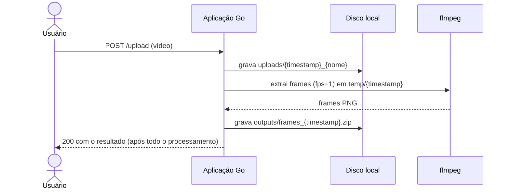

# Análise do projeto base

O ZipFrames substitui o [protótipo](https://drive.google.com/file/d/1tFxsvY91Nc6J_iShvD1Evi3qdz61vaaa/view?usp=sharing) analisado aqui, o mesmo que a FIAP X apresentou aos investidores.

## Resumo

O projeto base é o protótipo apresentado aos investidores: uma aplicação Go de arquivo único (`main.go`) que usa o framework Gin. Ela recebe um vídeo por formulário, executa o `ffmpeg` para extrair um frame por segundo em PNG, compacta os frames em um zip e oferece o arquivo para download.

O fluxo funciona e comprova a ideia de negócio, mas foi construído sem nenhuma das práticas de arquitetura exigidas para a nova versão. O problema central é que **todo o processamento acontece dentro da requisição HTTP**, sem fila, sem persistência e sem identidade de usuário.

## Como funciona hoje

| Rota | Comportamento |
|---|---|
| `GET /` | Devolve uma página HTML embutida no código Go |
| `POST /upload` | Salva o vídeo em `uploads/`, roda o `ffmpeg`, gera o zip em `outputs/` e só então responde |
| `GET /download/:filename` | Serve o zip a partir do nome informado na URL |
| `GET /api/status` | Lista todos os zips existentes na pasta `outputs/` |
| `/uploads` e `/outputs` | Servidos como arquivos estáticos públicos |

## Problemas encontrados

### Arquitetura e escalabilidade

- **Processamento síncrono na requisição.** O cliente fica conectado durante todo o processamento. Vídeos longos esbarram em timeouts de proxies e navegadores, e uma desconexão não cancela o `ffmpeg`.
- **Sem controle de concorrência.** Cada upload dispara um `ffmpeg` imediatamente. Em um pico, a CPU satura e as requisições falham, contrariando o requisito de não perder requisições.
- **Estado no disco local.** Vídeos, frames e zips ficam no sistema de arquivos do container. Isso impede escalar horizontalmente (outra réplica não enxerga os arquivos) e tudo se perde quando o container é recriado.
- **Monolito sem separação de responsabilidades.** HTTP, regra de negócio, acesso a disco, execução do `ffmpeg` e a interface HTML estão no mesmo arquivo. Não há camadas, interfaces ou pontos de extensão.
- **Sem persistência de status.** A "listagem de status" é apenas uma varredura da pasta `outputs/`. Vídeos em processamento ou com falha não aparecem.

### Correção e concorrência

- **Condição de corrida por timestamp.** O identificador de cada processamento é o horário com precisão de segundos. Dois uploads no mesmo segundo compartilham o diretório `temp/{timestamp}`: os frames se misturam, o primeiro a terminar apaga o diretório do outro com `os.RemoveAll`, e o zip `frames_{timestamp}.zip` de um sobrescreve o do outro.
- **Erros ignorados.** O retorno de `os.MkdirAll` é descartado, e o `Close` do `zip.Writer` é chamado em `defer` sem verificação. Como é esse `Close` que grava o diretório central do zip, uma falha nele gera um arquivo corrompido reportado como sucesso.
- **Sem timeout no `ffmpeg`.** O comando é executado sem contexto nem prazo, então um arquivo problemático pode travar a requisição indefinidamente.
- **Vídeos com falha nunca são removidos.** O arquivo original só é apagado em caso de sucesso, e o disco cresce sem limite.
- **Mensagem inconsistente.** A validação aceita sete extensões (`mp4`, `avi`, `mov`, `mkv`, `wmv`, `flv`, `webm`), mas o erro informa apenas quatro.

### Segurança

- **Nenhuma autenticação.** Qualquer pessoa envia vídeos e baixa os zips de qualquer outra.
- **Arquivos expostos publicamente.** As pastas `uploads/` e `outputs/` são servidas como estáticas, inclusive os vídeos originais que falharam no processamento.
- **Sem isolamento entre usuários.** `GET /api/status` lista os arquivos de todos.
- **Nome de arquivo vindo da URL.** O download monta o caminho com o parâmetro recebido, sem validação própria, e repete esse valor no cabeçalho `Content-Disposition`.
- **Vazamento de detalhes internos.** A saída completa do `ffmpeg` (caminhos, versão, parâmetros) é devolvida ao cliente, e a página a insere com `innerHTML`. Como essa saída contém o nome do arquivo enviado, o nome é interpretado como HTML.
- **Validação só por extensão.** Não há verificação do conteúdo nem limite de tamanho do upload.
- **CORS aberto** (`Access-Control-Allow-Origin: *`) e Gin em modo debug.

### Qualidade e operação

- **Sem testes, sem CI/CD e sem versionamento de contratos.**
- **Observabilidade inexistente.** Logs com `fmt.Printf`, sem estrutura nem correlação, sem métricas e sem health checks.
- **Sem graceful shutdown.** Um deploy interrompe processamentos em andamento.
- **Dependências desatualizadas.** Go 1.21 já está fora do suporte, e as versões de `golang.org/x/net` e `golang.org/x/crypto` no `go.mod` são anteriores a correções de segurança conhecidas. Uma verificação com `govulncheck` confirmaria o impacto.
- **Compressão redundante.** Os PNGs são adicionados ao zip com Deflate, mas PNG já é comprimido internamente, então o ganho de tamanho é pequeno para o custo de CPU.
- **Dockerfile propositalmente ruim.** Imagem completa do Go, `go run` em tempo de execução (compila a cada start), `go mod tidy` durante o build (não reprodutível), `COPY . .` sem `.dockerignore`, execução como root e sem health check. O pacote ainda traz a pasta `__MACOSX`.

## Requisitos da nova versão frente ao projeto base

| Requisito | Projeto base | Nova arquitetura |
|---|---|---|
| Processar mais de um vídeo ao mesmo tempo | Concorrência descontrolada, com corrida entre uploads | Worker sem estado, com prefetch controlado e escala horizontal pelo tamanho da fila (KEDA) |
| Não perder requisições em picos | Picos saturam a CPU e derrubam requisições | Upload direto no storage, confirmação rápida, outbox e fila durável com retry e DLQ |
| Proteção por usuário e senha | Inexistente | auth-service com senha em hash e JWT RS256 validado por cada serviço |
| Listagem de status por usuário | Varredura de pasta, sem status nem dono | Tabela de vídeos com máquina de estados, filtrada pelo dono, com cache |
| Notificação em caso de erro | Inexistente | notification-service consumindo `video.failed` e enviando e-mail |
| Persistência dos dados | Somente disco local efêmero | PostgreSQL por serviço e object storage compatível com S3 |
| Arquitetura escalável | Instância única com estado local | Microsserviços sem estado no Kubernetes |
| Testes | Inexistentes | Unitários, integração com Testcontainers, contrato e e2e |
| CI/CD | Inexistente | GitHub Actions por serviço e GitOps com Argo CD |

## O que mantemos

A regra de negócio do protótipo continua valendo e é a referência de comportamento da nova versão:

- extração de **um frame por segundo** (`ffmpeg -vf fps=1`);
- frames em **PNG**, nomeados em sequência (`frame_0001.png`, `frame_0002.png`, ...);
- **um zip por vídeo** contendo todos os frames;
- as **mesmas sete extensões** aceitas;
- a experiência do usuário: enviar, acompanhar e baixar.
